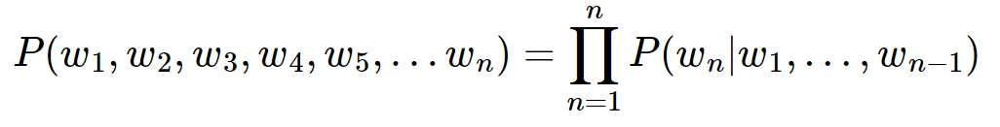

[toc]

# 통계적 언어 모델(Statistical Language Model)

## 1. 개념
### 1. 조건부 확률

- 주어진 사건이 일어났다는 가정하에 다른 한 사건이 일어날 확률
- 기존의 단어를 바탕으로 만들어질 다음 단어의 확률
- **지금까지 나온 단어들의 정보 = 문맥정보**
- p(B|A) = P(A,B)/P(A)
- P(A,B) = P(A)P(B|A)
- 조건부 확률의 연쇄법칙
- P(x_1, x_2, x_3 ... x_n) = P(x_1)P(x_2|x_1)P(x_3|x_1,x_2)...P(x_n|x_1 ... x_{n-1})


### 2. 문장에 대한 확률

- P(An adorable little boy is spreading smiles)의 확률
- 각 단어는 문맥이라는 관계로 인해 이전 단어의 영향을 받아 나온 단어
- 
- **문장의 확률은 각 단어들이 이전 단어가 주어졌을 때 다음 단어로 등장할 확률의 곱으로 구성됩니다.**

### 3. 카운트 기반의 접근

- SLM은 이전 단어로부터 다음 단어에 대한 확률을 카운트에 기반하여 확률을 계산합니다.

### 4. 카운트 기반 접근의 한계 - 희소 문제(Sparsity Problem)

- 언어 모델은 실생활에서 사용되는 언어의 확률 분포를 근사 모델링 합니다
- 기계에게 많은 코퍼스를 훈련시켜서 언어 모델을 통해 현실에서의 확률 분포를 근사하는 것이 언어 모델의 목표입니다.
- 기계가 훈련하는 데이터는 정말 방대한 양이 필요합니다.
- 이전 단어들의 시퀀스가 존재하지 않는다면 확률의 분모가 0이되어 확률이 정의되지 않고 그 다음 단어 또한 존재 하지 않는다면 확률은 0이된다.
- 충분한 데이터를 관측하지 못하여 언어를 정확히 모델링하지 못하는 문제를 **희소 문제(sparsity problem)**라고 합니다.
- 이러한 한계로 인해 언어모델의 트렌트는 SLM에서 인공 신경망 언어 모델로 넘어가게 됩니다.


## 2. 유니그램 모델

- **모든 단어의 활용이 완전히 서로 독립**이라면 단어 열의 확률은 다음과 같이 각 단어의 확률의 곱되는 기반의 모델
- P(w1,w2,w3,...,wm)  =p(w1)\*p(w2)\*...*p(wm)
-  an, adorable, little, boy, is, spreading, smiles (단어들이 독립적)


## 3. 바이그램 모델

- **단어의 활용이 바로 전 단어에만 의존한다.**

- N-gram모델에서 n을 2로 주면 된다.

-   P(w1,w2,…,wm)=P(w1)∏i=2mP(wi|wi−1)

- ```python
  from nltk import bigrams , word_tokenize
  t='I am a boy'
  tk=word_tokenize(t) #단어 토큰화
  bg=bigrams(tk)#직전의 단어에 의존
  list(bg)
  #out : [('I', 'am'), ('am', 'a'), ('a', 'boy')]
  ```

- an adorable, adorable little, little boy, boy is, is spreading, spreading smiles

- **하나의 토큰은 바로 전 단어+이후 단어로 생성**

- **직전 단어들과의 조건부 확률의 곱이 전체 문장의 확률이다.**


## 4. N-gram언어 모델

- 코퍼스에서 카운트 하지못하는 경의 감소를 위해 사용
- 단어의 활용이 바로 전 n-1개의 단어에만 의존
- 일부 단어만 고려하는 접근방법
- 
- 문장을 근사하기 위한 기준을 위해 사용되는 단어 개수: n
- n개의 연속적인 단어 나열
- **n개의 단어 뭉치 단위로 끊어서 이를 하나의 토큰으로 간주**

- **n-gram을 통한 언어 모델에서는 다음에 나올 단어의 예측은 오직 n-1개의 단어에만 의존**

  - 4-그램(n-그램) 
  - an adorable little boy, adorable little boy is, little boy is spreading, boy is spreading smiles /  n개의 단어 뭉치
  - spreading 다음 단어 예측시 n-1 에 해당하는 앞의 3개의 단어 (boy, is, spreading) 만을 고려합니다.

- 조건부 확률을 추정할 때는 문장의 시작과 끝이라는 조건을 표시하기 위해 모든 문장에니타내는 특별 토큰을 추가한다.

- SS : 문장의 시작 / SE : 문장의 끝 이라는 토큰

- ```python
  from nltk.util import ngrams
  t='I am a boy'
  tk=word_tokenize(t)
  ng=ngrams(tk,3)
  
  bigram = ngrams(tokens, 2, pad_left=True, pad_right=True, left_pad_symbol="SS", right_pad_symbol="SE")
  for t in bigram:
      print(t)
  
  ```


### 1. 빈도수 확인

- NLTK패키지를 사용하면 바이그램 형태의 조건부 확률을 쉽게 추정할 수 있다.

- `ConditionalFreqDist` 클래스로 각 문맥별 단어 빈도를 측정한다.

- ```python
    from nltk import ConditionalFreqDist
    
    sentence = "I am a boy."
    tokens = word_tokenize(sentence) #단어 토큰화
    bigram = ngrams(tokens, 2, pad_left=True, pad_right=True, left_pad_symbol="SS", right_pad_symbol="SE")
    #패딩 SS<문장>SE
    cfd = ConditionalFreqDist([(t[0], t[1]) for t in bigram])
    #ConditionalFreqDist 클래스는 문맥을 조건으로 가지는 사전 자료형과 비슷하다.
    #정답 접근 정보
    #문맥의 빈도수를 가지고 있다.
    print(cfd.conditions())
    #Out : ['SS', 'I', 'am', 'a', 'boy', '.']
    
    print(cfd['SS']) #문장의 처음의 다음 단어로 나오는 토큰들을 빈도수와 함꼐 보여준다.
    #Out : FreqDist({'I': 1})
    
    ```

    #### 샘플코퍼스 사용
    
- ```python
  import nltk
  nltk.download('movie_reviews')
  nltk.download('punkt') #텍스트를 문장으로 나눠주는 비지도 알고리즘
  from nltk.corpus import movie_reviews #샘플 코퍼스 데이터 연결
  
  sentences = []
  for tokens in movie_reviews.sents(): #한 문장을 꺼내서
      bigram = ngrams(tokens, 2, pad_left=True, pad_right=True, left_pad_symbol="SS", right_pad_symbol="SE")
      #토큰의 시작과 끝 추가 SS<문장>SE -> 토크을 앞+뒤 2개의 토큰을 하나의 토큰으로 묶는다.
      sentences += [t for t in bigram]
  
  sentences[:20]
  #각 문맥별 단어 빈도를 측정한다.
  cfd = ConditionalFreqDist(sentences)
  cfd['SS'].most_common(5)
  #문장의 첫 단어 분포의 TOP5
  ```


### 2. 조건부확률 추정

- `ConditionalProbDist` 클래스를 사용하면 조건부 확률을 추정한다.

- 다음 단어가 나올 확률(우도/최대가능도)를 추정
-  P(w|wc)=C((wc,w))/ C((wc))(전체 말뭉치에서 바이그램의 횟수 /전체 말뭉치에서 유니그램(단어)의 횟수)

- NLTK의 `ConditionalProbDist` 클래스에 `MLEProbDist` 클래스 팩토리를 인수로 넣어 위와 같이 빈도를 추정할 수 있다.

- 트레이닝이 끝나면 조건부 확률의 값을 보거나 샘플 문장을 입력해서 문장의 로그 확률을 구할 수 있다.

- ```python
  from nltk.probability import ConditionalProbDist, MLEProbDist
  cpd = ConditionalProbDist(cfd, MLEProbDist) #빈도 추정 클래스
  cpd["i"].prob("am")
  #out : 0.018562267971650354
  cpd["i"].prob("is")
  #out : 0.0002249971875351558
  
  ```


### 3. 조건부확률을 통한 문장의 확률(바이그램)

```python
#P(SS<문장>SE) = P(시작단어|SS)*P(|)*P(|)*P(|)*P(|)*P(SE|종료단어)
#조건부 확률을 알게 되면 각 문장의 확률을 구할 수 있다.
def sentence_score(s): #단어집합(딕셔너리)
    p = 0.0
    for i in range(len(s) - 1):
        c = s[i] #우도(최대가능도) 
        w = s[i + 1]
        p += np.log(cpd[c].prob(w) + np.finfo(float).eps)
    return np.exp(p)
import numpy as np
test_sentence = ["i", "like", "the", "movie", "."]
sentence_score(test_sentence)
#out : 2.740764134071561e-06
test_sentence = ["like", "i", "the", ".", "movie"]
sentence_score(test_sentence)
#out : 1.5015040140827832e-38

test_data2=['movie','.','the']#실현 불가능 문장
sentence_score(test_data2)
#out : 3.085769765203191e-17
```


### 4. 언어 모델을 기반으로 문장 생성(바이그램 언어 모델)

```python
def generate_sentence(seed=None):
    if seed is not None:
        import random
        random.seed(seed)
    c = "SS"
    sentence = []#새로 만들 sentence
    while True:
        if c not in cpd: #''현재문자'가 없다면 생성 불가
            break
        w = cpd[c].generate() #다음 문자 발생

        if w == "SE":
            break
        elif w in ["i", "ii", "iii"]:
            w2 = w.upper() #전처리
        elif w in ["mr", "luc", "i", "robin", "williams", "cindy", "crawford"]:
            w2 = w.title() #전처리
        else:
            w2 = w

        if c == "SS": 
            sentence.append(w2.title())
        elif c in ["`", "\"", "'", "("]: #특수문자 전처리
            sentence.append(w2)
        elif w in ["'", ".", ",", ")", ":", ";", "?"]: #특수문자 전처리
            sentence.append(w2)
        else:
            sentence.append(" " + w2) #공백을 이용힌 단어 구분

        c = w #다음단어가 현재 단어가 된다.
    return "".join(sentence)

generate_sentence(6) #6개의 랜덤 문장 발생
```


## **5. N-gram Language Model의 한계**

- n-gram은 뒤의 단어 몇 개만 보다 보니 의도하고 싶은 대로 문장을 끝맺음하지 못하는 경우가 생긴다는 점입니다.
- **(1) 희소문제**
  -  일부 단어만을 보는 것으로 현실적으로 코퍼스에서 카운트 할 수 있는 확률을 높일 수는 있었지만, n-gram 언어 모델도 여전히 n-gram에 대한 희소 문제가 존재합니다.
  - 이와 같이 충분한 데이터를 관측하지 못하여 언어를 정확히 모델링하지 못하는 문제를 **희소 문제(sparsity problem)**라고 합니다.
- **(2)** **n을 선택하는 것은 trade-off 문제.**
  -  몇 개의 단어를 볼지 n을 정하는 것은 trade-off가 존재합니다.
  - 임의의 개수인 **n을 1보다는 2로 선택하는 것은 거의 대부분의 경우에서 언어 모델의 성능**을 높일 수 있습니다.
  - n을 크게 선택하면 실제 훈련 코퍼스에서 해당 **n-gram을 카운트할 수 있는 확률은 적어지므로 희소 문제는 점점 심각해집니다.** 
  - 또한 n이 커질수록 모델 사이즈가 커진다는 문제점도 있습니다. 기본적으로 코퍼스의 모든 n-gram에 대해서 카운트를 해야 하기 때문입니다.

## 6. 적용분야에 맞는 코퍼스의 수집

- 어떤 분야인지, 어떤 어플리케이션인지에 따라서 특정 단어들의 확률분포는 당연히 다릅니다. 예를들어 마케팅 분야에서는 마케딩 단어가 빈번하게 등장할 것이고, 의료분야에서는 의료 관련 단어가 당연히 빈번하게 등장합니다. 이 경우 언어 모델에 사용하는 코퍼스를 해당 도메인의 코퍼스를 사용한다면 당연히 언어 모델이 제대로된 언어 생성을 할 가능성이 높아집니다.
- 때로는 이를 모델의 약점이라고 하는 경우도 있는데, 훈련에 사용한 코퍼스에 따라 성능이 비약적으로 달라지기 떄문입니다.


## 7 . 인공신경망을 이용한 언어 모델

- N-gram 언어 모델의 한계점을 극복하기 위해 분모, 분자에 숫자를 더해서 카운트 했을 때 0이 되는것을 방지하는 등의 여러 일반화 방법이 존재한다.
- 그럼에도 통계적 언어 모델의 취약점을 완전히 해결하지 못하였고, 이를 대안으로 인공 신경망을 이용한 언어 모델이 많이 사용되고 있다.
