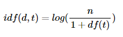

[toc]

# 4. TF-IDF(단어 빈도-역 문서 빈도, Term Frequency-Inverse Document Frequency)

DTM 내에 있는 **각 단어에 대한 중요도를 계산할 수 있는 TF-IDF 가중치**에 대해서 알아보겠습니다. TF-IDF를 사용하면, 기존의 DTM을 사용하는 것보다 TF-IDF가 DTM보다 항상 좋은 성능을 보장하는 것은 아니지만, 많은 경우에서 DTM보다 더 좋은 성능을 얻을 수 있습니다.


##  1. TF-IDF

TF-IDF(Term Frequency-Inverse Document Frequency)는 단어의 빈도와 역 문서 빈도(문서의 빈도에 특정 식을 취함)를 사용하여 **DTM 내의 각 단어들마다 중요한 정도를 가중치로 주는 방법입니다.** 우선 **DTM을 만든 후, TF-IDF 가중치를 부여합니다.**

- 정수인코딩->DTM->TF-IDF

**TF-IDF는 주로 문서의 유사도를 구하는 작업, 검색 시스템에서 검색 결과의 중요도를 정하는 작업, 문서 내에서 특정 단어의 중요도를 구하는 작업 등에 쓰일 수 있습니다.**

TF-IDF는 TF와 IDF를 곱한 값을 의미하는데 이를 식으로 표현해보겠습니다.

문서를 d, 단어를 t, 문서의 총 개수를 n이라고 표현할 때 TF, DF, IDF는 각각 다음과 같이 정의할 수 있습니다.

**(1) tf(d,t) : 특정 문서 d에서의 특정 단어 t의 등장 횟수.**

TF는 이미 앞에서 구한적이 있다. TF는 앞에서 배운 DTM의 예제에서 각 단어들이 가진 값들입니다. DTM이 각 문서에서 각 단어의 등장빈도를 나타내는 값이었기 때문이다.

**(2) df(t) : 특정 단어 t가 등장한 문서의 수.**

여기서 특정 단어가 각 문서, 또는 문서들에서 몇 번 등장했는지는 관심가지지 않으며 **오직 특정 단어 t가 등장한 문서의 수에만 관심을 가집니다.** 앞서 배운 DTM에서 바나나는 문서2와 문서3에서 등장했습니다. 이 경우, 바나나의 df는 2입니다. 문서3에서 바나나가 두 번 등장했지만, 그것은 중요한 게 아닙니다. 심지어 바나나란 단어가 문서2에서 100번 등장했고, 문서3에서 200번 등장했다고 하더라도 바나나의 df는 2가 됩니다.

**(3) idf(d, t) : df(t)에 반비례하는 수.** (특정단어t가 등장한 문서의 수에 반비례)



IDF라는 이름을 보고 DF의 역수가 아닐까 생각했다면, IDF는 DF의 역수를 취하고 싶은 것이 맞습니다. 그런데 log와 분모에 1을 더해주는 식에 의아하실 수 있습니다. log를 사용하지 않았을 때, IDF를 DF의 역수(ndf(t)라는 식)로 사용한다면 총 문서의 수 n이 커질 수록, IDF의 값은 기하급수적으로 커지게 됩니다. 그렇기 때문에 log를 사용합니다.

왜 log가 필요한지 n=1,000,000일 때의 예를 들어봅시다. log의 밑은 10을 사용한다고 가정하였을 때 결과는 아래와 같습니다.

| 단어 t |   df(t)   | idf(d,t) |
| :----: | :-------: | :------: |
| word1  |     1     |    6     |
| word2  |    100    |    4     |
| word3  |   1,000   |    3     |
| word4  |  10,000   |    2     |
| word5  |  100,000  |    1     |
| word6  | 1,000,000 |    0     |

- n이 커지더라도 log를 사용한 idf는 차근차근 커진다.

또 다른 직관적인 설명은 불용어 등과 같이 자주 쓰이는 단어들은 비교적 자주 쓰이지 않는 단어들보다 최소 수십 배 자주 등장합니다. 그런데 비교적 자주 쓰이지 않는 단어들조차 희구 단어들과 비교하면  또 최소 수백 배는 더 자주 등장하는 편입니다. 이 때문에 log를 씌어주지 않으면, **희귀 단어들에 엄청난 가중치가 부여 될수 있습니다**.  로그를 씌우면 이런 격차를 줄이는 효과가 있습니다. log 안의 식에서 **분모에 1을 더해주는 이유는 첫번째 이유로는 특정 단어가 전체 문서에서 등장하지 않을 경우에 분모가 0이 되는 상황을 방지하기 위함입니다.**

TF-IDF는 모든 문서에서 자주 등장하는 단어는 중요도가 낮다고 판단하며, 특정 문서에서만 자주 등장하는 단어는 중요도가 높다고 판단합니다. TF-IDF 값이 낮으면 중요도가 낮은 것이며, TF-IDF 값이 크면 중요도가 큰 것입니다. 즉, the나 a와 같이 불용어의 경우에는 모든 문서에 자주 등장하기 마련이기 때문에 자연스럽게 불용어의 TF-IDF의 값은 다른 단어의 TF-IDF에 비해서 낮아지게 됩니다. 


## 2. 사이킷런을 이용한 DTM과 TF-IDF 실습

```python
from sklearn.feature_extraction.text import CountVectorizer

corpus = [
    'you know I want your love',
    'I like you',
    'what should I do ',    
]

vector = CountVectorizer()

# 코퍼스로부터 각 단어의 빈도수를 기록
print(vector.fit_transform(corpus).toarray())

# 각 단어와 맵핑된 인덱스 출력
print(vector.vocabulary_)
```


- 사이킷런의 TfidfVectorizer

```python
from sklearn.feature_extraction.text import TfidfVectorizer

corpus = [
    'you know I want your love',
    'I like you',
    'what should I do ',    
]

tfidfv = TfidfVectorizer().fit(corpus)
print(tfidfv.transform(corpus).toarray())
print(tfidfv.vocabulary_)
```


- BoW, DTM, TF-IDF는 문서들 간의 유사도를 구하기 위해 사용되는 자료이다.
