# 01) GPT(Generative Pre-Trainig of a Language Model)

## 1. 배경

- Unlabeled dataset
  - 위키피디아 2020년 기준
  - 6,020,081개의 기사와 그 기사들은 35억개의 단어들을 가진다.
- Labeld dataset
  - STS Benchmark for sentence similarity: 8,628 sentences
  - Quora question pairs: 404,290 question pairs
  - CoLA dataset: 10,657 sentences

<b>정보의 대부분은 Unlabeld 데이터 셋으로 존재한다.</b>

## 2. 사용법

1. Unlabeled Text Corpora 
2. GPT 언어 모델을 통한 임베딩 벡터를 찾아 낸다
3. Labeled Text Corpora for a Specific Task
4. Discriminative Fine Tuning

## 3. 동기

1. Leveraging more than word-level information from unlabeled text is challenging
   1. It is unclear **what type of optimization objectives are most effective** at learning text 
      representations that are useful for transfer
2. There is no consensus on **the most effective way** to transfer these learned 
   representations to the target task

## 4. ELMO VS GPT

- GPT: Unsupervised pre-training

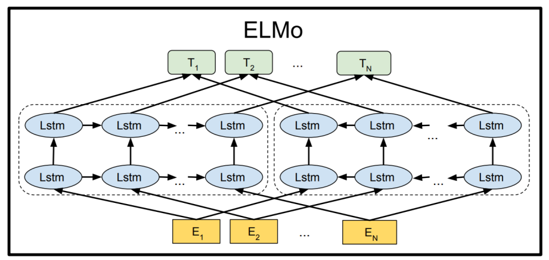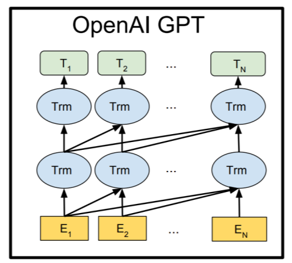

1. ELMO
   1. E : Sequence's Tokens
   2. Left : Forward Lanaguage Model
   3. Right : Backward Lanaguage Model
   4. Output : LSTM의 히든 레이어 선형 결합으로 나오는 벡터
2. GPT
   1. E : Sequence's Token's Embedding
   2. Trm : 트랜스포머의 디코딩 블록
3. Language 모델의 목적
   1. 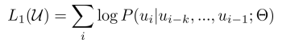
   2. k is the size of context window
   3. ▪ P is the conditional probability modeled using a neural network with parameter setar

## 5. GPT의 구조

### 1. GPT: Unsupervised pre-training

A multi-layer Transformer decoder is used for language model

Parameter

 : the context vector of tokens
▪ n: the number of layers
▪ We
: token embedding matrix
▪ Wp
: position embedding matrix

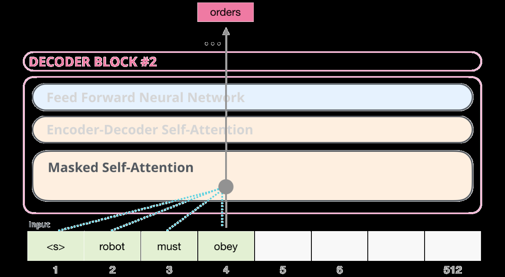

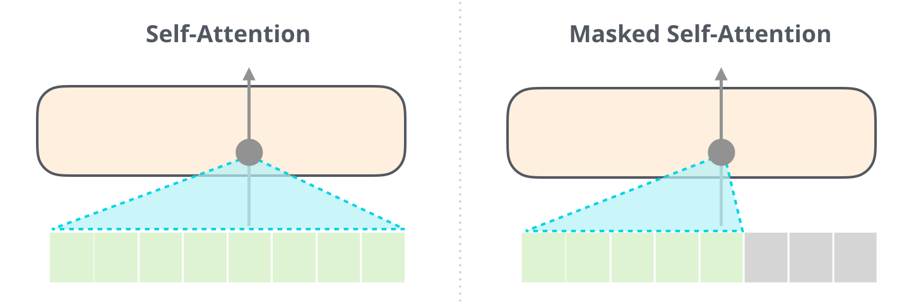

- GPT의 트랜스포머 디코더에서 Encoder - Decoder Self Attention은 사용하지 않는다.
- Decoder-only block
- 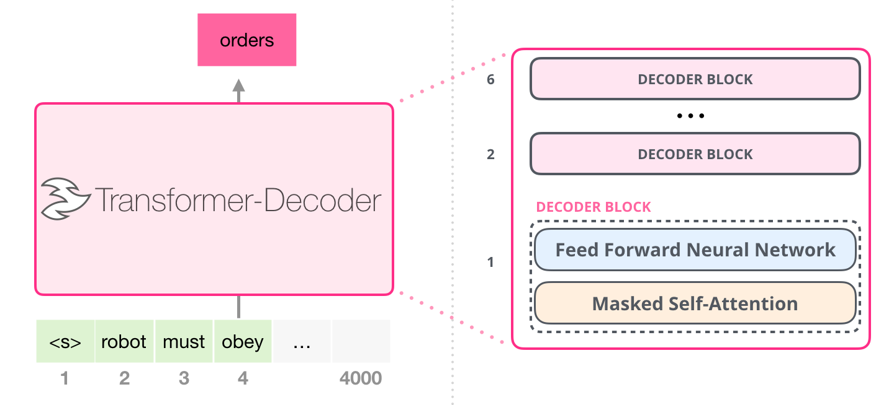

- 디코더 층을 몇 개 쌓을 건가 인가는 사용자가 매개변수로 정한다.

### 2. GPT : Supervised fine-tuning

1. A labeled dataset with each instance consisting of a sequence of input tokens, $x^1$, …, $x^m$, along with a label y
2. The inputs are passed through the pre-trained model to obtain the final transformer block’s activation $h^l_m$, which is then fed into an added linear output layer with parameter $W_y$ to predict y:
   1. 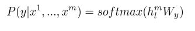
3. This gives us the following objective to maximize:
   1. 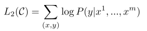

The authors additionally found that including language modeling as an auxiliary objective to the fine-tuning helped learning by

- Improving generalization of the supervised model
- Accelerating convergence

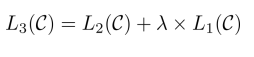

- L1 :  supervised model

- L2 : unsupervised model

- 즉 목적함수를 결합하여 갱신한다.

  

  

### 6. GPT 활용
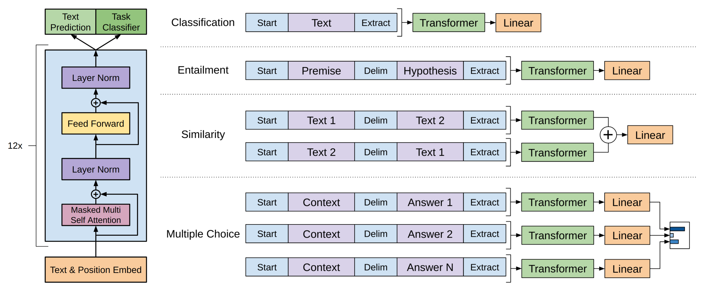

## 7. GPT 성능 평가

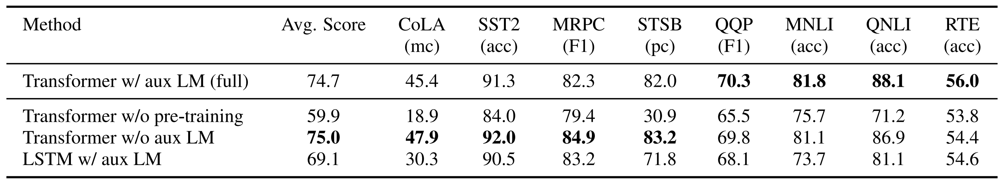

- Larger datasets benefit from the auxiliary objective but smaller datasets do not
- LSTM only outperforms the Transformer on one dataset