[toc]

# 02) GPT - 2

- Language Models are Unsupervised Multitask Learners
- 버전 발전 과정
  - ELMO -> GPT -> BERT-BASE -> GPT-2 -> GPT-3
- 기존 GPT랑 다를 게 없는 오직 Decoder's transformer을 사용
- 학습 된 데이터 셋만이 커졌다.

## 1. Transformer vs GPT vs BERT

- Transformer revisited
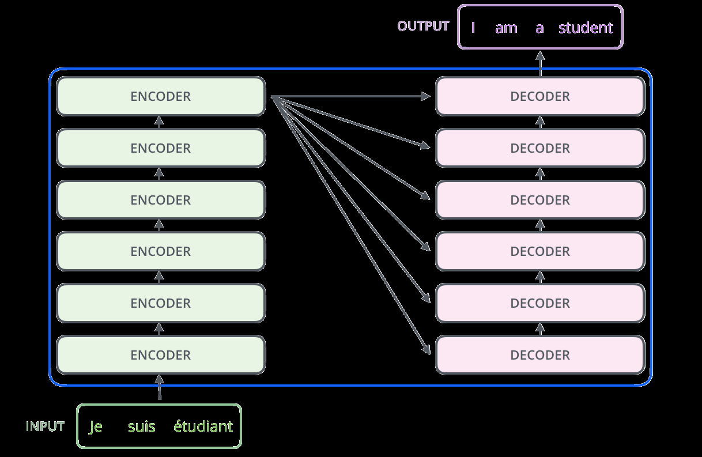 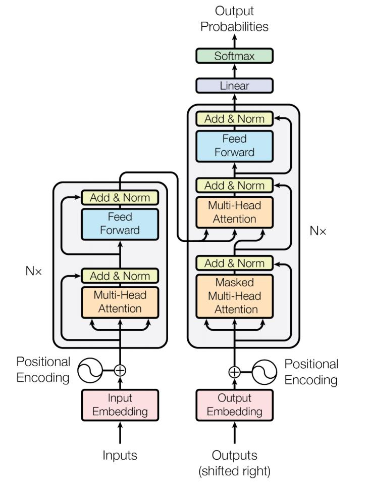
- 

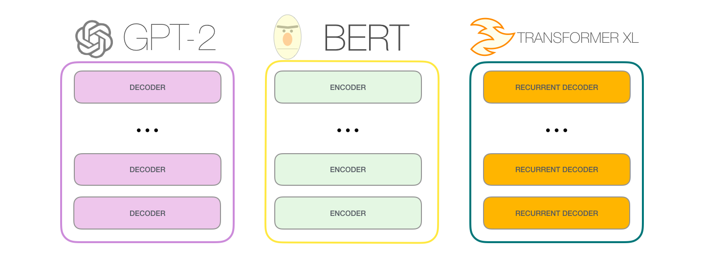

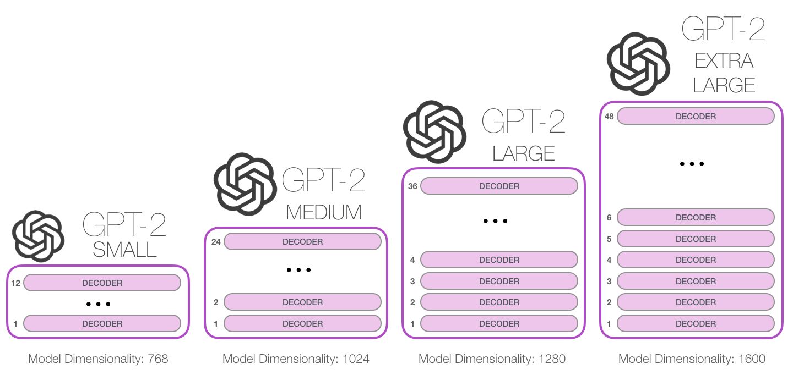

- **Main difference between GPT-2 and BERT**
- GPT-2 is auto-regressive but BERT is not
  - After each token is produced, that token is added to the sequence of input

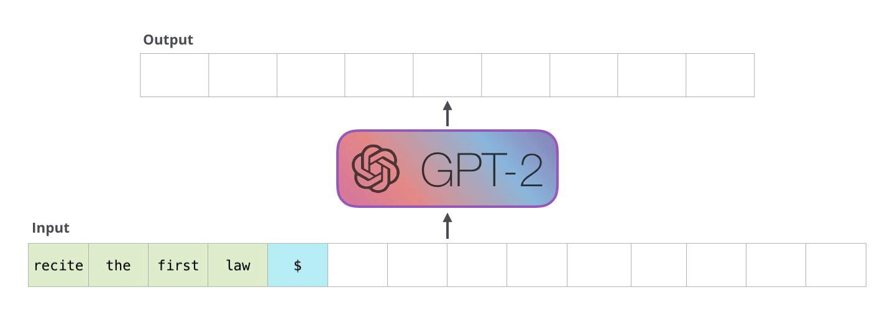

## 2. GPT 활용

GPT-2 can process 1024 tokens

- Each token flows through all the decoder blocks along its own path

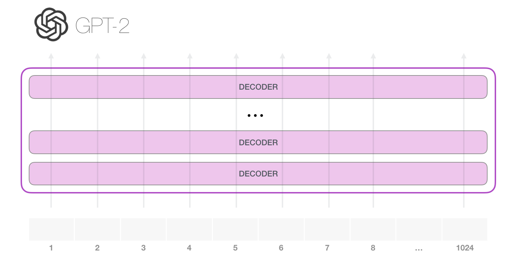

### 1. **The simplest way to run a trained GPT-2 is to allow it to ramble on its own**

- Generating unconditional samples

- GPT-2 has a parameter called top-k that we can use to have the model consider 
  sampling words other than the top word

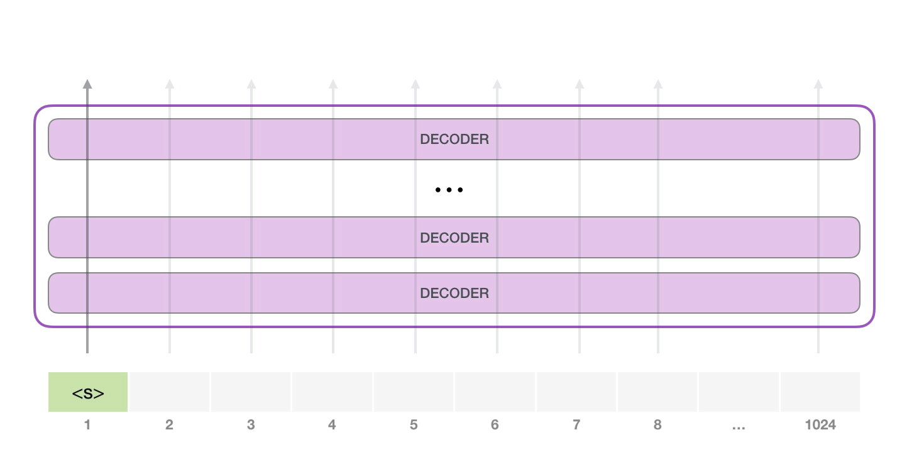

### 2. In the next step, we add the output from the first step to our input sequence, 
and have the model make its next prediction:

1. The second path is the only that’s active in this calculation
2. GPT-2 does not re-interpret the first token in light of the second token

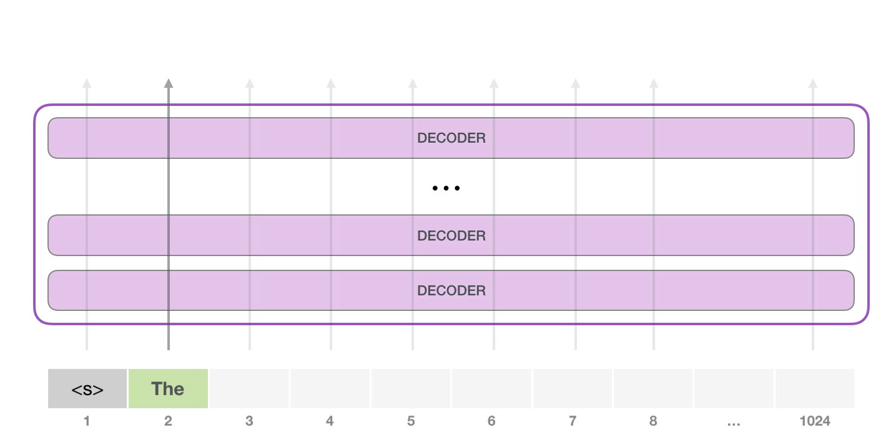

- GPT2 : A deeper look inside
  - Sending a word to the first transformer block
  - 

### 3. A journey up the stack

- Once a lower-level transformer block processes the token, it sends its resulting vector up the stack to be processed by the next block

  - The process is identical in each block, but each block has its own weights in both selfattention and the neural network sublayers

  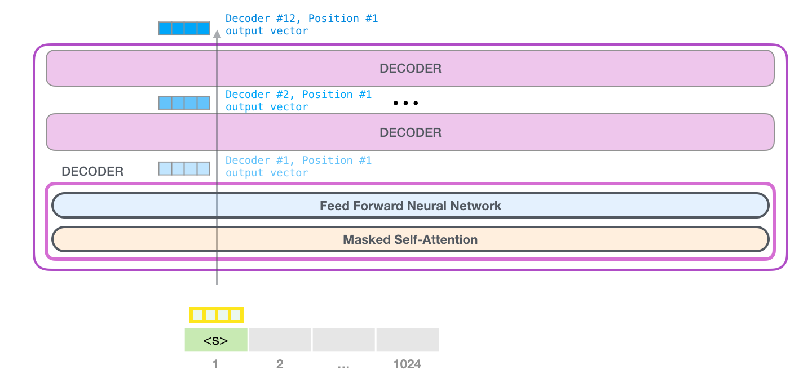

- Same Sturcuter, different weights for each DECODER

## 3. Self-Attention Recap

- Language heavily relies on context
- This self-attention layer in the top block is paying attention to “a robot” when it processes the word “it”

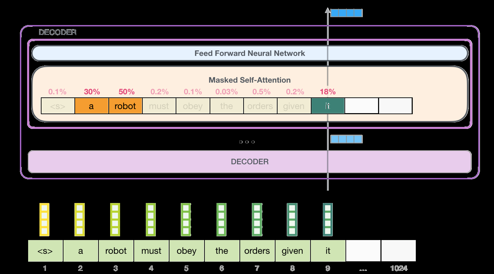

-  Think of it like searching through a filing cabinet
  - The query is like a sticky note with the topic you’re researching
  - 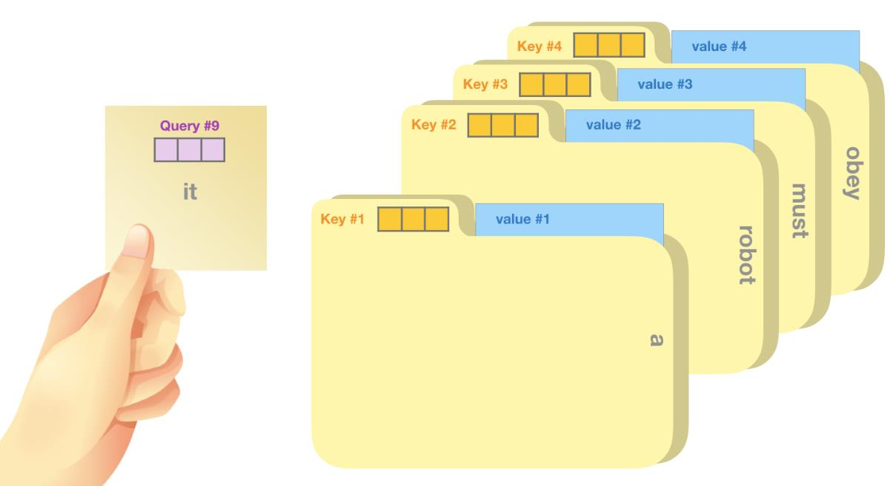
  - The keys are like the labels of the folders inside the cabinet
  - When you match the tag with a sticky note, we take out the contents of that folder, these contents are the value vector
  - Except you’re not only looking for one value, but a blend of values from a blend of folders.

- Multiply each value by its score and sum up – resulting in our self-attention outcome
- 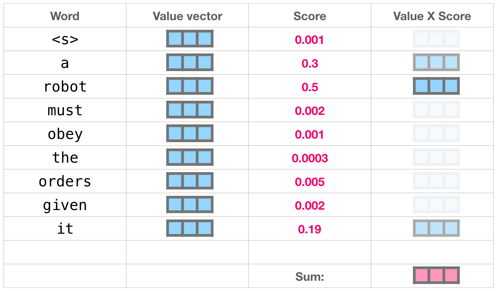
  - This weighted blend of value vectors results in a vector that paid 50% of its attention to 
    the word robot, 30% to the word a, and 19% to the word it
-  Model Output
  - When the top block in the model produces its output vector (the result of its own 
    self-attention followed by its own neural network), the model multiplies that vector 
    by the embedding matrix
  - 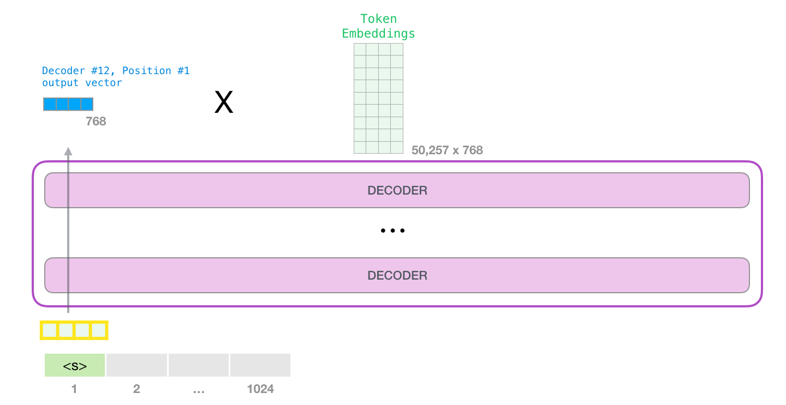
  - 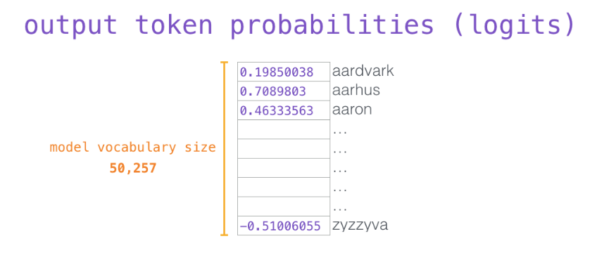

## 4. GPT-2 유의점

1. GPT-2 uses Byte Pair Encoding to create the tokens in its vocabulary; tokens are usually parts of words
2. When training, a maximum of 512 tokens are processes at the same time
3. Layer normalization is important in Transformer structure

## 5. GPT-2 성능

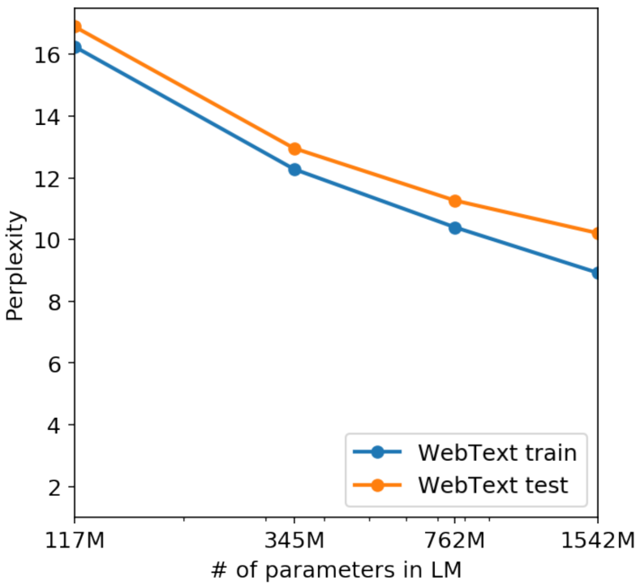
