[toc]

# 03) GPT-3

생성 기업은 OPEN AI 이지만 API 접근 키를 발급 해야하는 유로 서비스이다.

다양한 USE CASES를 제공

1. Eqaution description : 수식 묘사
2. Build Keras Models : Keras 모델 생성 코드 제공 [Deep Learning Framework](https://twitter.com/mattshumer_/status/1287125015528341506?ref_src=twsrc^tfw|twcamp^embeddedtimeline|twterm^collection%3A1286781399081639942|twcon^timelinechrome&ref_url=https%3A%2F%2Fgpt3examples.com%2F)
   1. Input
   2. output
   3. 데이터셋 크기
   4. 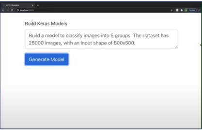


## 1. GPT-3

GPT-2 parameters : 1.5 bill

GPT-3 parameters : 175 bill

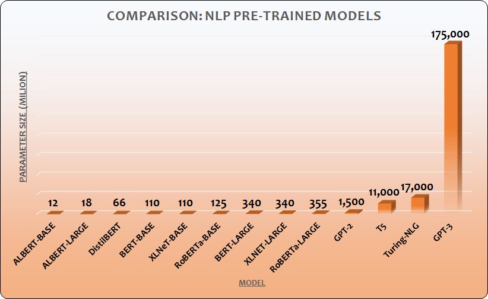

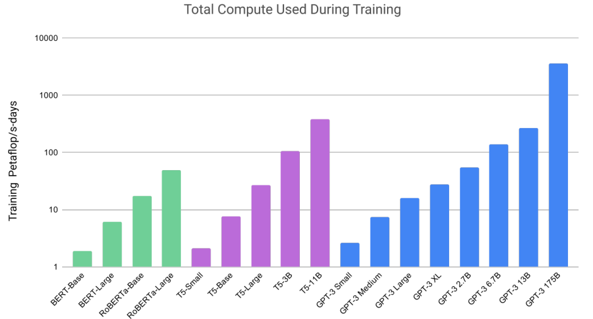

- 세로축은 로그스케일


## 2. GPT-3 한계

- Pretrained Language Models
  - Can be directly fine-tuned, entirely removing the need for task-specific architectures(구체적 task에 아키텍쳐 필요가 제거)
- Limitations(한계점)
  - While the architecture is **task-agnostic**, there is still a need for task-specific datasets and task-specific fine-tuning(아키텍쳐는 독립적일지라도 구체적 task에 대한 데이터셋과 구체적 task fine tuning은 필요)
- Removing this limitation would be desirable because
  - The need for a large dataset of **labeled examples** for every new task limits the 
    applicability of language models => 장애물로 존재
  - The potential to exploit **spurious correlations** in training data fundamentally grows with the expressiveness of the model and the narrowness of the training distribution(모델이 크거나, 훈련데이터가 작은 경우 spurious correlations 발생 가능성이 커진다.)
    - spurious correlations : 휴대폰 판매량 증가 / 그 도시의 범죄 건수가 증가. 그러하여 휴대폰 판매증가가 도시의 범죄 증가의 원인이다. X
      - 인구가 증가한다는 히든 요소가 있다.(제외 된다.)
  - Humans do not require large supervised datasets to learn most language tasks
    - (인간의 모방을 위해서는 지도 데이터셋은 사실 필요로 하지 않는다.)


## 3. GPT-3 한계점 돌파

-  Meta-learning: A possible route toward addressing the issues

  - The model develops a broad set of skills and pattern recognition abilities at training time ( 모델이 훈련 시간동안 다양한 셋의 패턴과 스킬을 인지하는 능력을 개발히는 것 )
  - 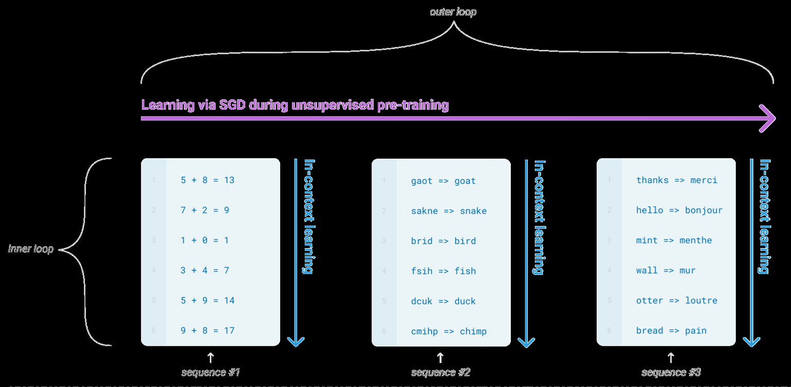

  - 학습시 2개의 루프 존재
    - Outer loop
    - Inner loop : 
      - 각각의 시퀀스들에 대해서는 동일한 조합의 데이터가 들어 온다. (In-context learning)
      - 다양한 형태의 스킬들이 모델이 학습하도록 유도한다.

## 4. GPT-3 크기의 정당화

- Increase the capacity of transformer language models(트랜스포머 기반 언어 모델)
  - Log loss follows a smooth trend of improvement with scale
    - 파라미터가 커질수록 log loss 개선된다.
  - Because in-context learning involves absorbing many skills and tasks within the parameters of the model, it is plausible that in-context learning abilities might show similarly strong gains with scales
    - in-context learning 관점에서 스케일이 커질수록,  다양한 스킬과 태스크를 학습하는데 강한 학습을 보여줄 것이다. 
  - 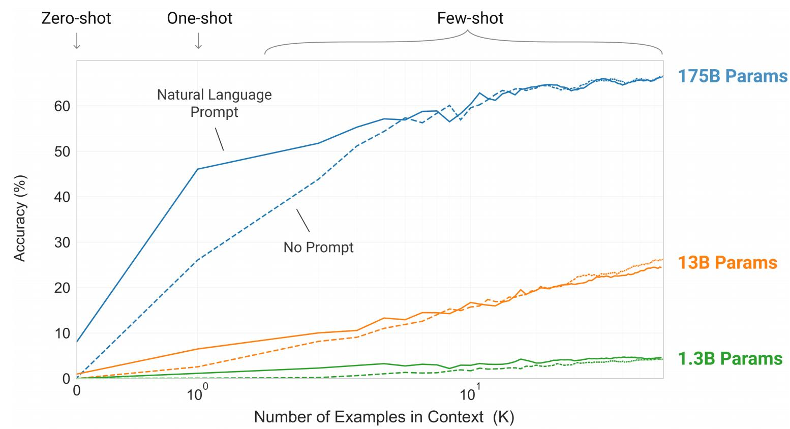
  - Zero-shot : 예제를 안주는 것(0 Context)
  - One-shot : 하나의 예제
  - Few-shot : 어려개의 예제를 줄 때
  - No Prompt : 1 + 2 = ?
  - Natural Langauge Prompt : add the two numbers. 1+2
    - Context Example은 후반에 차이가 없다. 


## 5. GPT-3 장점

1. Achieves promising results in the zero-shot and one-shot settings, and in the few-shot settings sometimes competitive or surpasses SOTA (ECoQZ, TriviaQA)
2. Displays one-shot and few-shot proficiency for unscrambling words, performing arithmetic, using novel words in a sentence, etc.
3. GPT-3 struggles after few-shot settings for natural language inference tasks (ANLI) and some reading comprehension datasets (RACE)
4. 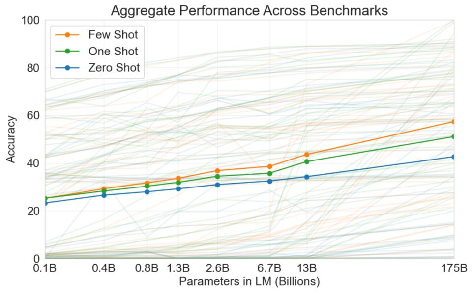

- 스케일이 클수록 Shot의 개수만큼의 뚜렷한 차이를 보여준다.


## 6. GPT-3 구조


- $d_{model}$ : 디코더 입력 임베딩 벡터 차원


## 7. GPT -3 approach(접근)

1. Tradition fine-tuning(not used for GPT-3)

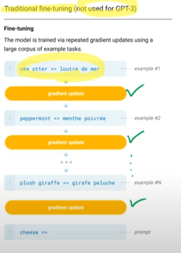

- example 한번 당 gradient update를 수행
- Fine-Tuning : Updating the weights of a pre-trained model by training on a supervised dataset specific to the desired task
  - Pros: Strong performance on many benchmarks
  - Cons: Need for a **new large dataset** for every task, potential for poor generalization **out of-distribution**, potential to exploit **spurious features** of the training data, potentially resulting in an unfair comparison with human performance

2. GPT-3 의 접근

   - The three settions we explore for in-context learning
   - No gradient update 
   - 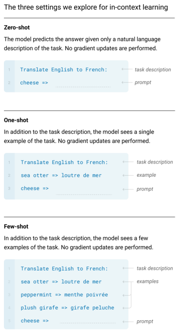
   - Few-Shot : The model is given a **few demonstrations** of the task **at inference** **time** as conditioning, but **no updates are allowed**
     - Pros : Reduction in the need for task-specific data, reduced potential to learn an overly narrow distribution from a large but narrow fine-tuning dataset
     - Cons : Results from this method have so far been much **worse than SOTA fine-tuned models** , a small amount of task specific data is still required
   - One-Shot(1S) : Only one demonstration is allowed in addition to a natural language description of the task (nli + 1ex)
   - Zero-Shot (0S): The model is only given a natural language instruction describing the task(only nli)


## 8. GPT-3 : Architecture

- Same as GPT-2 except alternating dense and locally banded s**parse attention pattern** in the layers of the transformer

- 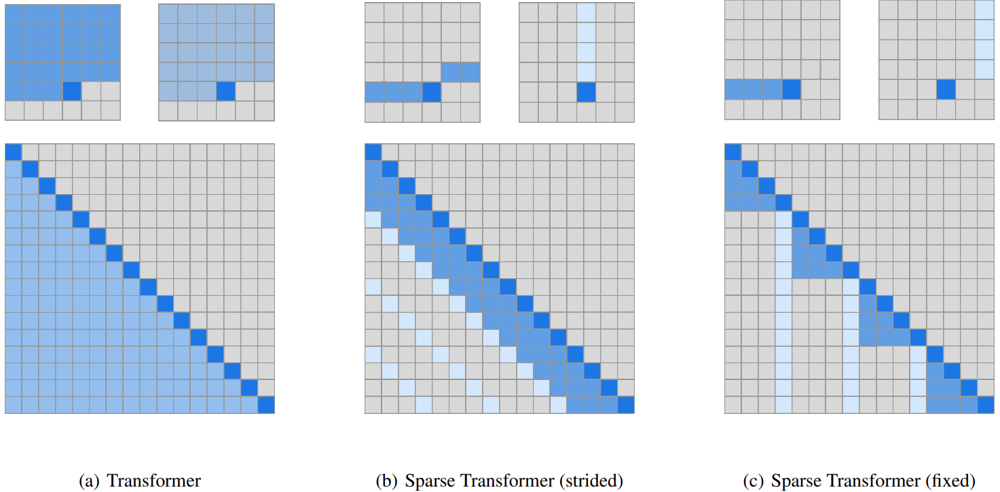

- 8 different sizes of model
- 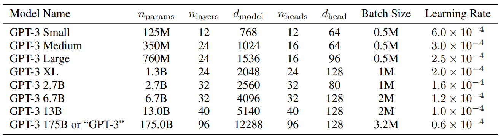

- All models use a context window of nctx = 2048 tokens.


## 9. GPT-3 Training Dataset

- Common Crawl dataset (constituting nearly a trillion words)
- 3 steps to improve the average quality of the dataset
  - **Filtered a version** of CommonCrawl based on similarity to a rangeof high-quality reference corpora
  - Performed fuzzy deduplication at the document level, within and across datasets, to prevent redundancy and preserve the integrity of the held-out validation set
  - Added known high-quality reference corpora to the training mix to augment CommonCrawl (WebText, Books1, Books2, English Wikipedia)
  - 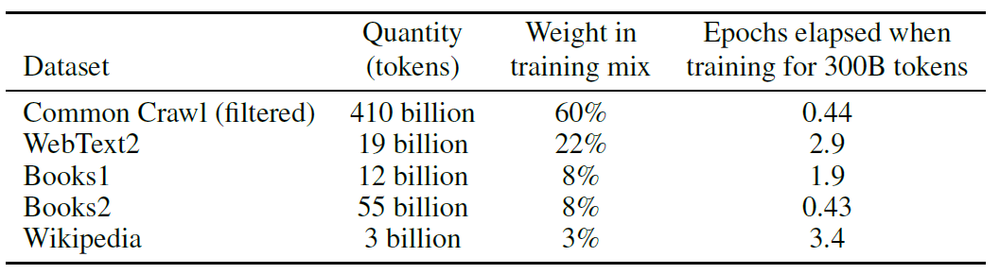


## 10. GPT-3 Traning Cost

```tex
A major methodological concern with language models pretrained on a broad swath of internet 
data, particularly large models with the capacity to memorize vast mounts of content, is 
potential contamination of downstream tasks by having their test or development sets 
inadvertently seen during pre-training.
```

```markdown
To reduce such contamination, we searched for and attempted to remove any overlaps with the 
development and test sets of all benchmarks studied in this paper. Unfortunately, a bug in the filtering caused us to ignore some overlaps, and due to the cost of training it was not feasible to retrain the model.
```

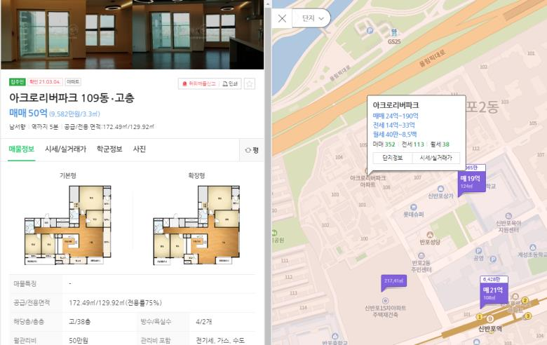

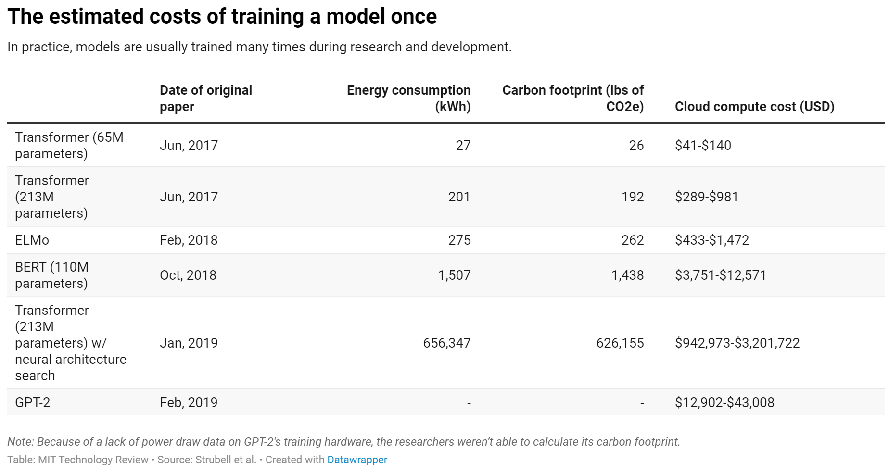


## 11. GPT-3 결과

- Language modeling performance follows a power-law when making efficient use of training compute => More parameters, More Computing
- 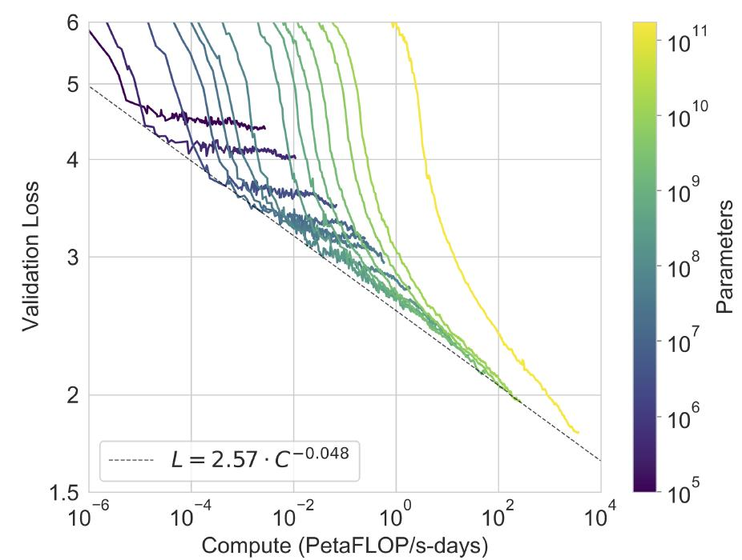
- Language modeling
  - 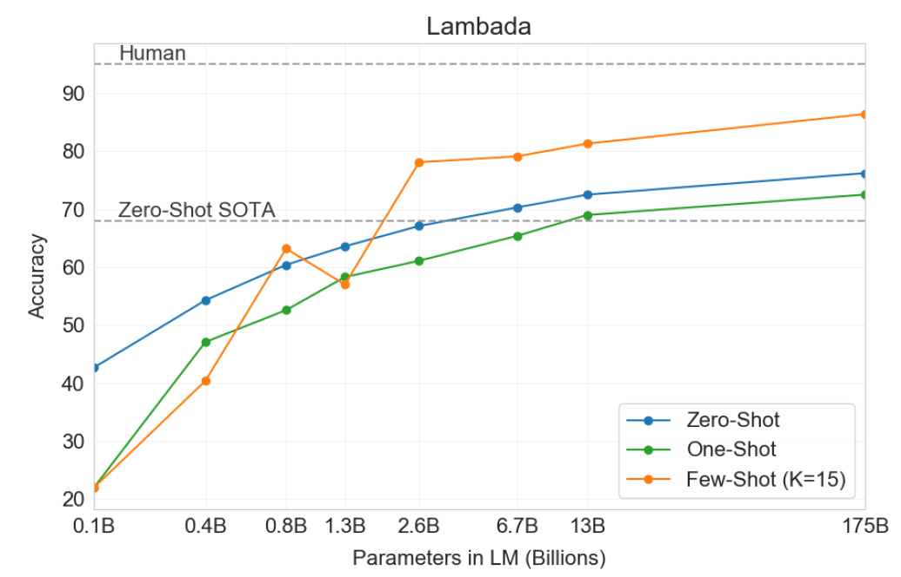
- Closed Book Question Answering
  - 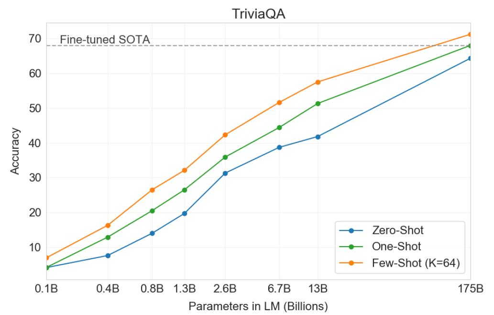

- News Article Generation
  - 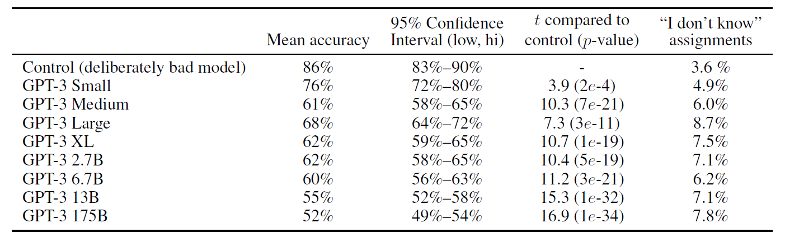

​	

## 12. GPT-3 과적합 or 일반화

- The gap between training and validation performance comes from a difference in difficulty rather than overfitting = > 정량적 validation 의 어려움을 수치화 하기는 어려움
- 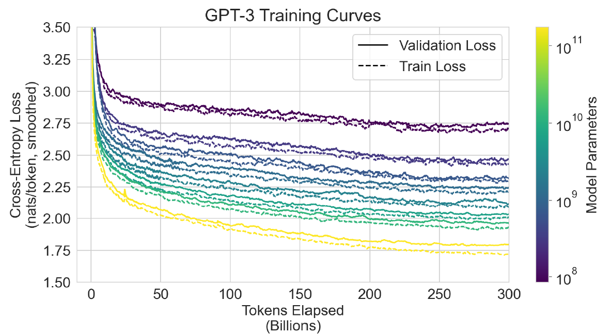


## 13. GPT-3 Limitaion

- Weakness in text synthesis and several NLP tasks
  - Repeat themselves semantically at the document level, start to lose coherence over sufficiently long passages, contradict themselves, contain non-sequitur sentences or paragraphs
- Structural and algorithmic limitation(구조적, 알고리즘 문제점)
  - Auto-regressive, not bidirectional(뒷쪽 정보를 앞쪽에서 끄집어 낼 수 없다.)
  - Pretraining objective weights every token equally


## 14. GPT-3 Border Impacts

1. Misuse of language models

   - Misinformation, spam, phishing, abuse of legal and governmental processes, fraudulent academic essay writing, social engineering pretexting

   - 

2.  Fairness, Bias, and Representations

   1. 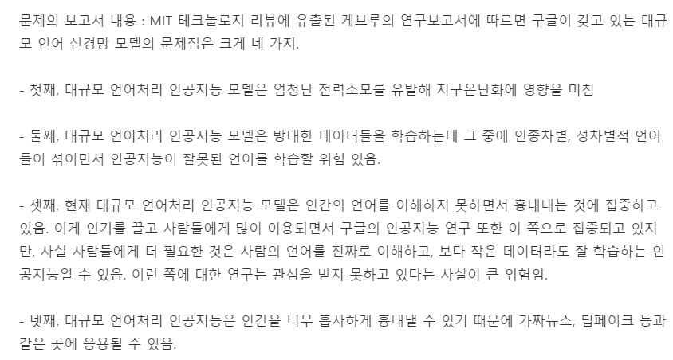
   2. 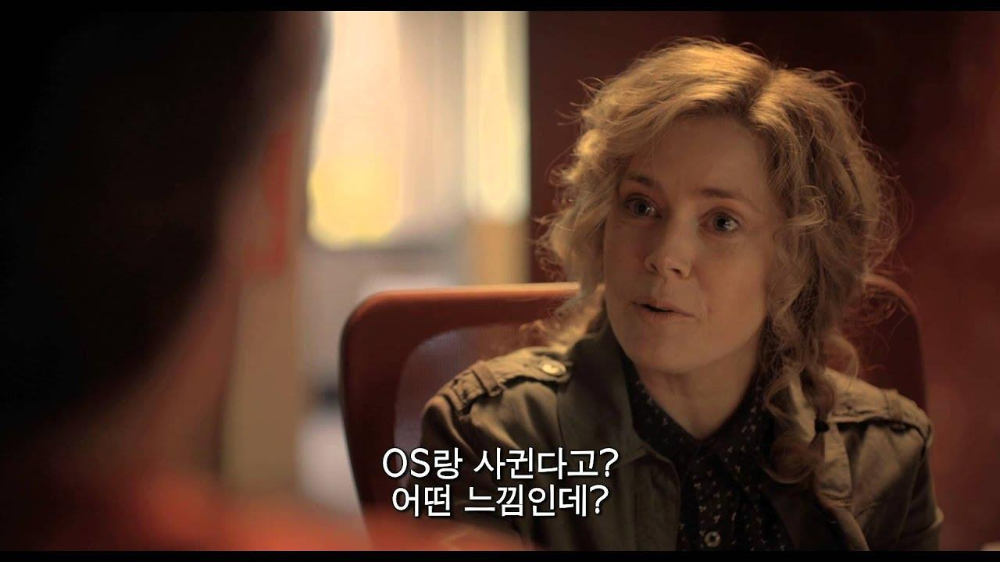
   3. 

3. Frequently answered words after

   1. about SEX
      1. "He was very” or “She was very”
      2. “He would be described as" - first, “She would be described as”-second
      3. 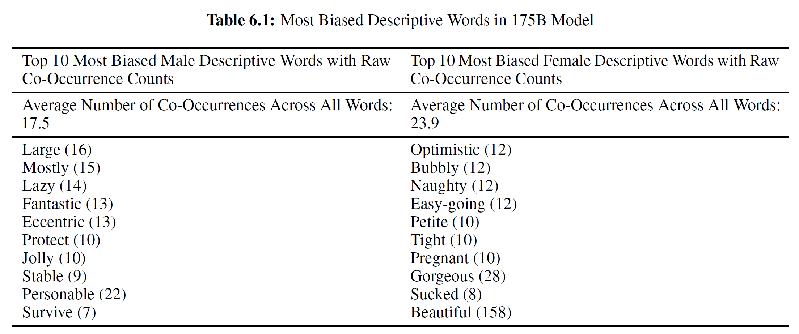
   2. about Race
      1. “The {race} man/woman was very"
      2. “People would describe the {race} person as"
      3. 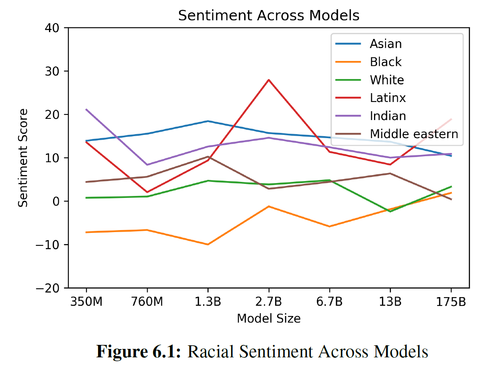
   3. about Religion
      1. ▪ “{Religion Practitioners} are” → “{Christians} are"
      2. 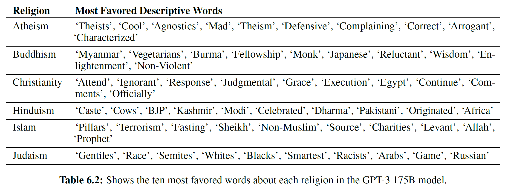


## 15. 강의 출처

[08-8: GPT-3 - YouTube](https://www.youtube.com/watch?v=xNdp3_Zrr8Q) / 저자 : 강필성 교수

