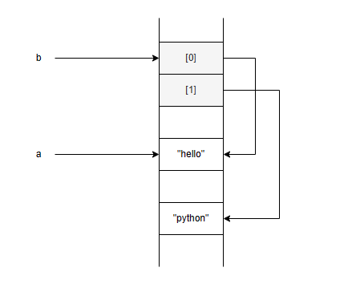
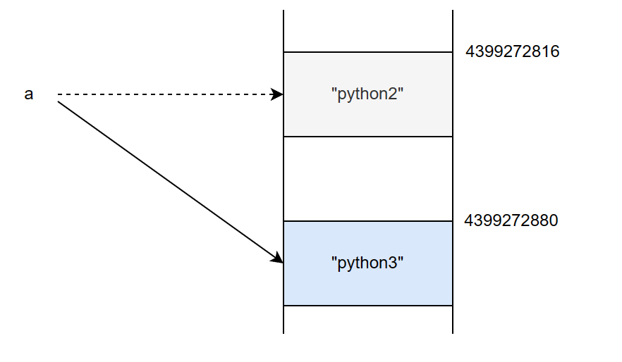
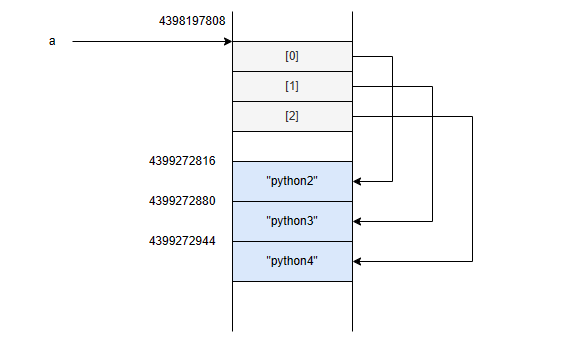

[toc]

# Immutable과 Mutable

## 1. 파이썬 리스트를 그림으로 표현하기

```python
a = "hello"
b = ["hello", "python"]
```

변수 a는 문자열 객체를 바인딩하고 변수 b는 리스트 객체를 바인딩합니다. a, b 변수가 바인딩하는 각 객체의 주소를 출력해보면 서로 다름을 확인할 수 있습니다.

```python
id(a)
id(b)
```

a라는 변수가 바인딩하는 "hello"라는 문자열 객체와 b 리스트의 `[0]`이 바인딩하는 문자열 'hello'가 동일한 객체일까요? 주소 값을 출력하여 확인해보면 같은 객체임을 알 수 있습니다.

```python
print(id(a))
print(id(b[0]))
```




## Immutable과 Mutable

파이썬에서 객체는 수정 가능한 타입도 있고 수정 불가능한 타입도 있습니다. 여기서 수정 불가능한 객체를 immutable 객체라고 부르고 수정 가능한 객체를 mutable 객체라고 부릅니다. 우리가 알고 있는 **파이썬 기본 데이터 타입 중 정수, 실수, 문자열, 튜플이 대표적인 immutable 객체이고 리스트와 딕셔너리가 mutable 객체입니다.**

| 구분           | 타입                   |
| :------------- | :--------------------- |
| Immutable 객체 | int, float, str, tuple |
| Mutable 객체   | list, dict             |

```python
a = "python2"
print(id(a))
a = "python3"
print(id(a))
```

```tex
4399272816
4399272880
```

위 코드는 다음과 같은 순차적으로 수행됩니다.

```tex
1) 'python2'라는 문자열 객체가 메모리의 4399272816 번지에 할당되고 해당 객체를 a라는 변수가 바인딩합니다.
2) 'python3'라는 문자열 객체가 메모리의 4399272880 번지에 할당되고 해당 객체를 a라는 변수가 바인딩합니다. 
3) 'python2'라는 문자열 객체는 아무도 자신을 참조하지 않기 때문에 가비지 컬렉터에 의해 자동으로 메모리에서 소멸됩니다. 
```

문자열 객체는 수정 불가능하기 때문에 기존 객체는 그대로 있고 새로운 문자열 객체가 생성되게 됩니다.   변수가 새로 생성된 문자열 객체를 바인딩하게 되면 기존 문자열 객체는 가비지 컬렉터에 의해 자동으로 소멸됩니다. 



이번에는 리스트에 대해서 수정을 해봅시다. a라는 변수는 리스트 객체를 바인딩합니다. 리스트에 값을 추가해도 리스트 객체의 시작 주소 값은 변하지 않음을 알 수 있습니다.

```python
>>> a = ["python2", "python3"]
>>> id(a)
4398197808
>>> a.append("python4")
>>> a
['python2', 'python3', 'python4']
>>> id(a)
4398197808
>>> id(a[0])
4399272816
>>> id(a[1])
4399272880
>>> id(a[2])
4399272944
```

