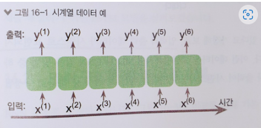

[toc]

## 시퀀스 데이터

말 그대로 순서가 있는 데이터

다른 데이터타입과 다르게 시퀀스는 특별한데, 왜냐하면 **시퀀스 원소들은 특정 순서를 가지므로 독립적이지 않기 때문이다.**

일반적으로 지도학습의 머신러닝 알고리즘은 입력데이터가 '독립 동일 분포'라고 가정한다.

예를 들어, n개의 데이터 샘플이 있을 때 머신러닝 알고리즘을 훈련에서 데이터를 사용하는 순서는 상관이 없다.

x와 y는 시간을 따라 순서대로 나열되어 있으며, 위 첨자는 샘플의 순서를 나타낸다.

대표적인 시퀀스 데이터가 **시계열 데이터(시간의 흐름에 따라 기록된 데이터) 와 텍스트데이터(텍스트도 쪼개어 보면 시간에 따라 문맥이 존재함. 즉 순서가 존재)**

- 시퀀스 데이터 : 연관된 연속의 데이터를 지칭하며 소리, 문자열, 주가등 의 데이터를 나타낸다.
- **시퀀스 데이터는 연속된 데이터이므로 순서가 매우 중요하게 작용한다.(CNN에서 활용하는 이미지 데이터는 시퀀스 데이터와는 거리가 멀다.)**
- **과거의 영향을 받기 때문에 과거 정보의 맥락을 고려하는 새로운 모델이 필요 하였다.(CNN은 과거의 데이터의 영향을 고려하지 않는 모델)**

### 시계열 데이터

시계열란 일정한 시간동안 수집 된 **일련의 순차적**으로 정해진 데이터 셋의 집합 입니다. 시계열 데이터의 특징으로는 시간에 관해 순서가 매겨져 있다는 점과, 연속한 관측치는 서로 상관관계를 갖고 있습니다.

- 특징이 순서를 가지므로 순차 데이터이다.

 즉, **시계열 데이터의 분석 목적은 시계열이 갖고 있는 법칙성을 발견해 이를 모형화하고, 또 추정된 모형을 통하여 미래의 값을 forecasting 하는 것입니다.**

### 시계열 데이터 종류

- 심전도 신호
- 주식 시세
- 음성신호

 

### 시퀀스 모델링

#### 종류

1. **다대일 모델링**

**입력 데이터가 시퀀스**로, 출력은 시퀀스가 아니라 고정 크기의 벡터임

ex) 감성분석 : **텍스트데이터** (입력)=> 감성 클래스 분류(출력)

2. **일대다 모델링**

입력데이터가 시퀀스가 아닌 일반적인 형태이며, **출력이 텍스트 데이터**이다.

ex) 이미지_캡셔닝 : 이미지데이터(입력)=> 텍스트 데이터(출력)

3. 다대다 모델링

입력과 출력 배열이 모두 시퀀스 데이터

- 동기적인 다대다 모델링
  - **비디오 분류 : 비디오데이터(입력)=> 시간 순서에 따른 비디오분류 라벨(출력)**
- 비동기적 다대다 모델링
  - **번역 : 한 언어의 텍스트 데이터 (입력)=> 다른 언어의 텍스트 데이터(출력)**