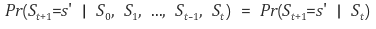
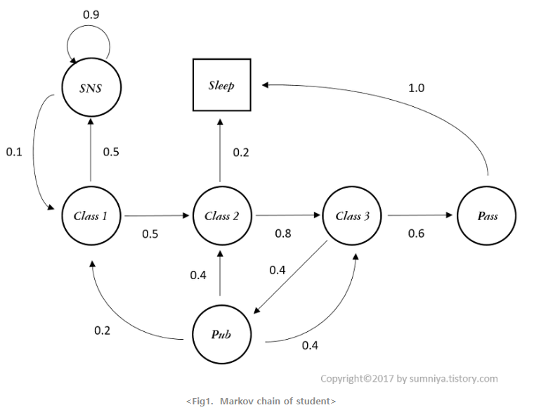
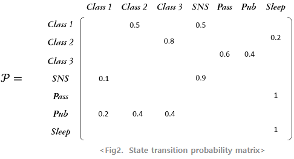
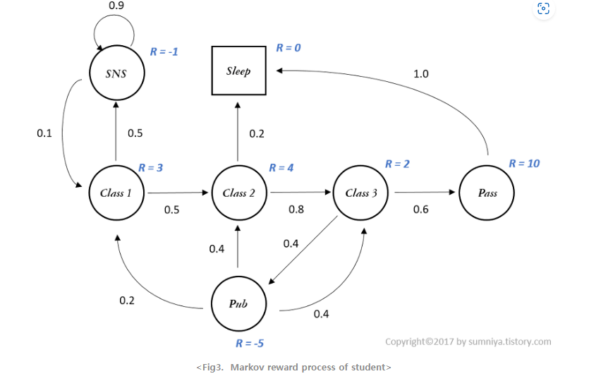

[toc]

# ch2. Markov Decision Process

## Markov Process(MP, Markov Chain)

 Markov Process의 정의부터 알아봅니다. Wikipedia에 따르면, Markov Process는 다음과 같은 정의를 같습니다.

> 확률론에서 마르코프연쇄는 메모리를 갖지 않는 이산 시간 확률 과정이다.

우선 **확률 과정**이라고 함은, 시간이 진행 함에 따라 상태가 확률적으로 변화하는 과정을 의미합니다. 확률론적으로 접근하자면, 어떠한 확률 분포를 따르는 random variable이 discrete한 time interval마다 값을 생성해내는 것을 의미합니다. 이때 time interval이 discrete하고 현재의 state가 이전 state에만 영향을 받는 확률 과정이 바로 **Markov Process**입니다. 

### Markov Property

그럼 다른 확률 과정과 구분되는 Markov Process는 무엇일까요? 이름에서도 나타나듯 바로 Markov property를 갖는 확률 과정이 다른 확률 과정과 다른 점이라고 할 수 있습니다. **Markov property**란, 어떤 시간에 특정 state에 도달하든 그 이전에 어떤 state를 거쳐왔든 다음 state로 갈 확률은 항상 같다는 성질입니다. 이 때문에 memoryless property 라고도 부르기도 합니다. 

 수식적으로 보자면, 

0부터 t시간 까지의 여러 state를 거쳐오고 t+1시간에 s'라는 state에 도달할 확률(좌변)이 바로 직전 t시간의 state에서 state s'로 올 확률이 같다는 것을 나타냅니다. 0부터 t-1시간까지의 정보는 이미 t시간의 state가 가지고 있다는 가정이 전제되어 있는 것입니다.

> 현재의 상태만이 다음 상태로 갈 확률에 영향을 미친다.

 위 그림은 학생의 일과에 대한 Markov Chain입니다**. 한 state에서 다른 state로 이동할 확률의 합은 1을 유지한 상태로 여러 state들이 연쇄적으로 이어져있습니다.** 위 그래프에서 'sleep' state는 모양이 조금 다른데 이를 terminal state라고 부릅니다. sleep 상태에 빠지게되면 다시 다른 state로의 이동이 없는, 마지막 state가 되기때문입니다. 이렇게 무한대의 시간이 지나고 나면 terminal state로 수렴하는 것을 stationary distribution이라고 부릅니다. 

### State Transition Probability Matrix (상태 전이 확률 행렬)

State들간에 이동하는 것을 전이(transition)이라고 하는데, 이를 확률로 표현하게 됩니다. 이를 state transition probability라고 하고 수식으로는 다음과 같이 씁니다.
$$
P_{ss'} = Pr(S_{t+1} = s'| S_t = s)
$$
그리고 위 그래프에 나온 상태 전이 확률을 아래와 같이 행렬의 형태로 정리한 것을 **state transition probability matrix**라고 합니다. 

## Markov Reward Process(MRP)

### Reward

Markov Process에 Reward의 개념을 추가한 것이 Markov Reward Process입니다. MP에서는 각 state별 transition 확률이 주어져 있다할 뿐이지, 이 state에서 다음 state로 가는 것이 얼마나 가치가 있는지는 알 수 없습니다. 이를 정량화하기 위해 도입한 개념이 **Reward** 입니다.

> Reward는 상태 전이에 대한 가치를 나타낸다.

위에서 예시로 든 MP에 Reward를 추가

이렇게 각 state별로 reward의 개념이 적용되어 어떠한 state가 어떠한 가치(value)를 갖게 되는지 보이게 됩니다. 이렇게 되면, state를 받아 reward의 기댓값으로 mapping하는 함수를 ℛs 라고 할때, 다음과 같이 수식으로 표현할 수 있습니다.
$$
R_s = E[r_{t+1}\,|\,S_t = s]
$$
이는 또한 바로 다음시간, t+1에 얻을 수 있는 보상이기 때문에 **immediate reward**라고 합니다.

### Discounting factor(할인 요인)

하지만 state의 정확한 가치를 구하기 위해서는 어느 시점에서 reward을 얻느냐도 중요한 관점이다. 즉, '특정 state에 당장 도달해서 지금 reward를 얻을 것이냐? 아니면 나중에 도달해서 reward를 얻을 것이냐?'에 대한 가치판단이 필요합니다. 이 가치판단이 필요한 이유를 두 가지 상황에서 생각해보겠습니다.

- 어떤 agent가 time interval 마다 reward가 0.1씩 얻도록 state가 변하는 것과 1씩 얻도록 변하는 것을 시간이 무한대일 때 어떠것이 가치가 높다고 판단할 수 있을 까요?
- reward가 0인 state를 반복하다 마지막 state에서 reward를 1받고 끝났습니다. 하지만 시작 state에서 1을 받고 마지막 state까지 reward를 계속 0으로 받는 다면, 이 둘 중 어떤 것을 더 가치있다고해야 할까요? 

실생활에서 돌아보면, 우리가 은행에 돈을 넣어두면 이자가 붙게되는데 이 이자는 현재가치와 미래가치의 가치판단을 하게 해주는 척도입니다. 현재가치와 미래가치는 그럼 어떤 것이 높은 걸까요? 

 (현재가치)에 (이자 : 현재가치 * 이자율)를 더하면 (미래가치)가 됩니다. 그럼 (현재가치) < (미래가치) 인걸까요? 이때 시간의 개념이 필요합니다. (현재가치)는 t시간이고 (미래가치)는 t시간보다 더 미래의 시간입니다. 미래가치는 t시간으로부터 충분히 시간이 지나고, 그에 따른 이자가 붙어야지만 현재가치와 동일해집니다. 즉, 미래가치를 현재 시점으로 보면, 현재가치보다 적은 것입니다. 이를 수식적으로 반영한 것이 **discounting factor,** **γ**입니다. **보통 γ는 0과 1사이의 값으로 하여 미래가치를 현재 시점에서의 가치로 변환합니다.** 

### Return

그러면 우리는 immediate reward뿐만 아니라, 먼 미래에 얻을 수 있는 total reward에 대해 고려할 수 있게 됩니다. 이를 **Return**이라고 하고 다음과 같이 씁니다. 

여기서 R은 위에서 언급한 immediate reward입니다. Return은 각 시점에서의 immediate reward들을 현재가치로 환산하여 합한 것이라고 생각하시면 도빈다.

### Value Function of MRP

이제 MRP에서 state의 가치를 표현할 수 있는 모든 요소가 나왔습니다. state의 가치를 표현하는 함수를 Value function이라고 하며, 어떠한 state에서 미래에 얻을 수 있는 모든 reward를 더한 것의 expectation입니다.
$$
V(s) = E[G_t\,|\,S_t = s]
$$
state s에서 이동 가능한 state들의 scenario들을 따라 그 state들의 reward에 discounting factor를 적용하여 모두 더한 값이 state s에서의 가치 V(s)가 됩니다. 즉, 이동가능한 scenario들마다 return 값이 생기게 되고 모든 scenario에서의 return 값의 expectation이 V(s)라고 생각하시면 됩니다. 따라서 return값은 scenario에 따라 여러 개가 나올 수 있지만, 가능한 모든 scenario에 대해 기대하는 값인 V(s)는 해당 state에서 하나 존재하게 됩니다.

> 가치 함수가 기대값인 이유. 특정 시점 t, 상태 s에서 이동 가능한 scenario들은 여러가지이고, 이는 여러 return값 $$G_t$$를 생성하므로 해당 state에서 하나만을 지정하기위해 기댓값으로 지정
>
> state s에서의 가치 = state s의 한 시나리오의 모든 보상값에 감가율을 곱한 가중합 = 한 시나리오의 리턴값

## Markov Decision Process(MDP)

MP에사서 reward를 추가한 것이 MRP라면, MDP는 MRP에 action이라는 개념이 추가되면 policy라는 개념이 등장합니다.

**< Fig4. MP, MRP vs MDP >** 

 Ch.1에서 action의 주체는 agent였습니다. 이전**의 MP, MRP에서는 value를 Env.관점에서 매겼다면, action을 함으로써 agent의 관점에서 value를 평가하게 됩니다.** **즉, agent가 action을 취함에 따라 state를 변화시킬 수 있습니다.** 이렇게되면, 이제는 state에 대한 value뿐만 아니라 agent가 하는 action에 대해서도 value를 측정해야합니다. 이 부분은 뒤에서 다루겠습니다.

> agent는 action을 취함으로써 state s에대한 value를 평가한다. 
>
> state에 대한 value뿐만 아니라 agent가 하는 action에 대해서도 value를 측정해야한다.

### **Policy **

이 용어가 처음 등장하여, 이에 대해 매우 헷갈릴 수도 있습니다. 쉽게 말씀드리자면 **Policy**란, state에서 action을 mapping하는 함수라고 생각하시면 됩니다. 즉, 해당 state에서 어떤 action을 할 지를 정하는 것이 policy라고 생각하시면 됩니다.

수식으로는 다음과 같이 state s에서 action a를 수행할 확률로 정의됩니다.

**강화학습의 목적은 return을 최대화 하는 policy를 찾는 것입니다. state에 도달할때마다 return을 최대화하는 action을 선택하는 함수를 찾는 것이라고 이해하면 조금 더 와닿을지 모르겠네요.** 

### Policy vs Transition probability

잠시 혼동될 수 있는 개념을 짚고 가겠습니다. Policy는 state s에서 action a를 취할 확률이라 했습니다. 근데 비슷한 개념을 앞에서 다루었는데요, state s에서 다음 state s'로 변할, 전이할 확률을 transition probability라고 했습니다. 앞서 말씀드린 transition probability가 MDP에서는 action이란 개념이 추가되어 다음과 같이 쓸 수 있습니다.

 이제 Policy와 Transition probability를 다음과 같이 구분할 수 있습니다.

- **Policy : state s에서 action a를 할 확률**

- **Transition probability : state s에서 action a를 해서 state s'로 전이할 확률** 

transition probability는 state s에서 policy에 의해 action a까지 한 뒤에 그 결과로 state s'로 변할 확률이라고 이해하시면 편할 것 같습니다. 또한, reward도 이제는 state의 변화가 action에 따라 달라지므로, 다음과 같이 action a를 추가한 함수가 됩니다.

### Value function of MDP 

 이제 MDP에서 value에 대해서 다루어보겠습니다. MRP에서는 state들에 대한 value만 판단했었는데, 이제는 그에 더하여 새롭게 추가된 agent의 action에 대해서도 value를 판단할 수 있습니다. 각각의 value function들을 보기 이전에, MDP의 process를 차근차근 뜯어 보겠습니다. 아래 그림을 봐 주세요. (뒤에서 언급하겠지만 $V_π(s)$는 State-value function을, $q_π(s,a)$는 Action-value function을 말합니다.)

1. 시점에 state s에 놓인 agent가 policy에 따라 action a를 수행한다.

> return을 최대화하는 action a를 찾는다.

2. state s에서 action a를 수행하면 reward를 받는다.

3. 그리고 transition probability에 따라 state s'로 전이한다.

#### State-value function

 MDP에서는 state-value는 state에서 선택하는 policy에 따라 그 action이 달라지고, 이후 state가 달라지기 때문에 policy에 영향을 받습니다. 따라서 state-value function을 다음과 같이 $$π$$를 더하여 쓸 수 있습니다.

**MDP에서 State s의 가치는 해당 state에서 policy에 얻게 되는 reward들의 총합(return)을 나타냅니다.**

#### Action-value function

마찬가지로 agent가 하는 action에 대해서도 다음과 같이 value를 판단할 수 있습니다.

**MDP에서 Action a의 가치는 State s에서 policy에 따라 action을 취했을 때, 얻게 되는 reward들의 총합(return)을 나타냅니다.** 

 이렇게 가장 basic한 모델인 MP부터 MRP 그리고 MDP까지 차근차근 살펴봤습니다. MDP에서의 두 가지 value function들은 조금 곰곰히 생각해보면 서로 관계를 갖습니다. 

## 마치며

 state의 가치는 그 state에서 선택하는 policy에 따라 취하게 되는 action의 action-value function으로 판단할 수 있고, 

 action의 가치는 그 다음에 전이가능 state들의 가치로 판단할 수 있습니다. 

이렇듯 두 value function은 서로 연관성이 있어서 그 것을 식으로 표현할 수 있는데 이것이 다음 장에서 다룰 Bellman Equation입니다. 다음 포스팅에서는 이에 대해 다루겠습니다.
