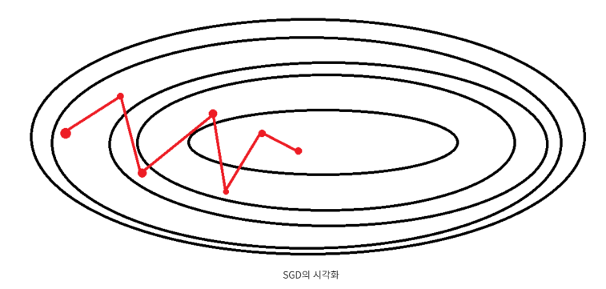

[toc]

# 경사 하강법

## 1. 개념

1차 근사값 발견용 최적화 알고리즘. 기본 개념은 **함수의 기울기(경사)를 구하고 경사의 절댓값이 낮은쪽으로 계속 이동시켜 극값에 이를 때 까지 반복시키는 것**

## 2. 머신러닝에서 쓰이는 이유

함수의 최솟값을 찾고자 할 때, 미분계수를 구함으로써 찾곤한다. 컴퓨터에서는 해당방법을 사용하지 않는 이유는 다음과 같다.

- 실제 분석에서(특히, 딥러닝 알고리즘을 활용하는 경우) 보게 되는 함수들은 형태가 굉장히 복잡해서 **미분계수와 그 근을 계산하기 어려운 경우가 많음**
- 미분계수 계산 과정을 컴퓨터로 구현하는 것보다, **경사하강법을 구현하는 것이 훨씬 쉬움**
- 데이터의 양이 매우 큰 경우 경사하강법과 같은 순차적인 방법이 **계산량 측면에서 훨씬 효율적**

지도 학습 알고리즘의 핵심 구성요소중 하나는 **학습과정동안 최적화하기 위해 정의한 목적함수입니다.** **종종 최소화 하려는 비용함수가 목적함수가 됩니다.**

## 3. 공식 유도

경사하강법은 **함수의 기울기(=gradient)를 이용해서 함수의 최소값 일 때의 x값을 찾기 위한 방법**이다. 기울기가 양수인 경우는 *x* 값이 증가할수록 함수 값도 증가하고, 반대로 음수인 경우에는 *x* 값이 증가할수록 함수 값이 감소한다. 그리고 기울기 값이 크다, 기울기가 가파르다는 것은 최소값으로부터 거리가 멀다는 뜻이다. 극값에서 주로 최솟값을 가진다.

이 점을 이용해서 **기울기가 양수라면 음의 방향**으로 *x*를 옮기면 되고, **기울기가 음수라면 양의 방향**으로 *x*를 옮기면 된다.
$$
x 
_{i+1}
​
 =x 
_{i}
​
 −이동거리×기울기의 부호
$$
식에서는 기울기의 부호는 알 수 있지만. 이동거리는?

미분 계수는 극소값에 가까워 질수록 값이 작아진다. 따라서, **이동거리에는 미분계수와 비례하는 값을 이용한다.** 그럼 극소값에서 멀 때는 많이 이동하고, 극소값에 가까울 때는 조금씩 이동할 수 있다.
$$
x _{i+1}=x _{i}-a{\operatorname{df}\over\operatorname{dx}}
$$

- **Step size(= *α*)**

**step size 선택은 매우 중요**하다. Step size가 큰 경우 이동 거리가 커지므로 빠르게 수렴할 수 있다는 장점이 있지만, 최소값으로 수렴되지 못 하고 함수값이 발산할 여지가 있다.
한편, step size가 너무 작으면 발산하지는 않겠지만, 최소값을 찾는데 너무 오래 걸릴 여지가 있다.

- **Local minima**

우리가 찾고 싶은 건 global minima(함수 전체에서의 최소값)이지만, 어떤 경우에는 local minima에 빠져 벗어나지 못 하는 상황이 발생한다.

하지만 최근에는 **실제로 딥러닝이 수행될 때, local minima에 빠질 확률이 거의 없다**고 한다.
위의 그래프는 가중치(w)가 1개인 모델이지만 실제 딥러닝 모델에서는 w가 수도 없이 많고, 그 수 많은 w가 모두 local minima에 빠져야 w 업데이트가 정지된다. 이론적으로 거의 불가능에 가까운 일이므로, 사실상 local minima는 고려할 필요가 없다는 것이 중론이다.

## 4. 특성 스케일을 조정하여 경사 하강법 결과 향상

표준화 - 가장 대표적으로 사용되는 스케일링

이 정규화 과정은 데이터에 평균이 0이고, 단위분산을 갖는 표준 정규 분포의 성질을 부여하여 경사 하강법학습이 좀 더 빠르게 수렴되도록 돕습니다.

## 5. 배치경사 하강법

GPU가 CPU보다 유리한 점은 병렬 연산이다. **배치는 GPU가 한번에 처리하는 데이터의 묶음**을 의미한다.

전체학습 데이터를 하나의 배치로(배치 크기가 n)묶어 학습시키는 경사 하강법

전체 데이터에 대한 모델의 오차의 평균율 구한 다음 , 이를 이용하여 미분을 통해 경사를 산출, 최적화를 진행한다.

**배치는 1 epoch당 사용되는 training dataset의 묶음이며, epoch의 의미는 훈련 세트를 한 번 모두 사용하는 과정을 의미합니다.**

### 배치 경사 하강법의 특징

- BGD은 한 스텝에 전체 데이터를 이용하기 때문에 연산 횟수가 적습니다.(1 epoch 당 1회 update)
- 전체 데이터를 모두 한 번에 처리하기 때문에, 메모리가 가장 많이 필요하다.
- 항상 같은 데이터 (전체 데이터)에 대해 경사를 구하기 때문에, 수렴이 안정적이다. (아래 그림 참고)
- 최적해에 대한 수렴이 안정적으로 진행됩니다.
- 보통 딥러닝 라이브러리에서 배치를 지정하지 않으면 이 방법을 쓰고 있다고 생각할 수 있다.
- 여기서의 **배치(Batch)**의 의미는 *전체 데이터셋*을 의미합니다.

## 6. 확률적 경사 하강법 (Stochastic Gradient Descent: SGD)

- 확률적 경사 하강법은 전체 데이터 중 **단 하나의 데이터를 이용하여 경사 하강법을 1회 진행(배치 크기가 1)**하는 방법이다.
- 전체 학습 데이터 중 랜덤하게 선택된 하나의 데이터로 학습을 하기 때문에 확률적 이라 부른다.

### SGD 특징

- 데이터로 학습할 수 있고, 속도가 빠른 장점이 있다. 무엇보다 큰 특징은 **수렴에 Shooting이 발생**한다는 점이다.
- 수렴속도는 빠르지만 각 데이터에 대한 손실값의 기울기는 약간씩 다르기 때문에 shooting 이 발생한다.
- 그러나 결국 학습 데이터 전체에 대해 보편적으로 좋은 값을 내는 방향으로 수렴한다. 다만, 최저점에 안착하기는 어렵다.

- 온라인 학습으로 사용할 수도 있다.
  - 새로운 훈령 데이터가 도착하는 대로 훈련이 됩니다.
  - 예를 들어 고객 데이터를 처리하는 웹 애플리케이션입니다.
  - 온라인 학습을 사용해서 시스템은 변화에 즉시 적응합니다.

## 7. 미니 배치 경사 하강법
배치 경사하강법과 확률적 경사하강법의 절충안으로, 전체 훈련세트를 1~M 사이의 적절한 batch size로 나누어 학습하는 것입니다.

- 예를 들어, 전체 훈련세트가 5000000개일 때, 배치 사이즈를 100000개라고 한다면, 50개의 묶음이 나오게 되므로 기울기는 1 Epoch 당 50번 업데이트 됩니다.

## 8. 정리

- 배치 사이즈는 경사 하강법 1회 업데이트에 사용되는 데이터의 사이즈입니다.

- 배치 사이즈에 따라 아래와 같이 나눌 수 있습니다.
  - 배치 경사 하강법 (BGD)
    - 배치 크기 == 전체 학습 데이터
  - 확률적 경사 하강법 (SGD)
    - 배치 크기 == 1
  - 미니 배치 확률적 경사 하강법 (MSGD)
    - 배치 크기 == 사용자가 지정

- 배치 사이즈에 따라 아래와 같이 나눌 수 있습니다.
  - 배치 경사 하강법 (BGD)
    - 배치 크기 == 전체 학습 데이터
  - 확률적 경사 하강법 (SGD)
    - 배치 크기 == 1
  - 미니 배치 확률적 경사 하강법 (MSGD)
    - 배치 크기 == 사용자가 지정
