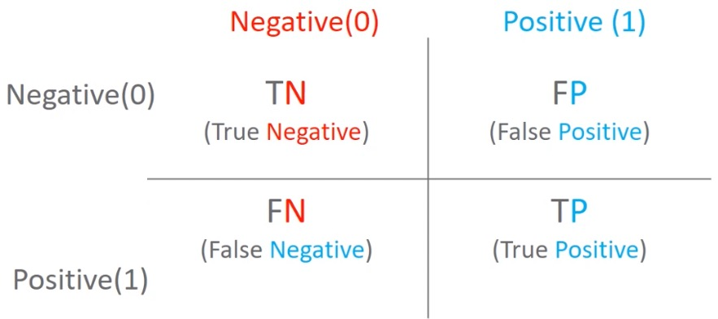

[toc]

# 이진분류 성능 평가 지표

## 1. 정확도

$$
정확도(Accuracy) = \frac{예측결과가 동일한 데이터 건수}{전체 예측 데이터 건수}
$$

- 정확도는 직관적으로 모델 예측 성능을 나타내는 평가지표입니다. 하지만 이진 분류의 경우 데이터 구성에 따라 ML모델의 성능을 왜곡할 수 있기 때문에 정확도 수치 하나만 가지고 성능을 평가하지 않습니다.
- 특히 정확도는 불균현한 레이블 값 분포에서 ML모델의 성능을 판 단할 경우, 적합한 평가 지표가 아닙니다.
- ex) 타이타닉생존자 예측에서 여성은 모두 생존으로 판별 => 데이터의 불균형
- MINIST 데이터셋을 Multi classifiaction에서 binary classifiacion으로 변경 => 왜곡

## 2. 오차행렬

오차 행렬은 이진 분류의 예측 오류가 얼마인지와 더불어 어떠한 유형의 예측 요류가 발생생하고 있눈지를 함께 나타내는 지표입니다.

- 행이 실제클래스(Actual Class), 열이 예측클래스(predicted Class)



### 오차 행렬을 통한 정확도 지표 문제점 인지

|            |          | 예측클래스 | 예측클래스 |
| :--------: | :------: | :--------: | :--------: |
|            |          |  Negative  |  Positive  |
| 실제클래스 | Negative |  TN(75개)  |  FP(25개)  |
| 실제클래스 | Positive |  FN(50개)  |  TP(50개)  |

- 정확도 : 예측 결과와 실제 값이 동일한 건수 / 전체 데이터
  - (TN+TP) / (TN+TP+FN+FP)
  - 여기서는 125/200 = 62%

- 정밀도 : 예측 Positive 중 Positive정답 비율

  - 정밀도 : TP/ (FP+TP)
  - 정밀도는 예측을 Positive로 한 대상 중에 예측과 실제 값이 Positive로 일치한 데이터의 비율을 뜻합니다.
  - precision_score()

- 재현율 : 실제 Positive중 Positive정답 비율

  - 재현율 : TP / (FN+TP)
  - 실제값이 Positive인 대상 중에 예측과 실제 값이 Positive로 일치한 데이터의 비율을 뜻합니다.
  - recall_score()

- 오차 행렬, 정확도, 정밀도, 재현율을 한꺼번에 계산하는 함수 생성

- ```python
  from sklearn.metrics import accuracy_score, precision_score, recall_score, confusion_matrix
  def get_clf_eval(y_test, pred):#인자로는 (실제레이블, 예측레이블)
      #오차행렬
      confusion = confusion_matrix(y_test, pred)
      accuracy = accuracy_score(y_test, pred)
      precision = precision_score(y_test, pred)
      recall = recall_score(y_test,pred)
      
      print('오차행렬')
      print(confusion)
      print('정확도 : {0:.4f}, 정밀도 : {1:.4f}, 재현율: {2:.4f}'.format(accuracy,precision,recall),'\n')
  ```

### 3. 정밀도와 재현율의 (trade-off) 관계

- 재현율(TP/(FN+TP))이 상대적으로 더 중요한 지표인 경우에는 실제 Positive양성인 데이터 예측을 Negative로 잘못 판단하게 되면 업무상 큰 영향이 발생하는 경우 : 암 진단, 금융사기 판별=>**가급적 양성이라고 하고 확인하는 것이 나은 경우**
- 정밀도(TP/(FP+TP))이 상대적으로 더 중요한 지표인 경우에는 실제 Negative 음성인 데이터를 예측을 Positive 양성으로 잘못 판단하게 되면 업무상 큰 영향이 발생하는 경우 : 스팸메일=> **가급적 음성이라 하고 확인하는 것이 나은 경우**
- 분류하려는 업무의 특성상 정밀도 또는 재현율이 특별히 강조돼야 할 경우 분류의 결정 임계값을 조정해 정밀도 또는 재현율의 수치를 높일 수 있습니다.
- 하지만 정밀도와 재현율은 상호보완적인 평가 지표이기 때문에 어느 한쪽을 강제로 높이면 다른 하나의 수치는 떨어지기 쉽습니다. 이를 트레이드오프라고 부릅니다.

### 4. 분류 결정 임계값에 따른 Positive예측 확률 변화

- 정밀도 : TP/ (FP+TP) : 예측을 Positive로 한 대상중에 예측과 실제가 Positive로 일치한 데이터 비율
- 재현율 : TP / (FN+TP) : 실제값이 Positive인 대상중에 예측과 실제가 Positive로 일치한 데이터 비율
- 분류결정 **임계값이 낮아질 수록 Positive로 예측할 확률이 높아짐. 재현율 증가**
  - 사이킷런 Estimator객체의 predict_progba()메소드는 분류 결정 예측 확률을 반환합니다.
  - 이를 이용하면 임의로 분류 결정 임계값을 조정하면서 예측 확률을 변경할 수 있습니다.
- 분류 결정 임계값에 따른 정밀도, 재현율 곡선

```python
#테스트 데이터(타이타닉)의 분류 결정 예측 확률을 반환해준다.
pred_proba = lr_clf.predic_proba(X_test)
pred_proba.shape
pred_proba[:10]
#샘플이 클래스 Negative[0]가 될 확률, Positive[1]가 될 학률을 반환
array([[0.46175211, 0.53824789],
       [0.87863924, 0.12136076],
       [0.87717092, 0.12282908],
       [0.88269294, 0.11730706],
       [0.85528973, 0.14471027],
       [0.88225767, 0.11774233],
       [0.88838772, 0.11161228],
       [0.20882912, 0.79117088],
       [0.78290779, 0.21709221],
       [0.3693535 , 0.6306465 ]])

#테스트 데이터 predict 결과(벡터)
pred = lr_clf.predict(X_test)
```


#### 1. 예측 확률(pred_proba)와 예측결과값(pred)을 결합해서 비교해 보자

```python
#예측 결과값은 1차원 벡터이므로 2차원으로 변환 후 concat
pred_proba_result = np.concat([pred_proba,pred.reshape(-1,1)],axis=1)
```

#### 2. Binarizer: 요소들이 기준값보다 큰지 작은지를 알려주는 함수

- <Binarizer>
  - 요소가 기준값(threshold)와 비교해서, 같거나 작으면 0을 반환, 크면 1을 반환
- 분류 임계값 0.5로 예측값 변환(Binarizier)

```python
from sklearn.preprepreocessing import Binarizer
#predict_proba의 두번째 칼럼, 즉 Positive컬럼을 추출한 후
#(1차원이니 2차원으로 reshape으로 해준다.)
pred_proba_1 = pred_proba[:,1].reshape(-1,1)

#Binarizer를 적용 - 0.5를 임계값으로 설정
custom_threshold = 0.5
binarizer = Binarizer(threshold=custom_threshold).fit(pred_proba_1)
#해당 배열을 임계값 기준으로 이진화시켜준다.
custom_predict = binarizer.transform(pred_proba_1)
get_clf_eval(y_test, custom_predict)
'''
오차 행렬
[[104  14]
 [ 13  48]]
정확도: 0.8492, 정밀도: 0.7742, 재현율: 0.7869
'''

```

- 분류 임계값을 0.4로 낮춰서 예측값을 보면 재현율이 높아진다.  **Positive로 예측할 확률이 높아짐**

```python
custom_threshold = 0.4
#2차원으로
pred_porba_1 = pred_porba[:1].reshape(-1,1)
binarizer = Binarizer(threshold=custom_threshold).fit(pred_proba_1)
#행렬에 Binarizer를 적용하면 1 or 0을 예측한다.
custom_predict = binarizer.transform(pred_proba_1)

get_clf_eval(y_test,custom_predict)
'''
오차 행렬
[[98 20]
 [10 51]]
정확도: 0.8324, 정밀도: 0.7183, 재현율: 0.8361
'''

```

#### 3. precision_recall_curve( ) 를 이용하여 임곗값에 따른 정밀도-재현율 값 추출

```python
from sklearn.metrics import precision_recall_curve

#레이블 값이 1일 예측 확률들을 추출
pred_proba_class1 = lr_clf.predict_proba(X_test)[:, 1]

print(pred_proba_class1.shape)
pred_proba_class1

#실제값과 예측 확률(레이블 값이 1일 때)을 precision_recall_curve인자로 입력
precision, recalls, thresholds = precision_recall_curve(y_test, pred_porba_class1)
# 벡터를 반환시킨다.
print('분류 임곗값 Shape  :', thresholds.shape, '\n')

print('precisions Shape:', precisions.shape)
print('recalls Shape   :', recalls.shape)
```


#### 4. 임계값의 변경에 따른 정밀도-재현율 변화 곡선을 그림

```python
import matplotlib.pyplot as plt
import matplotlib.ticker as ticker
%matplotlib inline
# 정밀도, 재현율 변화 그래프 그리는 코드
def precision_recall_curve_plot(y_test, pred_proba_c1):
    precisions, recalls, thresholds = precision_recall_curve(y_test, pred_proba_c1)
    # X축을 threshold값으로, Y축은 정밀도, 재현율 값으로 각각 Plot 수행. 정밀도는 점성능로 표시
    plt.figure(figsize=(8,6))
    threshold_boundary = thresholds.shape[0] #임계값 개수
    plt.plot(thresholds,precisions[0:threshold_boundary], linestyle='--', label = 'precision')
    plt.plot(thresholds, recalls[0:thershold_boundary], label='recall')
    plt.title('Precision and recall by classification threshold')
    
    #threshold 값 X축의 Scale을 0,1 단위로 변경
    start, end=plt.xlim()
    #눈금들은 소수점 2이하 0~1사이의 수로
    plt.xticks(np.round(np.arange(start,end, 0.1),2))
    
    #x축, y축 label과 legend. 그리고 grid 설정
    plt.xlabel('Threshold value'); plt.ylabel('Precision and Recall value')
    plt.legend(); plt.grid()
    plt.show()
    

```


- 정밀도를 100%로 만드는법 => 가급적  음성이라고 한다.
  - 확실한 기준이 되는 경우만 Positive로 예측하고 나머지는 모두 Negetive로 예측합니다. 정밀도는 = TP/(TP+FP) 입니다. 전체 환자 1000명 중 확실한 Positive징후만 가진 환자는 단 1명이라고 하면 이 한명만 Positive로 예측하고 나머지는 모두 Negative로 예측하더라도 FP는 0, TP는 1이 되므로 정밀도는 1/(1+0) 으로 100%가 됩니다.
- 재현율을 100%로 만드는법 => 가급적 양성이라고 한다.
  - 모든 환자를 Positive로 예측하면 됩니다. 재현율 = TP/ (TP+FN) 이므로 전체 환자 1000명을 다 Positive로 예측하면 이중 실제 양성인 사람이 30명 정도라도 TN이 수치에 포함되지 않고 FN은 아예 0이므로 30/(30+0)으로 100%가 됩니다.

**전체 데이터를 예측하는 거지만 예측을 지정하고 실행하는 것이 아닌 한 샘플에 대한 각 클래스별 소속 확률을 바탕을 예측을 진행한다.**

## 3. F1 스코어

`F1스코어`는 **정밀도와 재현율을 결합한 지표**입니다. F1스코어는 정밀도와 재현율이 어느 한쪽으로 치우치지 않는 수치를 나타낼 때 **상대적으로 높은 값**을 가집니다.
$$
F1 = \frac{2}{\frac{1}{recall}+\frac{1}{precision}} = 2*\frac{precision*recall}{precision+recall}
$$

- 정밀도와 재현율을 두 개의 값이 비슷할 때 F1 Score는 가장 큰 값을 가진다.

- 만일 A예측 모델의 경우 정밀도가 0.9, 재현율이 0.1로 극단적인 차이가 나고, B예측 모델은 정밀도가 0.5, 재현율이 0.5로 큰 차이가 없다면 A예측 모델의 F1 스코어는 0.18이고, B예측 모델의 F1스코어는 0.5로 B모델이 A모델에 비해 매우 우수한 F1 스코어를 가지게 됩니다.

- 사이킷런은 f1 score를 위해 f1_score()함수를 제공합니다.

- ```python
  from sklearn.metrics import f1_score
  
  # f1_score클래스를 이용해서 f1 score 계산
  f1 = f1_score(y_test,pred)
  print('F1 스코어: {0:.4f}',format(f1))
  ```

- 정밀도와 재현율의 수치가 비슷하면 상대적으로 높다는 것이지 항상 참인 명제는 아니다.

## 4. ROC곡선과 AUC

- `ROC곡선`과 이에 기반한 `AUC스코어`는 이진분류의 예측성능측정에서 중요하게 사용되는 지표입니다.
- 일반적으로 의학분야에서 많이 사용되지만, `머신러닝의 이진 분류 모델`의 예측 성능을 판단하는 중요한 평가 지표이기도 합니다.
- ROC곡선은 FPR(False Positive Rate)이 변할 때 TPR(True Positive Rate)이 어떻게 변하는지를 나타내는 곡선입니다.
- FPR을 X축으로, TPR을 Y축으로 잡으면 FPR의 변화에 따른 TPR의 변화가 곡선 형태로 나타납니다.
- `분류의 성능 지표`로 사용되는 것은 **ROC곡선 면적**에 기반한 `AUC값`으로 결정합니다.
- AUC(Area Under Curve)값은 ROC곡선 및의 면적을 구한 것으로서 **일반적으로 1에 가까울수록 좋은 수치입니다.**
- 

- TPR은 True Positive Rate의 약자이며, 이는 재현율을 나타냅니다. 따라서 TPR은 TP/(FN+TP)입니다. **TPR, 재현율은 민감도로도 불립니다.**
- FPR은 실제 Negative(음성)을 잘못 예측한 비율을 나타냅니다. 즉, 실제는 Negative인데 Positive또는 Negative로 예측한 것 중에 Positive로 잘못 예측한 비율을 나타냅니다. FPR= FP/(FP+TN)입니다.
- 사이킷런은 임계값에 따른 ROC곡선 데이터를 roc_curve()로, AUC 스코어를 roc_auc_score() 함수로 제공

|              API 명               |                         입력파라미터                         |                            반환값                            |
| :-------------------------------: | :----------------------------------------------------------: | :----------------------------------------------------------: |
|   roc_curve(y_true, pred_proba)   | - y_true: 실제 클래스 값 array<br />- pred_proba : predict_proba()의 반환값, array에서 Positive컬럼 예측 확율을 보통 사용 | fpr : fpr 값을 array로 반환<br />tpr : tpr값을 array로 반환<br />thresholds : threshold값 array 반환 |
| roc_auc_score(y_true, pred_proba) | y_true: 실제 클래스 값 array<br />- pred_proba : predict_proba()의 반환값, array에서 Positive컬럼 예측 확율을 보통 사용. Binary 분류시 shape = [n_sample] |                         AUC스코어 값                         |
|                                   |                                                              |                                                              |

```python
def roc_curve_plot(y_test, pred_proba_c1):
    #임계값에 따른 FPR, TPR값을 반환 받음
    fpprs, tprs, thresholds = roc_curve(y_test, pred_proba_c1)
    
    #ROC Curve를 plot곡선으로 그림
    plt.plot(fprs, tprs, label='ROC')
    
    #가운데 대각선 직선(random 값일 때)을 그림
    plt.plot([0,1],[0,1],'k--', label='Random')
    
    #FPR X축의 Scale을 0.1 단위로 변경, X,Y 축명 설정 등
    start, end = plt.xlim() # 그래프
    plt.xticks(np.round(np.arange(start,end,0.1),2))
    plt.xlabel('FPR(1-Specificity)'); plt.ylabel('TPR(recall)')
    plt.legend()
    plt.show()
    
roc_curve_plot(y_test, lr_clf.predict_proba(X_test)[:,1])
```


- f1_score는 f1_scire(y_test, pred)
- roc_auc_score(y_test, pred_proba)
