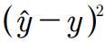

[toc]

## 1. 분류기 요약

모델해석이 중요할 때는 결정트리를 사용하기 좋습니다.

로지스틱회귀는 학률적 경사 하강법을 사용한 온라인 학습뿐만 아니라 특정 이벤트 확률을 예측하는 것에도 사용할 수 있습니다.

서포트 벡터 머신(SVM)은 강력한 선형 모델이지만 커널 트릭을 사용하여 비선형 문제에도 확장할 수 있습니다. 이 모델은 예측 성능을 높이기 위해 튜닝할 하이퍼 파라미터가 많습니다. 

대조적으로 랜덤포레스트 같은 앙상블 모델은 매개변수 튜닝이 많이 필요하지 안ㅎ고 결정 트리만큼 쉽게 과대적합되지 않습니다.

KNN분류기는 게으른 학습을 통한 다른종류의 분류 방식을 사용합니다. 예측 단계의 계산비용이 높고 차원의 저주에 걸릴 수 있다. 


- 가장 중요한 선형회귀와 로지스틱회귀 정리

## 2. 선형회귀

- 종속변수 y와 한 개 이상의 독립변수 x와 선형 상관관계를 모델링하는 회귀분석 기법
- 기존 데이터를 활용해 **연속형 변수값**을 예측
- 꼴의 수식을 만들고 a와 b의 값을 찾아냄
- **하나 이상의 특성과 연속적인 타깃 변수 사이의 관계를 모델링하는 것이 목적**
- 지도 학습의 회귀는 범주형 클래스 레이블이 아니라 `연속적인 출력 값`을 예측


### 단순 선형회귀

- 하나의 특성(설명변수 x)과 연속적이 타깃(응답변수 y)사의의 관계를 모델링
- 즉 , 특성이 하나이고 그 선형모델은 다음 공식을 가진다.
- 
- w0는 y축 절편을 나타내고 w1은 특성의 가중치
- 특성과 타깃 사이의 관계를 나타내는 **선형 방정식의 가중치를 학습하는 것이 목적**
- 이 **방정식**으로 훈련 데이터셋이 아닌 새로운 샘플의 타깃값을 예측할 수 있음
- 
- 데이터에 가장 잘 맞는 직선을 회귀 직선(regression line)
- 회귀 직선과 훈련 샘플 사이의 직선 거리를 오프셋 또는 잔차라고 한다. 
- 
- 그럼 최적의 직선이라는게 무엇일까?
- 예측함수와 실제값의 차이(오차, 오프셋, 잔차)
  - 예측 함수는 예측값과 실제 값간의 차이를 최소화하는 방향으로
  - 오차 값들이 음수와 양수로 나왔을 떄 값들의 함의 상쇄되어 0으로 계산될 수 있다.
- 값의 제곱을 사용하여 오차의 합을 표현
- 제곱 오차 : 로 예측값과 실제값의 제곱을 표시하여 오차를 나타냄
- 제곱 오차를 최소화하는 w0와 w1을 찾아야 함

#### 비용함수

- 비용함수 : 머신러닝에서 최소해야할 예측값과 실제값의 차이

- 가설함수 : 예측값을 예측하는 함수 

- 함수 입력값은 x이고 함수에서 **결정할것**은 θ로, 가중치(weight) 값인 wn

- 비용함수가 두 개의 가중치 값으로 결정됨. 

- 잔차의 제곱합 : 예측값인 가설함수와 실제 값이 y값 간의 차이를 제곱해서 모두 합함

- 평균제곱오차(MSE) : 총 데이터는 m개가 존재하니 제곱을 하고 평균을 구함

- 비용함수의 편미분

  - 비용함수식의 최저값
  - J를 wn(가중치)에 관해 미분해서 식을 최적화
  - 

  	- 미분한 값을 0으로 만드는 최적값 을 구한다


#### 경사하강법

- 경사를 하강하면서 수식을 최소화하는 매개변수의 값을 찾아내는 방법
- 
- 점이 최소값을 달성하는 방향으로 점점 내려감
  - 몇 번 적용할 것인가? : 많이 실행할수록 최솟값에 가까워짐
  - 한 번에 얼마나 많이 내려갈 것인가? : 한 번에 얼마나 많은 공간을 움직일지를 기울기, 즉 경사를 한번에 얼마나 움직이는지. 학습률
- 경사하강법 알고리즘
  - 
  - 경사하강법의 기본 수식
  - X(올드)는 현재의 X값, X(new)경사값이 업데이트 후 생성된 값
    - 경사만큼의 변화가 계속 에 적용되어 의 최솟값 찾음. 반복적으로 미분 값을 적용시키면서 더 이상 값이 변하지 않거나 변화가 미미해지는 지점까지 값
      이 줄어든다
- **경사하강법에에서 개발자가 결정해야 할 것**
  - 학습률을 얼마로 할 것인가. a값을 결정
    - 반복이 수행될 때 마다 최솟값 변화
    - 값이 너무 작으면 충분히 많은 반복을 적용해도 원하는 최적값을 찾지 못하는 경우 발생
    - 값이 너무 크면 발산하여 최솟값 수렴 않거나 시간이 너무 오래 걸림
  - 얼마나 많은 반복으로 돌릴 것인가
- w변수가 두 개이기 때문에 3차원 그래프로 J를 표현
  - 
- 매개 변수 w0와 w1에 대한 업데이트
- 먼저 임의의 w0와 w1을 지정(가설함수)
- 비용함수 J가 최소화 도리때 까지 반복을 수행시켜 가중치와 절편 업데이트
- 비용함수가 더 이상 줄어들지 않거나 정해진 반복이 종료되면 학습이 끝남

### 단순 선형회귀-2

- 훈련/테스트 분할(train/test split) – 머신러닝에서 데이터를 학습을 하기 위한 학습 데이터셋(train dataset)과 학습의 결과로 생성
  된 모델의 성능을 평가하기 위한 테스트 데이터셋(test dataset)으로 나눔
- 모델이 **새로운 데이터셋에도 일반화(generalize)하여 처리할 수 있는지를 확인**
- 모델이 데이터에 과다적합인 경우
  - 생성된 모델이 특정 데이터에만 잘 맞아서 해당 데이터셋에 대해서는 성능을 발휘할 수 있지만 새로운 데이터셋에서는 전혀 성능을 낼수 없다.
- 모델이 데이터에 과소적합 된 경우
  - 기존학습데이터를 제데로 예측하지 못함
- 홀드아웃 메소드
  - 전체 데이터셋에서 일부를 학습데이터와 테스트 데이터로 나누는 일반적인 데이터 분할 기법
  - 전체 데이터에서 **랜덤**하게 학습 데이터셋과 테스트 데이터셋을 나눔
    • 일반적으로 7:3 또는 8:2 정도의 비율
    • sklearn 모듈이 제공하는 train_test_split 함수
  - 
- 선형회귀의 성능 측정 지표
  - MAE(Mean Absolute Error) : 평균 절대 잔차
    - 
  - RMSE(Root Mean Squared Error) : 평균제곱근 오차
    - 평균제곱근 오차
    - 오차에 대해 제곱을 한 다음 모든 값을 더하여 평균을 낸 후 제곱근을 구함
    - mean_squared_error함수 활용
  - 결정계수(R-squared) :
    - 두 개의 값의 증감이 얼마나 일관성을 가지는지 나타내는 지표
    - 예측값이 크면 클수록 실제값도 커지고, 예측값이 작으면 실제값도 작아짐
    - 두 개의 모델 중 어떤 모델이 조금 더 상관성이 있는지를 나타낼 수 있지만, 값의 차이 정도가 얼마인지는 나타낼 수 없다는 한계가 있음

#### 경사하강법2

- 경사하강법 종류
  - 전체-배치 경사하강법(full-batch gradient descent) 
  - 확률적 경사하강법(Stochastic Gradient Decent, SGD) 
  - 미니-배치 경사하강법(mini-batch gradient descent)
- **배치(Batch)란**
  - 일괄적으로 처리되는 집단을 의미합니다. GPU의 병렬연산기능을 최대한 효울적으로 사용하기 위해 쓰는 방식입니다.
  - 배치는 1 epoch당 사용되는 trainin dataset의 묶음이며, epoch의 의미는 훈련세트를 한번 모두 사용하는 과정으ㅡㄹ의미

#### 전체 배치 경사 하강법

- 손실함수 기울기 계산에 전체 학습 데이터셋에 대한 에러를 구한 뒤 기울기를 한번만 업데이트 하는 방식
- 전체 데이터에 대한 모델의 오차의 평균(비용함수)을 구한 다음 , 이를 이용하여 미분을 통해 그래디언트의 반대 방향으로 parameter를 개선하여, 학습속도를 이용하여 업데이트를 수행
- 특징
  - 업데이트 횟수 적다.
    - 가중치 업데이트 횟수가 줄어 계산상 효율성 상승
  - 안정적인 비용함수 수렴
    - 모든값의 평균을 구하기 때문에 일반적으로 경사하강법이 갖는 지역 최적화 문제를 만날 가능성도 있음
  - 업데이트 속도 증가
    - 대규모 데이터셋을 한 번에 처리하면 모델의 매개변수 업데이트 속도에 문제 발생이 적어짐
  - parameter 업데이트를 위해 모든 학습데이터를 저장해야하므로 데이터가 큰 경우 많은 메모리 자원 필요

#### 학률적 경사하강법(SGD)

- 학습용 데이터에 샘플들을 랜덤하게 뽑아서 그 샘플에 대해서만 기울기를 계산.
- 대상 데이터를 섞은 후, 일반적인 경사하강법처럼 데이터를 한 개씩 추출하여 가중치를 업데이트
- SGD장점
  - 빈번한 업데이트를 하기 때문에 데이터 분석가가 모델의 성능 변화를 빠르게 확인
  - 데이터의 특성에 따라 훨씬 더 빠르게 결과값을 냄
  - 학습속도가 매우 빠르다.
  - 지역 최적화를 회피
  - 메모리 소모량이 매우 낮다.
  - 배치 경사 하강법과 반대로 local minimum에 빠지더라도 쉽게 빠져나올 수 있습니다. 또한, global minimum을 찾을 가능성이 SGD가 더 큽니다.
  - 노이즈가 심하다. (shooting이 심하다.)
- SGD단점
  - 대용량 데이터를 사용하는 경우 시간이 매우 오래 걸림
  - 결과의 마지막값을 확인하기 어려움
  - 흔히 `튀는 현상`이라고 불리는데 비용함수값이 줄어들지 않고 계속 변화 할 때 정확히 언제 루프가 종료되는지 알 수 없어 판단하기 어렵다.

#### 미니-배치 경사하강법

- 딥러닝 라이브러리 등에서 SGD를 얘기하면 최근에는 대부분 이 방법을 의미합니다.

- 예를 들어, 1,000개인 학습 데이터 셋에서 `batch_size`를 100으로 잡았으면 총 10개의 mini batch가 나오게 됩니다.

  이 100개씩의 mini batch를 갖고 한 번씩 SGD를 진행합니다. 1 epoch 당 총 10번의 SGD를 진행하게 됩니다.

- 즉, 랜덤한 미니배치를 갖고 한번씩 SGD를 실행

- **미니배치 경사 하강법의 특징**

  - 전체 데이터셋을 대상으로 한 SGD 보다 parameter 공간에서 shooting이 줄어듭니다.(미니배치의 손실 값 평균에 대해 경사 하강을 진행하기 때문에)
    \- BGD에 비해 Local Minima를 어느정도 회피할 수 있습니다.
  - 최적해에 더 가까이 도달할 수 있으나 local optima 현상이 발생할 수 있습니다.
    \- local optima의 문제는 무수히 많은 임의의 parameter로부터 시작하면 해결됩니다. → 학습량을 늘리면 해결됨!
  - 배치 크기는 총 학습 데이터 셋의 크기를 배치 크기로 나눴을 때 딱 떨어지는 크기로 하는 것이 좋습니다.
    \- 1,050개의 데이터 셋이 있을 때 `batch_size`를 100으로 하면 마지막 50개는 과도한 평가를 할 수 있기 때문입니다.
  - 만약 딱 떨어지지 않는다면, 50개의 데이터는 버리는 것이 좋습니다.


**에포크**

	- 훈련데이터를 전체를 학습시키는 횟수
	- 전체-배치 경사하강법를 한 번 학습하는 루프가 실행될 때 1에포크의 데이터가 학습된다고 말함
	- SGD와 BGD의 절충안으로 배치 크기를 줄여 확률적 경사 하강법을 이용하는 방법입니다.

**배치 사이즈**

- 한 번에 학습되는 데이터의 개수
- 총 데이터가 5012개 있고 배치 사이즈가 512라면 10번의 루프가 돌면서 1에포크를 학습했다
  고 말함

에포크와 배치 사이즈는 하이퍼 매개변수이므로 데이터 분석가가 직접 선정함


### 분산과 편차

과대 적합

- 머신러닝 모델 학습 시 학습 데이터셋에 지나치게 최적화하여 발생하는 문제
- 모델을 지나치게 복잡하게 학습하여 학습 데이터셋에서는 모델성능이 높게 나타나지만 정작 새로운데이터에는 일반화 되지 못한다.


과소적합

- 과대적합과 반대 개념으로서 머신러닝 모델이 충분히 최적화 되지 않아 학습데이터의 구조/패턴을 정확히 반영하지 못하는 문제


편향(bias)

- 학습된 모델이 학습 데이터에 대해 만들어 낸 예측값과 실제값과의 차이
- 모델의 결과가 얼마나 한쪽으로 쏠려 있는지를 나타냄
- 편향이 크면 학습이 잘 되어있지만 해당 데이터에만 잘맞음(과소적합)


분산(variance)

- 학습된 모델이 테스팅 데이터에 대해 만들어 낸 예측값과 실제값과의 차이
- 모델의 결과가 얼마나 퍼져 있는지 나타냄
- 분산이 크면 과대 적합이 되어 있을 수 있다.


- 편향-분산 트레이드오프(bias-variance trade-off) 

  - 편향과 분산의 상충관계

- 과대적합이 발생할 시 경사하강법 루프(에포크)가 진행될수록 학습 데이터셋에 대한 비용함수의 값은 줄어 들지만 테스트 데이터셋의 비용함수 값은 증가.

  

- 선형회귀 외에도 결정트리(decision tree)나 딥러닝처럼 연산에 루프가 필요한 모든 알고
  리즘에서 똑같이 발생

- 오컴의 면도날 원리

  - `보다 적은수의 논리로 설명이 가능한 경우, 많은 수의 논리를 세우지 않는다.`
    - 경제성의 원리 또는 단순성의 원리
    - 머신러닝에서는 너무 많은 피쳐를 사용하지 않는 것

- 선형회귀에서 과대 적합 해결책

  - 더 많은 데이터 활용하기 : 오류가 없고, 분포가 다양한 데이터 많이 확보
  - 피쳐 개수의 줄이기 : 필요한 피쳐만 사용
  - 적절한 매개변수 선정하기 : SGD학습률이나 루프의 횟수처럼 적절한 하이퍼 파라미넡 매개변수를 선정
  - 정규화 적용하기 : 데이터 편향성에 따라 필요 이상으로 증가한 피쳐의 가중치 값을 적절히 줄이는 규제 수식을 추가


### 리지 회귀

- L2 정규화
- 놈(norm) : 벡터의 크기를 나타낸다.
- **L2 놈(L2 norm) : 벡터 각 원소들의 제곱합에 제곱근을 취함**
- 
- 리지 회귀는 L2을 제곱한 값을 비용함수 수식에 더함
- 뒷부분에 새로 붙인 수식은 페널티텀(penalty term)으로, 모델의 가중치 값들의 제곱의
  합
  - 가중치 값이 조금이라도 커질 때 비용함수에 매우 큰 영향
  - λ가 클수록 전체 페널티텀의 값이 커져 θ 값이 조절됨
  - λ는 사람이 직접 값을 입력하는 `하이퍼 매개변수`
- 리지 회귀 수식을 미분하면 j의 값이 1 이상일 때 페널티가 적용됨
- 

### 라쏘 회귀

- L1 정규화
- 가중치에 페널티텀을 추가하는데, 기존 수식에다 L1 놈 페널티를 추가하여 계산
- 
- L1 놈(L1 norm) : 가중치 절대값.
- 
- L1 정규화와 L2 정규화가 실제 적용되는 과정


- 타원은 두 개의 가중치 값의 최적점과 그 가중치 값으로 생기는 비용함수의 공통 범위
- 아래 마름모나 원은 W(가중치)가 가질 수 있는 범위이고 타원과 만나는 점이 바로 사용가능한
  가중치 값
- L1정규화 직선과 타원 만나는 점이 양쪽 끝에서 생성됨
  - 극단적인 값이 생성되어 다른 가중치 값이 선택되지 않는 현상이 발생할 수 있음
  - 사용해야 하는 피쳐와 사용하지 않아도 되는 피쳐를 선택하여 사용하도록 지원
- L2 정규화는 원과 타원이 만나는 점이 많아져서 비교적 쉽게 연산되어 계산 효율 확보
  - 한점에서 만나기 때문에
- 규제 특징
  - L1규제는 규제가 커질 수록 **훈련 세트의 손실과 검증 세트의 손실이 커지고**(과소적합화됨)규제가 커질 수록 가중치 값이 "0"에 가까워진다. 

  - L2 규제는 L1 규제와 비슷한 양상을 보이나, 규제가 강해져 과소 접합이 심해지지 않는 특성을 가지고 있다. 그래서 L2 규제를 많이 사용한다. 


### 선형 회귀 설계

1. 데이터 확보
2. 데이터 전처리
3. 데이터 분류
4. 데이터 학습
5. 예측하기와 결과 분석

#### 1. 데이터 확보

- load_boston
- x와 y 각 데이터셋을 추출
- 1차원 벡터 y를 nx1형태로 변경

#### 2. 데이터 전처리

- 결측값제거
- 훈련데이터 평균과 표준편차로 정규화


## 로지스틱 회기

- 분류 문제

  - 몇 가지 이산적 값(클래스 레이블) 중 하나를 선택하는 모델. '분류 모델'이라고 부름

  

- 초록색 선을 추가해 선 상단은 합격, 선 하단은 불합격
- 아래 수식으로 기존 선형회귀 모델을 적용
- 문제점:
  - f(x)의 값이 1 이상이나 0이하로 나올 수 있음
  - 각 피쳐 들이 Y에 영행을 주는 것을 해석하는 문제
  - 사건의 발생 여부는 이산적인데 실제 f(x)수식은 연속적

### 로지스틱 회귀의 개념

- **이진 분류 문제를 확률로 표현**
- 어떤 사건이 일어날 확률을 P(X)로 나타내고 일어나지 않을 확률을 1 - P(x)로 나타냄 (0 ≤ 
  P(X) ≤ 1)
- **오즈비(odds ratio) : 어떤 사건이 일어날 확률과 일어나지 않을 확률의 비율**
- 확률이 올라갈수록 오즈비도 급속히 상승

- 로짓 함수 : 오즈비에 상용로그를 붙인 수식


- X값으로 확률을 넣으면 logit(P)꼴로 나타남

- 확률을 구하려면 기존 함수(로짓)의 역함수를 취하여 연산

- 

- 로지스틱 함수 - 로짓 함수의 역함수. 출력값은 확률이된다.

- 그래프가 S자 커브 형태인 시그모이드 함수

- 

- 로지스틱 회귀(Logistic Regression)

  - **종속변수(반응변수)가 이분형일 때 수행할 수 있는 , 예측 분석을 위한 회귀분석 기법**
  - 회귀라고는 하지만 이분형일때의 예측이므로 정확히는 분류이다.

- 시그모이드 함수 수식

  - y값을 확률 p로 표현
  - z 값은 선형회귀와 같이 가중치와 피쳐의 선형 결합(linear combination)으로 표현 가능
  - 시그모이드 함수(wTx) : 입력 벡터 x가 주어졌을 때 이 샘플이 클래스 1에 속할 확률

- 가설함수(hypothesis function)

  - 
  - z는 가중치 값과 피쳐 값의 선형 결합
  - 가중치 값을 찾는 학습을 위해 **경사하강법** 알고리즘 사용
    - 

- 비용함수

  - 먼저 비용함수를 정의하고 예측값과 실제 값의 차이를 최소화하는 방향으로 학습
  - 실제값이 1일 때와 실제값이 0일 떄의 각각 다르게 비용함수를 정의
  - 
  - (a)는 y = 1일 때, (b)는 y = 0일 때 비용함수 그래프
  - 
  - (a)에서 h 값이 1에 가까워질수록 비용함수가 0에 가까워짐
    (b)에서 h 값이 0에 가까워질수록 비용함수가 0에 가까워짐
  - 두 경우의 비용함수를 하나로 통합

  

  - 비용함수의 미분과 가중치 업데이트
    - θ의 최적값을 구하기 위해 값을 θ에 대해 미분
    - θ는 z값 안에 있는, 의 집합
    - 
  - 가중치 값을 업데이트
    – 선형회귀와 동일하게 모든 θ에 대해 동시에 가중치가 업데이트됨
  - 

- 모델을 평가하는 성능지표들

  - 회귀 : MAE, MSE, RMSE, SSE
  - 분류(classification) : 정확도, 정밀도, 민간도, F1스코어, ROC커브, 리프트 차트
  - 클러스터링:  DBI, 엘보우 메서드, 실루엣계수

- 여러가지 상황을 고려하여 모델의 성능지표를 선택해야 한다.

  - 모델이 다른 모델보다 경제적으로 나은가
  - 모델이 사용하는 데이터가 많은가? 또는 적은가
  - 모델이 용량이 작은 컴퓨터에서도 작동하는가
  - 모델의 손해가 얼마나 나는가

```python
from sklearn.linear_model import LogisticRegression
model = LogisticRegression(penalty='l2')
model.fit(X_train,y_train)
```

### 로지스틱 회귀분석 대표 하이퍼 파라미터 종류

**하이퍼 파라미터 설정여부에 따라 성능 및 학습 시간이 크게 달라질 수 있다.**

- penalty : 설정 가능 값 : 'l1', 'l2', 'elasticnet','none', 기본값 : 'l2'
  - 1차, 2차, 1+2차 혼합, 미규제 , 복잡한 모델에 대한 **규제 방법을 선택**

- C (규제 매개변수): penalty에 대한 계수 설정, 기본 값은 1.0, 높을 수록 복잡한 모델에대한 규제 강화

- **solver** : 설정 가능 값 : ‘newton-cg’, ‘lbfgs’, ‘liblinear’, ‘sag’, ‘saga’ 기본 값 : 'lbfgs'

  로지스틱 회귀는 비선형 방정식이라 근사 알고리즘으로 접근하는데, 알고리즘의 종류 선택

  특정 solver는 일부 penalty 방식을 지원하지 않을 수도 있음

- 
