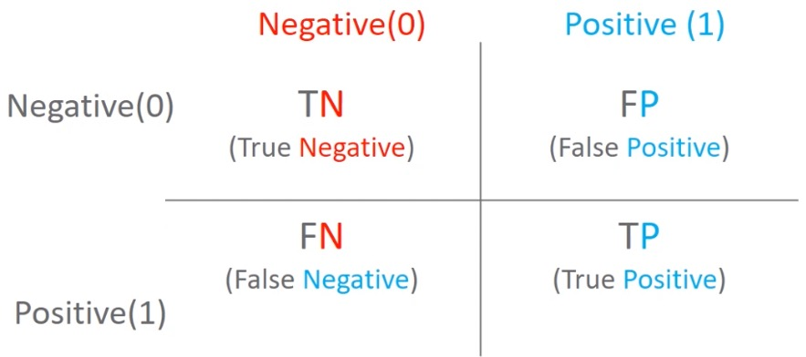

[toc]

# 이진분류 성능 평가 지표

## 1. 정확도

$$
정확도(Accuracy) = \frac{예측결과가 동일한 데이터 건수}{전체 예측 데이터 건수}
$$

- 정확도는 직관적으로 모델 예측 성능을 나타내는 평가지표입니다. 하지만 이진 분류의 경우 데이터 구성에 따라 ML모델의 성능을 왜곡할 수 있기 때문에 정확도 수치 하나만 가지고 성능을 평가하지 않습니다.
- 특히 정확도는 불균현한 레이블 값 분포에서 ML모델의 성능을 판 단할 경우, 적합한 평가 지표가 아닙니다.
- ex) 타이타닉생존자 예측에서 여성은 모두 생존으로 판별 => 데이터의 불균형
- MINIST 데이터셋을 Multi classifiaction에서 binary classifiacion으로 변경 => 왜곡

## 2. 오차행렬

오차 행렬은 이진 분류의 예측 오류가 얼마인지와 더불어 어떠한 유형의 예측 요류가 발생생하고 있눈지를 함께 나타내는 지표입니다.

- 행이 실제클래스(Actual Class), 열이 예측클래스(predicted Class)



### 오차 행렬을 통한 정확도 지표 문제점 인지

|            |          | 예측클래스 | 예측클래스 |
| :--------: | :------: | :--------: | :--------: |
|            |          |  Negative  |  Positive  |
| 실제클래스 | Negative |  TN(75개)  |  FP(25개)  |
| 실제클래스 | Positive |  FN(50개)  |  TP(50개)  |

- 정확도 : 예측 결과와 실제 값이 동일한 건수 / 전체 데이터
  - (TN+TP) / (TN+TP+FN+FP)
  - 여기서는 125/200 = 62%

- 정밀도 : 예측 Positive 중 Positive정답 비율

  - 정밀도 : TP/ (FP+TP)
  - 정밀도는 예측을 Positive로 한 대상 중에 예측과 실제 값이 Positive로 일치한 데이터의 비율을 뜻합니다.
  - precision_score()

- 재현율 : 실제 Positive중 Positive정답 비율

  - 재현율 : TP / (FN+TP)
  - 실제값이 Positive인 대상 중에 예측과 실제 값이 Positive로 일치한 데이터의 비율을 뜻합니다.
  - recall_score()

- 오차 행렬, 정확도, 정밀도, 재현율을 한꺼번에 계산하는 함수 생성

- ```python
  from sklearn.metrics import accuracy_score, precision_score, recall_score, confusion_matrix
  def get_clf_eval(y_test, pred):#인자로는 (실제레이블, 예측레이블)
      #오차행렬
      confusion = confusion_matrix(y_test, pred)
      accuracy = accuracy_score(y_test, pred)
      precision = precision_score(y_test, pred)
      recall = recall_score(y_test,pred)
      
      print('오차행렬')
      print(confusion)
      print('정확도 : {0:.4f}, 정밀도 : {1:.4f}, 재현율: {2:.4f}'.format(accuracy,precision,recall),'\n')
  ```

### 3. 정밀도와 재현율의 (trade-off) 관계

- 재현율(TP/(FN+TP))이 상대적으로 더 중요한 지표인 경우에는 실제 Positive양성인 데이터 예측을 Negative로 잘못 판단하게 되면 업무상 큰 영향이 발생하는 경우 : 암 진단, 금융사기 판별=>**가급적 양성이라고 하고 확인하는 것이 나은 경우**
- 정밀도(TP/(FP+TP))이 상대적으로 더 중요한 지표인 경우에는 실제 Negative 음성인 데이터를 예측을 Positive 양성으로 잘못 판단하게 되면 업무상 큰 영향이 발생하는 경우 : 스팸메일=> **가급적 음성이라 하고 확인하는 것이 나은 경우**
- 분류하려는 업무의 특성상 정밀도 또는 재현율이 특별히 강조돼야 할 경우 분류의 결정 임계값을 조정해 정밀도 또는 재현율의 수치를 높일 수 있습니다.
- 하지만 정밀도와 재현율은 상호보완적인 평가 지표이기 때문에 어느 한쪽을 강제로 높이면 다른 하나의 수치는 떨어지기 쉽습니다. 이를 트레이드오프라고 부릅니다.

### 4. 분류 결정 임계값에 따른 Positive예측 확률 변화

- 정밀도 : TP/ (FP+TP) : 예측을 Positive로 한 대상중에 예측과 실제가 Positive로 일치한 데이터 비율
- 재현율 : TP / (FN+TP) : 실제값이 Positive인 대상중에 예측과 실제가 Positive로 일치한 데이터 비율
- 분류결정 **임계값이 낮아질 수록 Positive로 예측할 확률이 높아짐. 재현율 증가**
  - 사이킷런 Estimator객체의 predict_progba()메소드는 분류 결정 예측 확률을 반환합니다.
  - 이를 이용하면 임의로 분류 결정 임계값을 조정하면서 예측 확률을 변경할 수 있습니다.
- 분류 결정 임계값에 따른 정밀도, 재현율 곡선

```python
#테스트 데이터(타이타닉)의 분류 결정 예측 확률을 반환해준다.
pred_proba = lr_clf.predic_proba(X_test)
pred_proba.shape
pred_proba[:10]
#샘플이 클래스 Negative[0]가 될 확률, Positive[1]가 될 학률을 반환
array([[0.46175211, 0.53824789],
       [0.87863924, 0.12136076],
       [0.87717092, 0.12282908],
       [0.88269294, 0.11730706],
       [0.85528973, 0.14471027],
       [0.88225767, 0.11774233],
       [0.88838772, 0.11161228],
       [0.20882912, 0.79117088],
       [0.78290779, 0.21709221],
       [0.3693535 , 0.6306465 ]])

#테스트 데이터 predict 결과(벡터)
pred = lr_clf.predict(X_test)
```


#### 예측 확률(pred_proba)와 예측결과값(pred)을 결합해서 비교해 보자

```python
#예측 결과값은 1차원 벡터이므로 2차원으로 변환 후 concat
pred_proba_result = np.concat([pred_proba,pred.reshape(-1,1)],axis=1)
```

#### Binarizer: 요소들이 기준값보다 큰지 작은지를 알려주는 함수

- <Binarizer>
  - 요소가 기준값(threshold)와 비교해서, 같거나 작으면 0을 반환, 크면 1을 반환
- 분류 임계값 0.5로 예측값 변환(Binarizier)

```python
from sklearn.preprepreocessing import Binarizer
#predict_proba의 두번째 칼럼, 즉 Positive컬럼을 추출한 후
#(1차원이니 2차원으로 reshape으로 해준다.)
pred_proba_1 = pred_proba[:,1].reshape(-1,1)

#Binarizer를 적용 - 0.5를 임계값으로 설정
custom_threshold = 0.5
binarizer = Binarizer(threshold=custom_threshold).fit(pred_proba_1)
#해당 배열을 임계값 기준으로 이진화시켜준다.
binarizer.transform(pred_proba_1)
```

