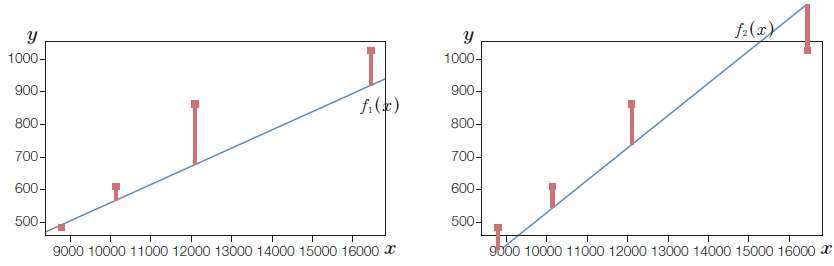
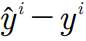
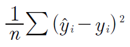
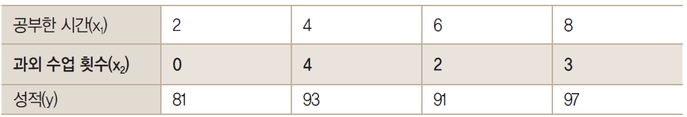

[toc]

# 분류 모델

## 1. 분류 알고리즘 선택

특정 문제에 알맞는 분류 알고리즘을 선택하려면 연습과 경험이 필요합니다. 알고리즘은 저마다 특징이 있고 일정한 가정을 전제로 합니다.

모델의 성능은 특성이나 샘플의 개수에 따라 다르고 데이터 셋에 있는 잡음 데이터 양과 클래스가 선형적으로 구분 되는 지 아닌지에 따라서도 다를 것 입니다.

**결국 분류모델의 예측 성능과 계산 성능은 학습에 사용하려는 데이터에 크게 의존합니다.**

머신러닝 알고리즘을 훈련시키기 위한 다섯가지 단계

1. 특성을 선택하고 훈련 샘플을 모읍니다.

2. **성능 지표를 선택합니다.**
3. 분류 모델과 최적화 알고리즘을 선택합니다.
4. 모델의 성능을 평가합니다.
5. 알고리즘을 튜닝합니다.


## 2. 사이킷런 첫걸음 : 퍼셉트론 훈련

사용하기 쉬운 인터페이스로 분류 알고리즘 최적화하여 구현한 사이킷런 API를 통한 학습

사이킷런은 많은 학습 알고리즘을 제공할 뿐만 아니라. 데이터 전처리나 세부 조정, 모델 평가를 위해 편리하게 사용할 수 있는 많은 학습 알고리즘이 있습니다.

```python
from sklearn import datasets
import numpy as np

iris = datasets.load_iris()
```


사이킷런의 많은 함수와 클래스 메서드는 문자열 형태(비정형데이터) 클래스 레이블을 다룰 수 있습니다. => LabelEncoder, OvR(One versus Rest)로 정수 인코딩

정수레이블이 권장되는 이유 : 사소한 실수를 피할수 있고 작은 메모리 영역을 차지하므로 계산 성능을 향상시키기 때문이니다. 고로 클레스 레이블을 정수로 인코딩 하는 것은 대부분 머신러닝 라이브러리들의 관례이다.

처음 본 데이터에서 학습된 모델을 평가하기 위해 데이터셋을 훈련 데이터셋와 테스트 데이터셋으로 분할

```python
from sklearn.model_selection import train_test_split
X_train, X_test, y_train, y_test = train_test_split(X,y,test_size=0.3,random_state=1,stratify=y)
#random_state에 랜덤시드 지정시 실행결과를 재현할 수 있습니다.
# 나눠진 데이터셋의 레이블 비율이 입력(특성행렬) 데이터셋과 동일
print('y의 클래스 레이블 카운트 : ',np.bincount(y))
print('y_train의 클래스 레이블 카운트 : ',np.bincount(y_train))
print('y_train의 클래스 레이블 카운트 : ',np.bincount(y_test))
```

train_test_split 함수가 분할하기 전에 데이터셋을 미리 섞습니다. => 아니면 클래스 0과 1에 있는 샘플이 모두 훈련 데이터셋에 들어가므로 과대적합이 생길수 있다.

stratify=y를 통해 계층화 기능을 사용. train_test_split함수가 훈련 데이터셋과 테스트 데이터셋의 클래스 레이블의 비율을 입력 데이터셋과 동일하게 만든다는 의미입니다.

많은 머신러닝 알고리즘은 최적화 알고리즘을 위해 특성 스케일 조정(표준화)이 필요하다.

특성 표준화를 위해서 preprocessing모듈의 StandardScaler를 사용한다.

` StandardScaler` 객체의 fit메소드는 훈련 데이터셋의 각 특성 차원마다 평균과 표준편차를 계산

 `StandardScaler.transform`메소드는 계산돤 평균과 표준편차를 사용하여 데이터셋을 표준화

테스트데이터셋의 샘플들도 같은 비율로 이동하도록  동일 mean과 std 적용하여 표준화

```python
from sklearn.preprocessing import StandardScaler
#표준화 객체 생성
sc=StandardScaler()
#표준화 객체의 fit메소드는 훈련 데이터셋의 각 특성 차원마다 평균과 표준편차를 계산
sc.fit(X_train)
#데이터셋 표준화
X_train_std = sc.transform(X_train)
X_test_std = sc.transform(X_test)
```

```python
from sklearn.linear_model import Perceptron
ppn= Perceptron(eta0=0.1, random_state=1)
#퍼셉트론 객체에 훈련데이터 학습
ppn.fit(X_train_std,y_train)
```

적절한 학습률을 찾으려면 어느 정도 실험이 필요합니다. **학습률이 너무 크면 알고리즘은 전역 최솟값을 지나칩니다. 너무 작으면 학습 속도가 느리기 때문에 특히 대규모 데이터셋에서 수렴하기까지 많은 에포크가 필요합니다.** 

```python
>>> y_pred = ppn.predict(X_test_std) #레이블 예측
>>> print('잘못 분류된 샘플 개수 : %d'%(y_test!=y_pred).sum())
잘못 분류된 샘플 개수 : 1
# 분류 오차 : 1/45 == 2.2%
```

분류오차 vs 정확도

분류 오차 대신 많은 머신러닝 기술자는 모델의 `분류 정확도`를 계산합니다.

1-오차 = 97.8%

사이킷런 라이브러리는 `metrics`모듈 아래에 다양한 **성능지표**를 구현해 놓았습니다. 예를 들어 데스트 데이터셋에서 퍼셉트론 분류 정확도는 다음과 같다.

```python
>>> from sklearn.metrics import accuracy_score
>>> print('정확도 : %.3f' % accuracy_score(y_test,y_pred))
정확도 : 0.978
#y_test가 진짜 레이블 클래스 y_pred는 예측 클래스 레이블
```

사이킷런의 분류기(classifier)는 예측 정확도를 계산하는 score메소드를 가지고 있다.

```python
print('정확도 : %.3f' % ppn.score(X_test_std,y_test))
# predict메소드와 accuracy_score메소드를 합친 것이다.
```

- **과대적합 : 훈련데이터에 있는 패턴은 감지하지만 본 적이 없는 데이터에 일반화 되지 못하는 것**  

- 퍼셉트론의 한계 : 선형적으로 레이블이 구분되지 않는다면 수렴되지 않는다.  전역 최솟값 수렴X. 비용함수 최소화를 하지 못한다.


## 3. 선형 회귀

**하나 이상의 특성과 연속적인 타깃 변수 사이의 관계를 모델링하는 것이 목적**

**지도학습의 회귀는 범주형 클래스 레이블이 아니라 연속적인 출력 값을 예측**

### 1. 단순 선형 회귀

- 하나의 특성과 연속적인 타깃 사이의 관계를 모델링

- 특성이 하나인 선형모델공식은 다음과 같다.
- 
- 여기서 w0는 y축 절편을 나타내고 w1은 특성의 가중치
- 특성과 타깃 사이의 관계를 나타내는 선형 방정식의 가중치를 학습하는 것이 목적
- 이 방적식으로 훈련데이터 셋이 아닌 새로운 샘플의 타깃 값을 예측할 수 있음
- 


- 데이터에 가장 잘 맞는 이런 직선을 회귀 직선(regression line)이라고도 함
- 선은 직선이므로 일차함스 그래프 
- **회귀 직선과 훈련 샘플 사이의 직선 거리를 오프셋(offset) 또는 예측 오차인 잔차(residual)라고 함**
- 


- 

- 최대치가 적은 것이 더 좋은 선형회귀 직선

- 예측 함수와 실제값 간의 차이
  - 예측 함수는 예측값과 실제값 간의 차이를 최소화하는 방향으로
  
  - 데이터 n개 중 i번째 데이터의 값에 대한 실제값과 예측값의 차이
    - 
    
  - 데이터가 5개 있을 때 5개 데이터의 오차의 합
    - 
    
  - 오차 값들이 음수와 양수로 나왔을 때 값들 간의 차이가 상쇄되어 0으로 계산될 수 있음
  
  - **값의 제곱을 사용하여 오차의 합을 표현**(최소제곱법)
    
    - 
    
  - 제곱 오차 :  로 예측값과 실제값의 오차를 제곱으로 표시
  
  - 제곱 오차를 최소화하는 w0와 w1을 찾아야 함
  
  - $$
    \sum_{i=1}^n (w_{1}x^i+w_{0}\times1-y^i)
    $$
  

### 2. 비용함수

- **비용함수(목적함수) : 머신러닝에서 최소화해야 할 예측값과 실제값의 차이를 나타낸 함수**

- 가설함수 : 예측값을 예측하는 함수

- 
  $$
  f(x)=h_{@}(x)
  $$

- 함수 입력값은 x 이고 함수에서 함수에서 결정할 것은 @로 가중치 값인 Wn

- **비용함수가 두 개의 가중치 값으로 결정됨**

- **가설함수와 실제값 사이의 평균제곱오차를 구한다.**

- 잔차의 제곱합 : 예측값인 가설함수와 실제값인 y값 간의 차이를 제곱하여 모두 합함
  - 총 데이터는 m개가 존재하고 각 데이터 예측값과 실제값을 뺀 후 제곱한 값들을 모두 합한 값

- 가설을 하나 세운 뒤, 이 값이 주어진 요건을 충족하는지 판단하여 조금씩 변화를 주고, 이 변화가 긍정적이면 오차가 최소가 될 때까지 이 과정을 계속 반복하는 방법

- **1. 손실 함수 (Loss Function)** = 비용함수
  - 손실 함수는 실제값과 예측값의 차이(loss, cost)를 수치화해주는 함수이다.
  - 오차가 클수록 손실 함수의 값이 크고, 오차가 작을수록 손실 함수의 값이 작아진다.
  - **손실 함수의 값을 최소화 하는 W, b를 찾아가는것이 학습 목표이다.**
  - 회귀 : 평균제곱오차 / 분류 : 크로스 엔트로피

- 평균제곱오차(MSE) : 잔차의 제곱합을 N으로 나눈 값. 딥러닝에서 가장 많이 사용된다.

- 

- 비용함수의 최소값은 편미분을 사용하여 수렴하는 곳을 찾는다.

- 선형회귀란

  - 임의의 직선을 그어 이에 대한 평균 제곱 오차를 구하고 이값을 가장 작게 만들어 주는 a와 b를 찾아가는 작업

### 4. 경사하강법

- 비용함수가 최소가 되는 지점을 구하는 것

- 비용함수(MSE)의 식 : 
- 
- 우리가 할 일은 ‘미분 값이 0인 지점’을 찾는 것
- 이 값을 미분할 때 우리가 궁금한 것은 a 와 b라는 것에 주의해야 함. 
- 식 전체를 미분하는 것이 아니라 필요한 값을 중심으로 미분해야 하기 때문(a와 b로 각각 *편미분)
- 


## 3. 다중 선형 회귀

더 정확한 예측을 하려면 추가 정보를 입력해야 하며, **정보를 추가해 새로운 예측값을 구하려면 변수의 개수를 늘려 다중 선형 회귀를 만들어 주어야 함**



- 그럼 지금부터 두 개의 독립변수 x1과 x2가 생긴 것임
- 이를 사용해 종속 변수 y를 만들 경우 기울기를 두 개 구해야 하므로 다음과 같은 식이 나옴
- 
- 두 기울기 a1, a2를 구하는 방법 : 경사하강법
- 각각의 값에 기울기 a값이 다르므로 기울기도 a1과 a2이렇게 두가지를 만듦
- 경사 하강법을 적용하고 학습률을 곱해 기존의 값을 업데이트함


## 4. 로지스틱 회기

- 퍼셉트론 규칙은 머신 러닝 분류 알고리즘을 배우기에 간단하고 좋지만 클래스가 선형적을 로 구분되지 않을 때 수럄할 수 없다는 것입니다.
- 에포크마다 하나의 샘플이 계속 잘못 분류되면 끊없이 가중치를 업데이트
- 이런 경우 절대 수렴하지 못한다.
- 이름이 `로지스틱 회기`이지만 분류 모델이다.

### 1. 로지스틱 회기 이해와 조건부 확률

- 로지스틱 회기는 매우 구현하기 쉽고 선형적으로 구분되는 클래스입니다.

- 로지스틱 회기 모델은 이진분류를 위한 선형 모델일 뿐만아니라 다중 클래스 분류도 가능합니다.

- 이를 `다항 로지스틱 회귀` 또는 `소프트맥스 회귀`라고 부릅니다. 또는 OvR기법

- One vs Rest, One vs All 기법은,

  - 위에서 설명했듯 이진분류를 멀티클래스 분류로 활용할수 있도록 해주는 기법으로,

    이름대로의 의미입니다.

  - 이진 분류를 실행하되. 분류의 의미를 A클래스에 속하느냐, 나머지 클래스에 속하느냐로 분류

  - OvR : A클래스, B클래스, C클래스가 존재할시, 먼저 A클래스에 대해서 A에 속할지에 대한 확률을 알아보고(로지스틱 함수를 사용.), 그 이외의 클래스에 속할 확률을 알아보고,

    B클래스, C 클래스 역시 각각 위와 같은 방식으로 One vs All 알고리즘을 수행하면 됩니다.

  - **즉, N개의 클래스가 존재한다면, N개의 분류 함수가 필요하다는 것입니다.** 이 클래스에 속하는가, 아니면 나머지 클래스에 속하는가에 대한 분류 함수를 N개 준비하여, 각각 수행해주면 됩니다.

- 오즈비 

  - 오즈는 특정 이벤트가 발생할 확률입니다.

  - 오즈비
    $$
    \frac{P}{1-P}
    $$

  - P는 양성 샘플일 확률 입니다. 양성 샘플은 좋은 것을 의미하지 않고 예측하려는 대상을 의미 합니다.

  - 양성 샘플이 클래스 레이블 y=1인 샘플인다.

  - 오즈비에 로그함수(로그오즈)를 취해 로짓함수를 정의합니다.

  - $$
    logit(P)=log\frac{P}{1-P}
    $$
  
  - 로짓 함수는 0과 1사이의 입력값을 받아 실수 범위 값으로 변환합니다.
  
  - 
  
  - P(y=1|x)는 특성 x가 주어졌을 때 이 샘플이 클래스 1에 속할 조건부 확률이다.
  
  - 로짓 함수를 거꾸로 뒤집으면 `시그모이드 함수`
  
  - 어떤 샘플이 특정 클래스에 속할 확률을 알 수 있다.
  
  - 
  
  - 아달린은 활성화 함수로 항등함수
  
  - 로지스틱회귀는 활성화 함수로 시그모이드 함수
  
  - 가중치w와 곱해지는 특성x에 대한(wT*x) 시그모이드 함수의 출력은 특정 샘플이 클래스 1에 속할 확률로 해석합니다.
  
  - 예측 확률은 임계 함수를 사용하여 간단하게 이진 출력으로 바꿀 수 있습니다.
  
  - 
  
  - 최종 입력이 0 이상이면 1로 예측(양성 예측). 0보다 작으면 0으로 예측
  
  - 실제로 클래스 레이블을 예측하는 것 외에 클래스에 소속될 확률 `시그모이드 함수`
  
  - `시그모이드 함수 출력`을 사용하여 클래스 소속될 확률을 추정하는 것이 유용한 애플리케이션이 많습니다.
  
  - 로지스틱 회기 에서 임계함수의 가운데는 0.5이다. 입력값이 [0.0,1.0]이기 때문


### 2. 로지스틱 비용함수의 가중치 학습

- 제곱 오차합 비용


- 로그가능도 함수

  

- 로그가능도 함수는 언더플로를 방지하고 계수의 곱을 계수의 합으로 바꿀 수 있습니다.

- 로그가능도 함수를 각항에 -를 붙여 비용함수 J를 생성할 수 도 있다.

- ![img](data:image/png;base64,iVBORw0KGgoAAAANSUhEUgAAAagAAAEYCAYAAAAJeGK1AAAAOXRFWHRTb2Z0d2FyZQBNYXRwbG90bGliIHZlcnNpb24zLjQuMywgaHR0cHM6Ly9tYXRwbG90bGliLm9yZy/MnkTPAAAACXBIWXMAAAsTAAALEwEAmpwYAAA450lEQVR4nO3dd3gc1b3/8ffZVe+9W5Zsy703jBvVVAOmhWJDSEJJciEJXLjkQkhuQm7yS3ITSkIgQICQEAjFlBjTMcYFjHuT5S7J6t3qbff8/pi1XLCtVdmd2d3v63n2kXZ3duareSx9fM6cOUdprRFCCCGsxmZ2AUIIIcTJSEAJIYSwJAkoIYQQliQBJYQQwpIkoIQQQlhSkNkFHCspKUl3hCUSEWpnSHyE2eUIIYToj+YqaCyF9Img7GzcuLFGa53c191YKqBycnJIWvIHhiZG8JebpptdjhBCiP6oKoCS9TB5MdhsKKWK+rMbjwaUUqoQaAIcQLfWutfUiQix09Lh8GRZQgghPClltPEYIG+0oM7RWte4u3FkaBDNHd2erEcIIYQnVe0CR5fRxTcAlhskERkSRIsElBBC+K5Pfwlv3jHg3Xi6BaWBD5VSGviL1vrpEzdQSt0O3A6QnZ1NTHgQjW0SUKJvurq6KCkpob293exS/E5YWBhZWVkEBwebXYrwFe2HITRmwLvxdEDN0VqXKaVSgI+UUgVa68+P3cAVWk8DTJ8+XceEBdPY3uXhsoS/KSkpITo6mpycHJRSZpfjN7TW1NbWUlJSQm5urtnlCF/R0QhRqQPejUe7+LTWZa6vVcCbwMzePhMbHkxrp4Muh9OTpQk/097eTmJiooTTIFNKkZiYKC1T0TftjYPSgvJYQCmlIpVS0Ue+By4AdvT2uZhwoxuhsU1aUaJvJJw8Q86r6LOORgizdhdfKvCm6x93EPBPrfX7vX0o1hVQh9u6SIwK9WB5QgghPOKqp63dxae1PqC1nuR6jNNa/687n4sJNzKzsV0GSgjfExUVBUB5eTkLFy506zPV1dVcdNFFJ32vrKyMa665puf5DTfcwMSJE3nkkUcGXixQW1vLOeecQ1RUFHfeeeeg7FMIRpwPaRMGvBtLzSQBx7eghPBVf/jDH7jtttvc2jY5OZn09HTWrFnDnDlzjnsvIyOD119/HYCKigrWrl1LUVG/bso/qbCwMB5++GF27NjBjh299sAL0bvOVtj/KWRMgdjMAe3KcvdBxYRJQAnf98Ybb/S0ii655BK2bdsGwJQpU/jFL34BwEMPPcSzzz4LwKJFi3jppZe+tp/CwkLGjx8PwAUXXEBVVRWTJ09m1apVPds0NTWRm5tLV5fxO9PY2EhOTk7P89OJjIxk7ty5hIWFDeCnFeIYjaXwr8VQuHrAu7JsC0oGSYj++vm/d5Jf1jio+xybEcPPLhvn1rYHDx4kPj6e0FDjGur8+fNZtWoVOTk5BAUFsWbNGgBWr17NkiVLAJg+fTo/+clPTrvfd955h4ULF7Jly5bjXo+Ojubss8/m3XffZdGiRbzyyitcffXVBAcH87vf/e6kwTd//nwef/xxt34eIfqk3fW7Z/FBEv0SI118wseVl5eTnHx04uZ58+bx+OOPk5uby6WXXspHH31Ea2srhYWFjBo1CoCUlBTKysr6fcxbb72V3/72tyxatIjnn3+eZ555BoD77ruP++67b2A/kBB90VZnfI1IHPCuLBdQYcF2QoJscrOu6Dd3WzqeEh4eftx9QzNmzGDDhg0MGzaMBQsWUFNTwzPPPMO0adN6tmlvbyc8PLzfx5wzZw6FhYWsXLkSh8PR0y0oLSjhda21xld/DCgwrkNJF5/wVSNHjqSwsLDneUhICEOGDOHVV1/loYceorq6mnvvvZd77723Z5s9e/b0hEp/3Xzzzdxwww089NBDPa9JC0p4XU9AJQx4V5YbJAEQK/PxCR/U3d1NaGgokZGRDB8+nH379vW8N2/ePFJTU4mIiGDevHmUlJQwb968nvdXrFjBpZdeOqDjL168mPr6em644YY+fS4nJ4d77rmHF154gaysLPLz8wdUhwhw46+Gb/4bQmMHvCtLBlRcRAj1rZ1mlyFEn+zcuZPhw4cDcOedd/LCCy/0vPfwww+zdu1awBg6rrVm6tSpPe+/8847PQMmjpWTk9Mz/PvY709m9erVXHPNNcTFxfWp7sLCQurq6mhubqakpISxY8f26fNCHCc6DXLng23g8WLJLr6EyBAO1bWaXYYQbnvqqad4/PHHefTRRwG48sorqa2tdeuz1dXV3HPPPcTHx/f7+HfddRfvvfcey5cv7/c+hBgUez8CFOSdP+BdKa31wAsaJNOnT9cbNmzgx29s45OCKtY/OPAfUASGXbt2MWbMGLPL8FtyfoXbnr8EUPCtd3teUkptdGdF9RNZsosvITKE+pZOrBSeQggh3NBaOygDJMDCAdXt1DJQQgghfE1r7aAMMQeLBlRiVAgAtS0dJlcihBDCbU4ntNb5d0AlRBpTxNS1yEg+IYTwGR2HQTv8O6ASI4+0oCSghG/xteU2AH79618zYsQIRo0axQcffDBo+xUBKCQa7twAE78xKLuz7DBzkBaU8F2+stxGfn4+r7zyCjt37qSsrIzzzz+fPXv2YLfbB+0YIoDYgyApb9B2Z80WlOsaVHWTXIMSvslXltt4++23uf766wkNDSU3N5cRI0bw1VdfDeAnFwGtMh++eALa6gdld5ZsQYUG2YmPCKaqqb33jYU4medPMm3QuEUw8zZjQbWXrv36+5NvhCmLoaUWXr35+PeOuaejN7603EZpaSmzZs3qeT0rK4vS0lK3f1YhjlO0Bj54AMZf0/u2brBkQAGkxoRR1SgtKOF7fGm5jZPda6iU6ncdIsA1VYCyQWTSoOzOsgGVEhNGpXTxif46XYsnJOL070cm9qnFdCJfWm4jKyuLQ4cO9bxeUlJCRkZGv+sQAa65AqJSwTY41zCtG1DRoeytbDK7DCH6zJeW27j88su58cYbueeeeygrK2Pv3r3MnDlzQHWIANZUYUwWO0gsOUgCIDUmlOqmDpxOme5I+AZfXG5j3LhxfOMb32Ds2LFcdNFFPPHEEzKCT/RfUwVEpw/e/rTWlnlMmzZNH/G3tQf10PuX6eqmdi1Eb/Lz880uQW/ZskXPmDFDa6310qVL9YMPPuj2Z+fNm6fr6uoGdPzXXntNL1myZED7OBUrnF/hAzpatG6u+drLwAbdj0ywdBcfQGVjO0lRoSZXI8TpyXIbQmBc3w2JGLTdWXK5DYBNxfVc9ee1PH/LDM4ZnWJyZcLqZDkIz5LzK3rVUgOrHzFu10gdd9xbfrXcBkBaTBgAZYfbTK5E+Aor/WfLn8h5FW6p3Q9f/Aka+3+7xIksG1CpMWEE2RSl9RJQondhYWHU1tbKH9NBprWmtraWsLAws0sRVtdQbHyNyx60XVr2GpTdpkiPC6O0QQJK9C4rK4uSkhKqq6vNLsXvhIWFkZWVZXYZwuoOuwIqdvD+rVg2oAAy48IpkRaUcENwcDC5ublmlyFE4Go4ZCyzERI5aLu0bBcfQGZchHTxCSGEL2irH9TuPbB4CyorPpzKpnY6u52EBFk6S4UQIrB942/g6H0G/b6w9F/9zPhwtIZyGcknhBDWZw8e1N1ZOqCy4ozJM6WbTwghLOzIEjVFXwzqbi0dUJnxRkDJQAkhhLCw+kLIf3vQFio8wtIBlREXjt2mKK5rNbsUIYQQp1J/0PgaP3RQd2vpgAq228hOiOBgTYvZpQghhDiV2v2AgoRhg7pbjweUUsqulNqslFrWn8/nJkVyQAJKCCGsq3YfxA6B4P4vunky3mhB/RDY1d8P5yZFUljTIutCCSGEVdmDIWPyoO/WowGllMoCLgWe7e8+cpMiaetyUNnU3vvGQgghvG/Rn+G6vw/6bj3dgnoU+C/AeaoNlFK3K6U2KKU2nGwetWHJxrQZB6ulm08IIQKJxwJKKbUQqNJabzzddlrrp7XW07XW05OTk7/2/rCkKAC5DiWEEFZ0aD08cy5U7hz0XXuyBTUHuFwpVQi8ApyrlPpHX3eSGhNKeLBdRvIJIYQVVe+C0o2DOknsER4LKK31f2uts7TWOcD1wKda6yV93Y9SyhjJV9086DUKIYQYoJq9YA8xRvENMkvfB3VEXmoUeyoloIQQwnKqCyAxD2z2Qd+1VwJKa/2Z1nphfz8/Oi2G0oY2DrcN7ky5QgghBqhyJ6SN98iufaIFNTo9GoDdFU0mVyKEEKKHowsyp0HOPI/s3tLrQR0xNj0GgF3ljczMTTC5GiGEEIBxg64H7n86widaUCnRocRHBFNQ0Wh2KUIIIY5wdHt09z4RUEopRqfFkF8uXXxCCGEZy34IT8312O59IqDAuA61p6IJh8zJJ4QQ1lC5EyISPbZ7nwmoMekxtHU5KKqVG3aFEMJ0jm6o2gWpnhnBB74UUGlHBkpIN58QQpiubj90t0PKWI8dwmcCamRaFCF2G1tLGswuRQghRKlrmtXMqR47hM8EVGiQnXGZMWwuHtw174UQQvRDYh6c8V1IGuWxQ/jEfVBHTM2O5x9fFtHlcBJs95lsFUII/zNkhvHwIJ/6Kz8lO46Obie7yuV+KCGEME1XG1RsB6fDo4fxsYCKB2BzcYO5hQghRCAr2WDc/7TvE48exqcCKiM2jNSYULkOJYQQZipZb3zNmu7Rw/hUQCmlmDIknk3SghJCCPOUrIfEERDh2blRfSqgAKYOjaO4rpWa5g6zSxFCiMCjtRFQWTM9fiifC6gj16E2Fkk3nxBCeF39QWip9nj3HvhgQE3MiiU82M4X+2vNLkUIIQJPdAYsfgNGXeLxQ/nUfVBg3LA7MzeBVXurzS5FCCECT3AY5J3vlUP5XAsKYO6IJPZXt1B+uM3sUoQQInA4HfD576B6j1cO55sBlZcEwOq9NSZXIoQQAaRiG3z6Syjf4pXD+WRAjUqNJikqhDX7JKCEEMJr9q8wvg472yuH88mAstkUc0YksXpfLVrLAoZCCOEVBz6DlHEQleKVw/lkQAHMGZFETXMHuytlfSghhPC4rjYo/hKGn+O1Q/psQM0dIdehhBDCa6p3g83ute498OGAyogLZ3hyJCv3yHBzIYTwuIzJcH+hBJS7zhuTypcHamls7zK7FCGE8H9BoWAP9trhfDqgFoxNpcuhWblbWlFCCOExVbvgyTlQusmrh/XpgJqaHU9iZAgf5VeaXYoQQvivgnehcgdEp3v1sD4dUHab4tzRKazYXUVnt9PscoQQwj8VvAsZUyFGAqpPLp6QRlN7t8zNJ4QQnlBfCGWbYOzlXj+0zwfU3BHJxIYHs2xbudmlCCGE/9n5pvF13JVeP7TPB1RIkI0Lx6XyUX4l7V0Os8sRQgj/kjoezrwT4nO8fmifDyiAhRMzaO7o5jMZzSeEEIMrbwFc+L+mHNovAmr28ESSokJ4a3Op2aUIIYT/KFoLjWWmHd4vAirIbuOKyZl8UlBJfUun2eUIIYTvczph6R3w9n+YVoJfBBTANdOy6HJo3tlqXtoLIYTfKFoDh4th0o2mleCxgFJKhSmlvlJKbVVK7VRK/dxTxwIYkx7DuIwY3thU4snDCCFEYNjyTwiNgdGXmlaCJ1tQHcC5WutJwGTgIqXULA8ej2umZbGt5DD5ZY2ePIwQQvi39kbIfxvGLYKQCNPK8FhAaUOz62mw6+HR1QWvnJJJaJCNl9YVefIwQgjh34q/gO42mPYtU8vw6DUopZRdKbUFqAI+0lqv8+Tx4iJCuGxSBm9uLqVJZjgXQoj+GXkh3FMAmVNNLcOjAaW1dmitJwNZwEyl1PgTt1FK3a6U2qCU2lBdPfD7mJbMGkprp0OGnAshRH84uo2v0anm1oGXRvFprRuAz4CLTvLe01rr6Vrr6cnJyQM+1qSsWMZnxvDiF0Vo7dEeRSGE8D9v3g6vmdu1d4QnR/ElK6XiXN+HA+cDBZ463jHH5ZbZueytauZzWQ5eCCHcV18EO9+C2EyzKwE824JKB1YopbYB6zGuQS3z4PF6XD4pg9SYUJ75/IA3DieEEP5h3VOgFJzxXbMrASDIUzvWWm8Dpnhq/6cTEmTjltm5/Ob9AvLLGhmbEWNGGUII4TvaGmDTizD+aojNMrsawI9mkjjRjTOziQix88wqaUUJIUSvNr0Inc3GzOUW4bcBFRsRzA0zs3lnaxlFtS1mlyOEENY29WZY9BSkTzS7kh5+G1AAd8wfRpBN8cSKfWaXIoQQ1hYeB5NvMLuK4/h1QKXEhHHDzGze2FRKcW2r2eUIIYT1dLXBi4ugcI3ZlXyNXwcUwPfOHo5dWlFCCHFyG56HAyuM0XsW4/cBlRoTxo0zs3l9Uwn7q5t7/4AQQgSKjiZY9XvImQdDZ5tdzdf4fUAB3HnuCMKCbPzu/d1mlyKEENax5nForYHzPboaUr8FREAlRYVyx1nDeX9nBRuL6swuRwghzNdUCV/8CcZdCVnTzK7mpE4bUEqpM5VSTyiltimlqpVSxUqp5Uqp/1BKxXqryMFw67xckqND+dXyApmjTwghIhLh4t/AeT81u5JTOmVAKaXeA24FPsCY5DUdGAv8BAgD3lZKXe6NIgdDREgQd58/ko1F9SzfXmF2OUIIYS57kHHvU8Iwsys5pdO1oG7SWn9Ha/2O1rpMa92ttW7WWm/SWv9ea302sNZLdQ6Kb0zPYkx6DL98N5+Wjm6zyxFCCO/TGl5ZDFteNruSXp0yoLTWNQBKqW8rpfJOt42vCLLbePiKcZQfbudPMuxcCBGItr8GBcvA0WF2Jb1yZ5BEDvAXpdR+pdSrSqm7lFKTPVuW50zPSeCqqZk8u+qADDsXQgSW9kb48CeQMRWm3Gx2Nb3qNaC01j/VWp8LjAdWA/cBGz1dmCf998VjCAuy89O3d8iACSFE4FjxK2iugkv/D2zWH8Tda4VKqZ+4Bkx8CIwA7sVYwt1nJUeH8l8Xj2bNvlpe3XDI7HKEEMLzavfDV3+BGbdCpjWHlZ/InfWgrgK6gXeBlcCXWut2j1blBYtnZrNsaxm/XLaL+SOTSY8NN7skIYTwnMThsOQNyJphdiVuc6eLbypwHvAVsADYrpRa7enCPM1mU/zm6ol0OZ08sHS7dPUJIfxXc7Xxdfi5EBptbi194E4X33hgCfBN4DqgBPjUw3V5RU5SJPddOJoVu6tZuqnU7HKEEGLwlWyER8fDrmVmV9Jn7lwl+w0QDTwOjNFan6O1tu6tx310y+wcZuTE87N3dsqSHEII/9LRBEtvhYgkyJlrdjV95k4X36Va699qrddqrbu8UZQ32W2KR66bjFLwg1c20+Vwml2SEEIMjvfuh/pCuPoZY0FCH3O6qY7+rZS6TCkVfJL3himlfqGU+rZny/OOrPgIfn3VBLYcauCxj/eaXY4QQgzc9tdhy0sw715LLqXhjtO1oG4D5gEFSqn1rkliVyilDgJ/ATZprZ/zSpVesHBiBtdOy+KJz/axdr9PTZAhhBBf11wJ2bPhrPvNrqTflDuj15RSOUAa0Abs0Vq3eaKY6dOn6w0bNnhi125p6ejmsj+tprGti2V3zSMtNsy0WoQQYsCcDrDZza4CpdRGrfX0vn7udF18TUqpRqVUI7AN+AhYBVS6lt74Uil1Xv9Ltp7I0CD+smQarZ0OvvfSRjq6HWaXJIQQ7tPauO6072PjuQXCaSBON1lstNY65phHz3OM1tQdwGNeq9RL8lKj+b9rJ7G5uIGHl+WbXY4QQrhv/bOw7ikoMa8najD1azImrbVDa70V+OMg12MJl0xI546zhvGPL4t5db1MhSSE8AHFX8L7P4aRF8H8/zK7mkExoNkCtdZ/GaxCrOa+C0Yxd0QSD761nS/215pdjhBCnFrdAXjlRojLhiv/4hMTwbrDP34KDwiy23hi8VSGJkZyx983sK9KluYQQljUlpdBO2Hx6z55v9OpSECdRmx4MM/fMoOQIBvfeuErapqtv8CXECIAnfMA3PG5MSGsH5GA6sWQhAie/eYMqps6uO3FDbR1ysg+IYQFOJ3w8f9AzT5Qyuje8zMSUG6YPCSOR6+bwpZDDXzvpY10dst0SEIIE2kNHzwAqx+B3cvNrsZjJKDcdNH4NH515QQ+213N3f/agsMpy3MIIUzy2a9h3ZMw6/sw+y6zq/EYdxYsFC43zMympaObX767i8hQO//vqonYbMrssoQQgWTtH2Hlb2DKErjwV0b3np+SgOqjW+cNo7G9m8c/2UtkaBA/XTgW5cf/QIQQFuLogl3/hrGL4LLH/TqcQAKqX+4+P4/m9m6eW3MQQEJKCOF5TgfYg+GmN8EW7PPTGLlDAqoflFI8tHAMAM+tOUhnt5OHrxgv3X1CCM/48imj5bT4NQiJNLsar5GA6qcjIRUabOPJz/bT5XDy66smYpeQEkIMpjWPwUc/hdELwRZYf7I99tMqpYYAL2JMLOsEntZa+9Xkskop/uvCUYTYbTz2yV46u5387tpJBNtlcKQQYoC0hs9/Byv+F8ZdBVc9bXTxBRBPxnE38J9a601KqWhgo1LqI621X00RrpTi7gUjCQ228dv3d9PQ1sUTN04lMjSw/qcjhBhkK38Ln/0KJt0AVzwRENecTuSxv6Ja63Kg3PV9k1JqF5AJ+FVAHfH9s0eQEBHCg2/t4IZnvuS5W2aQFBVqdllCCF817krQDjjrx34z+WtfeeWndq3IOwVYd5L3bldKbVBKbaiurvZGOR5z/cxsnr5pGnsqm7j6ybUU1rSYXZIQwpe01sEXTxjde8kjjTn2AjScwAsBpZSKAt4AfqS1bjzxfa3101rr6Vrr6cnJyZ4ux+POG5PKy7fNoqm9m6ueXMum4nqzSxJC+IL6QnjuQmN+veoCs6uxBI8GlFIqGCOcXtJaL/XksaxkSnY8b3xvNtFhQVz/ly95fWOJ2SUJIazs4Cp4+hxorjTuc0oZY3ZFluCxgFLGnat/BXZprf/gqeNYVW5SJG99fw7Tc+K597Wt/HJZPt0OmWRWCHGCTS/C3xdBZBLctgJy5ppdkWV4sgU1B7gJOFcptcX1uMSDx7Oc+MgQ/vbtmdwyO4dnVx/kWy+s53Brl9llCSGsJCoN8i6AWz/2u/WcBkppbZ1ZuadPn643bNhgdhke8a/1xfzkrR1kxUfw5JKpjE6LMbskIYRZmiqgaC2Mv8p4rrVfz6unlNqotZ7e188F7vAQL7tuRjYv3zaL5o5uFj2xhn+tL8ZK/zkQQnjJ/hXw1Fx45wfQUmO85sfhNBASUF40PSeB5T+Yx7Sh8dz/xnbueXUrLR3dZpclhPAGpwNW/Ar+fiVEJBpdepFJZldlaRJQXpYcHcqL3z6Du88fyVtbSrn8T6vZXdFkdllCCE9yOuEfVxvrOE2+EW77FFJGm12V5UlAmcBuU/zw/Dxe+s4ZHG7r5vI/rebvXxRKl58Q/spmg7wFcMWfYdGfA2pG8oGQgDLR7BFJLP/hXGbmJvDQ2zv55vPrqTjcbnZZQojB0NEE79wFBcuN52f+B0xZbG5NPkYCymQp0WG8+O2ZPHzFOL46WMuFj37Ov7eWmV2WEGIgir6AJ+fApr/LrBADIAFlAUopbjozh+U/mEduUiR3vbyZH7y8mYbWTrNLE0L0RXcHfPQzeP5i4/m33oN595hbkw+TgLKQYclRvP7dM/nPBSNZvr2cBY98zvLt5XJtSghfsed9WPMoTL0ZvrcGhp5pdkU+TW7UtagdpYe5/41t7Cxr5PwxqTy8aBzpseFmlyWEOFF7I5Rvgdz5xg23JethyEyzq7IUuVHXz4zPjOXt/5jDf188mtX7qlnwh8958YtCnE7r/IdCiIBX8C48cQa8shjaDxs33Eo4DRoJKAsLstu446zhfPijs5g8JI6fvr2Ta55aS0HF11YtEUJ4U2MZ/OsmeOVGCI83ZiAPizW7Kr8jXXw+QmvNm5tLeXhZPofburhp1lDuWTCK2Ihgs0sTIrA0V8Pjk8HRBWf9F8z5Idjl9/B0+tvFJwHlYxpaO/n9h3t4aV0RseHB3HfhaK6bMQS7TebyEsKjKvMhdazx/VfPwIjzISHX3Jp8hFyDChBxESE8vGg8y+6aR15KNA+8uZ0rnljNxqI6s0sTwj/V7IOXroUnZ0P5NuO1mbdJOHmBBJSPGpsRw7/umMVj10+mpqmTq5/8gh+8vJlDda1mlyaEf2itg/cfgD/PMm68veCXkCzz53lTkNkFiP5TSnHF5EzOH5PKnz/bx19XH+S9HeXcNCuHO88dQUJkiNklCuGbujuMFlNzJUy6Ec77KUSnml1VwJFrUH6k4nA7j3y0h9c2HiIyJIjvnj2cb8/JJTzEbnZpQlif0wF7PoBRFxvDxbe9Bqnjjl53Ev0mgyREjz2VTfz2/QI+3lVFWkwYdy/I4+qpWQTZpUdXiK/RGvZ+CB//D1Tlw83vwLCzzK7Kr8ggCdFjZGo0z35zBq/ecSZpsWHc/8Z2zvvDSl7fWEK3w2l2eUJYg9aw9yN49jz45zegux2u/ZsxI4SwBGlB+TmtNR/vquLRj/ews6zRmIz23BFcPilDWlQisHV3wGOTwRYE8+81FhKU+5k8Qrr4xGlprfkwv5JHP97LrvJGhiVF8oPz8rhsUobcQyUCg9ZwYAVsfAGuehaCQqCqABKGGd8Lj5GAEm5xOo8E1R4KKpoYlhTJd88azhVTMggNksEUwg85ncYs46sfgZKvICYLbloKyaPMrixgSECJPnE6NR/srOBPK/axs6yR1JhQvjM3lxvPGEpUqNx9IPxEUyW8eLmxaGBctjEt0ZSbICjU7MoCigSU6BetNav31fDkZ/tZu7+WmLAgbj4zh1vm5JAUJb/Ewgd1NEPFdmMtJq3hjVth5EUw7kqwy3++zCABJQZs66EGnlq5n/d3VhBit3Ht9Cy+PSeXYclRZpcmRO+aKmH9s7D+GXB0w3/ugtBos6sSSECJQbS/uplnPj/A0k2ldDqcnD0qmW/NyWV+XhJKyYAKYTG1+2Hlb2DHUnB2wahLYe6PZF0mC5GAEoOuuqmDl9YV8Y8vi6lp7mB4ciS3zMnl6qmZRIRIV4kwkaMbOhohIgHKt8Lzl8DkxXDGHZA43OzqxAkkoITHdHQ7eHdbOc+vKWR76WFiwoK4fmY2N80aypCECLPLE4GktQ42/c1Y7iJ3Plz5lPF6ZwuERJpbmzglCSjhcVprNhXX89yaQt7fUYFTa84amcziM4ZyzqhkufFXeM6h9fDV05D/Fjg6IfcsOPNOGHmB2ZUJN/Q3oKSfRrhNKcW0oQlMG5pAWUMbr6w/xL/WF3PbixtIiwnj+plDuG7GENJjw80uVfiDtgYIjQGbzQimPe/DtFtg2rdkAtcAIS0oMSDdDiefFFTx0rpiVu2tRgHnjk5l8axs5uclyywVom+0htKNsOE5Y9DDDf+E4ecaXXtBodKN56OkBSVMEWS3ceG4NC4cl0ZxbSsvry/mtQ2H+HhXJRmxYVw1NYtrpmWRkyR/WMRpdLUZQ8Q3vwTVuyA4EiZdB7HZxvsRCebWJ0whLSgx6Dq7nXyUX8mrGw6xam81Tg0zcuK5dtoQLpmYLjNVCEN3J9QdgJTRxqi8R8ZBbBZMWQzjr4GwGLMrFINEBkkIS6o43M7SzSW8vrGEA9UthAfbuXhCGtdOG8IZuQnYpAsw8JRvgy3/hO2vgj0U7t4BNrvRjSctJb8kASUszRgB2MDrG0tYtrWMpo5uMuPCuXxyBosmZzIqTe7493t7PoBPfgGVO8AeAqNc9y6NOM8IKOG3JKCEz2jrdPDBzgre2lLKqr01OJya0WnRXD45g8snZZAVL/dW+YWWWsh/0xgSnpQH+z6Gz34DE78B46+W1lIAsVxAKaWeAxYCVVrr8e58RgIq8NQ0d7B8ezlvbyljY1E9ANOHxnPFlEwunZBOQqSs0+NTOlugYDlsfw32fwLObljwC2MWcRGwrBhQ84Fm4EUJKOGOQ3WtvLO1jLc2l7K3qhm7TTF7eCKXTEjnwnFpElZWpTUoZQx0+P0oaK0x1lyacDVMuBZSxxvvi4BluYACUErlAMskoERfaK3ZVd7EO1vLWL69nOK6Vuw2xZnDErl4QhoXjUsjUZYCMVdHs3HjbP7b0FwJ3/nQeH3jC5CYB9lnGjfYCoEPB5RS6nbgdoDs7OxpRUVFHqtH+B6tNTvLGlm+vZzl28sprG3FpmDWsKMtq+RoCSuvObgK1j1lXE/qboeoVBhzOVz0a7AHm12dsCifDahjSQtKnM6RltV7O8p5d3s5B6pbUAqmZcezYGwqF4xLI1duCB5cTRWwezmMvBhi0mHzP+CTh2HsFTBuEQw5Q0bgiV5JQImAorVmd2UTH+yo5MP8CnaWNQIwIiWKC8amsmBsKpOy4uQ+q77SGmr2QMG7xqPU9ft4xRMwZQk4ukDZpftO9IkElAhoJfWtfJxfyUe7KvnyQB0OpyYlOpTzXWF15rBEwoLlf/on5eiGtjqISoGWGvjdCEBDxlQYfQmMXgjJo2Wgg+g3ywWUUupl4GwgCagEfqa1/uvpPiMBJQZDQ2snK3ZX8eHOSlbuqaa100FYsI05w5M4e3QK545OITMuwGdcb6k1riPt/QD2fQJZ02HJG8Z7O98yVqONyTC1ROE/LBdQ/SEBJQZbe5eDLw/UsqKgik93V3Gorg2AUanRnOMKq6nZcYG1ltWyu43RdtoJkcmQd4Exq8OYhWZXJvyUBJQQvdBas7+6mU8Lqvi0oIoNhfV0OzUxYUHMH5lsPPKSSYsNM7vUwdFWDwc+M1pIhavgu2sgNMqYB6++yFjsL32KXE8SHifLbQjRC6UUI1KiGZESze3zh9PY3sXqvTV8WlDFyj3VLNtWDsDI1Cjm5xmBNTM3wfeuXRV/CR/+xFhXSTshNBaGnQXtDUZATb7R7AqFcIsElAhYMWHBXDIhnUsmpPcMYf98bzWr9lbz4hdFPLv6IKFBNs4Ylsj8vCTmj0wmLyUKZaXBAg3FsP9T4zF5MYy80FjUT2uYf5+x2F/mdLDLr7rwPdLFJ8RJtHZ2s+5AHSv3VPP53moOVLcAkBIdyuzhicwekcScEUnmDLboaoP3fwwHVkL9QeO16Aw47yFpHQlLki4+IQZRREgQ54xO4ZzRKYAxjH313hrW7K9l9b4a3tpSBsDQxAhmD09izohEZg9PGvz5AjuaoWgtHFwJwRFw7oMQFAbF64yh3zNvN1pJyaNkGLjwO9KCEqKPjtwkvGZfLWv31bDuYB3NHd0AjEmP4cxhiczMTWBGTnz/5wz86hnY/rpxo6yz21g/acxlcM1zR4qQQBI+Q0bxCWGSboeTrSWHWbuvhrX7a9lUXE9HtxOAvJQoZuYmMDM3gTNyE78+QrC1Doq/MFpJ5Vvh5reNqYPe+zGUfAW58431lLJnQXCA37slfJYElBAW0dHtYEfpYdYdrOOrg3VsKKzvaWFlx4czc1gii8K3MvPgE4TUFhgfsocaN8te+4Ixo4O0kIQfkWtQQlhEaJCdaUMTmJYdz/cnBeE4uJfGgpXYDq3l2fgf8o9d3ZS2V+Cwh7Az5EY6M2aRPPpMZoxIZ0REFDaQcBICCSghBo/TCd1txjDvugPwwkJoLMUOxIfHQ/Zs/nPuJO7OnMH+6jNZd/A6Cg7Wse5gLZV79wJ7iY8IZkZOQk+34Jj0GIIDaZYLIY4hASVEf7XVQ8lGKFlvPEo3GPciXfRriB0CQ+cYc9oNnWOMuHPN2GAD8lKjyUuNZsmsoWitOVTXxrqDtXx1sI6vCuv4ML8SgLBgGxMz45iSHceU7HimZseREuMnM10I0Qu5BiWEO5wOqNoFrbXGrAwA/zcKmitA2SBlrHENadSlxhRCA1RxuJ31hXVsLm5gU3E9O8sO0+Uwflcz48KPC6yxGTGEBvnYbBcioMggCSEGW+Ea2P+Jq3W0CTqbIT4HfrjVeH/nmxCeAJlTITTao6W0dznYWdbI5uJ6Nh9qYHNRPWWH2wEIsdsYlxnD1Ox4pmTHMTU7nvTYMGvNeCECmgSUEP3l6ILKnUYQlW+Fyx43uuPe+YGxgmzaBMia4XpMh8ThZlcMGK2snsAqrmdbyeGe4e2pMaFMGRLP1KFGS2tCZqzvzSko/IYElBDucHQbI+Rsdtj9Pnz+W6jYAY4O4/3IFLhjpbEWUnO1MeAhJMLcmt3U2e2koKKxp1twc3EDxXWtANhtiryUKCZmxTIhM5YJWXGMTouW0BJeIcPMhTiR0wE1e6Fs89FHxXZY8jrkzAVbEASFw8zbIGOKMaAhdsjRId5RyebW30chQTYmZsUxMSuOb87OAaCmuYPNxQ1sK2lgW8lhPt5VxasbSgAIsilGpUUzMSuW8ZmxTMyMY1RaNCFBMmpQWIO0oIR/cDqhbr8RQsmjIH0SHFoPfz3feD84EtInGkE09ZuQMtrcek2itaa0oY0dpYfZVnKY7a6vh9u6AON61uj0aKOVlRnLhKxYRqZGy1B3MSDSxScCT3cHfPIL47pR2RbobDJen/MjWPBzY9bvnW8ZoZSUZ3Tria85Msx9e+lhtpU2sN0VXE3txuwXIUE2xqbH9ITW2IwY8lKjZOSgcJsElPBPHc1QlQ8V24zuuYrtxqCFyx4zpgP6wxiIyYSMyUYQZUyBpFGy/tEAOZ2a4rpWtpUeZrure3BnWWPPlE1BNsWIlCjGpscwNiOGsekxjEmPIX6wZ3MXfkGuQQnfpjU0VxoB1NYAE681Xv/rAiOgAMLjjXBKzDOeKwV358uS5R5gsylykiLJSYrk8kkZgBFaRXWt5Jc1kl9+mPyyRtbsr2Hp5tKez2XEhvUElvE1liEJ4TLkXfSLBJTwPqfjaHfbpheN+4kqtkNLtfFaRCJMuMYIoHMeMAYzpE0wWkon/qGTcPIam02RmxRJblIkl05M73m9prmDXeWNruAyvn5aUIXT1TkTHRrEmBNaWnmpUTKCUPRKAkp4VnM1lG0y7jOq2mW0hmr3w/0HjeUj6ouM2RlGXghpE40gSh13NIjGXGZu/aJXSVGhzMtLZl7e0VGP7V0Odlc09QRWfnkjr244RGunAwCbgpzESEalRTMqLZrRadGMSoshOyECu01aW8Ig16DE4GhrMMLnSBDNv9e4l+iLJ+CDB4xtYjKNKYFSx8Lcu40uOxEwjnQR7ipvpKCiid0VjeyuaKKorpUjf4bCgm2MTI1mVGp0T3iNSosmOSpUugl9mAySEN7R2QI1e4ywiUoxpgNaehs0Hr0OQWgs3PgvGHomHC6BhmJIGSOBJE6qtbObvZXN7K5sYneF8SioaKKmuaNnm4TIkJ7QGp0WTV5qFCOSo4mNCDaxcuEuGSQhBpfTaVzfaamFNY9A9W6oLjDCBmDhIzD920YrKWeuEUAp44zW0bHXimKzjIcQpxAREsSkIXFMGhJ33Ou1zR09YbW7oondlU3HdRMCpESHMiIliryUKEakRpPn+j4xKtTLP4XwBGlBBTqnEw59aYRP9R7X190wZQmc+6DRdfd/IyFppHEDbPJo42vWDIhJ73X3Qgwmp9O40XhfVTN7q5rYW9nM3qpm9lU19wyBB6PF1RNcKVHkpRitrpRo6So0g7SgxKlpbYyQOxI+1QUQlw1zfmi0dF661pipOzgSkkcay0mkTzI+Gx4HD5bLTa7CEmw2xZCECIYkRHDO6JSe17XWVDS2HxNYTeyrambZtvKeWTIAosOCXK0sVzdhShR5qdFkyOzvliQB5U+6O6DuINTuNb6fcI3x+l8XGDN1HxEaA2OvML5XCpa8YXTVxWSdfNi2hJOwOKUU6bHhpMeGM3/k0dGEWmtqmjvZ6wosI8Ca+KSgkn9tONSzXUSInWHJkQxLimJYsjGUfnhyFLlJkUSGyp9Js0gXn6/RGpqr4PAhY+kHgE9/Cdtfh4Yi0MZyC8Rkwj2uG1zXP2vM4n2kiy467ev3EwkRYOpbOtlXbYTWnsomDtS0cKC6mdKGNo79s5gWE0ZuUqQRYMlRriCLJCtehsS7S7r4/E1XGwSFGUGy+33YudSYmbt2H3Q0GjevPlgB9mAIiTK65CZcY8yykDQCEkcc3deMW837OYSwqPjIEGZEJjAjJ+G419u7HBTVtnKgutkVWi0cqPl6d2GI3cbQxAhXeBnBNTw5ktykKBJkyqdBIQFlBdV7YM97UHfAuIm17oAxbPvufIjNNK4ZFa4xgmfidcbEp8cG0NwfmVa6EP4mLNjec//VsbTW1LV0ctAVWvtrml3h1cKK3VV0OY42u+IighnmCi6ju9CYNmpoQiThIdJl7i7p4vOG1joo/uKYANoPtQfg2hdgyAzY9qpxL1FEIiQMh4Rhxqqt024x7jXSWrrkhLCwboeTkvo2DhwTWgeqje+rmjqO2zY1JpShiZHkJEa4vkYyNDGCoYkRRIf5531d0sVnJkfX0ZZP3QFXAO2HM++EkRcYMyy8cqOxbXiCET45c4ypfgBGXwr3Fxkj5k5GwkkISwuy23om1z33hKXGmju6OVjdQmFtC0W1LRTWtlJc28pnu6upaio5btukqBCGugIr54SvcRGB120oAeWOIwMT6g9CfeHRR94CGH+10R335zOObh8eb7SCnK7+6vTJcOunkDjs5LMphER6/mcQQpgiKjSICVnG4o8naunopriutSe4impbKKxp5cv9tSzdVHrctrHhwce0ulxfk4wh9/46FZQE1BFd7cYouGMDKHk0TPsmODrh96OAI92hyhgllzbBeBqTBVf/FeJzjGCKOP6iK6FRkDXNWz+JEMJHRLpmeh+THvO199q7HByqaz0aXLUtFNW2svlQPcu2lfXMFg8QHmwnKz6cbNc9YkMSIlzfhzMkPsJnh8r7ZtX9oTW01BwTQAchLA7OuN14/7FJ0FxxdPvgSJjs6pYLCoXL/2gMz47PMW5yDTpmKhV70NF7joQQYhCEBdvJS40mLzX6a+91djspqW+lqLaVQ/VGl+Gh+laK69pYd7DuuFk1ABIjQ44JLiO0joRZemwYQXZrLlvjP4MktIa2eqMV1FAMDYfA2X10hNvzl0LR6uM/M+xsuPlt4/tNfzdCJz7HeEQmy7UfIYTP0VrT0NpFcd2R0GrlUF0bh1zPS+vb6D6m+WW3KTLjwhmSYLTAso4Jr+yECOIjggfcfWjJ2cyVUhcBjwF24Fmt9f873fanDaivBVCx0SJa8HPj/de/AzteP/4zcUPhR9uM77f8E9obISH3aCvoyCAFIYQIEN0OJxWN7RTXtVJS13ZCkLVS09x53PaRIXay4iPIig8nMz6crPhwsuIjyIwzvk+IDOk1wCwXUEopO7AHWACUAOuBG7TW+af6zPSpk/WGZS8cDaCGYljwCwgOgw9/Amv/ePwHQmPhvr1Gy2fXMmP7uOyjj1ONihNCCHFSrZ3dPS2u4mNaXSX1bZTUt9LYfnz3YXiwvSe4jNA6PsySo0Kx2WyWG2Y+E9intT4AoJR6BbgCOGVAUbEdnj7r6PPQGJh9pxE2Iy+C6IxTB9CYhR75IYQQIpBEhASd9EblIxrbu44LrJ7vG1rZeqiB+tau47YPDer/9S1PBlQmcOiY5yXAGSdupJS6HXCNVKBD/bxxx9F3G+GBoR4s0aclATVmF+Ej5Fy5T86V++RcuW9Ufz7kyYA6Wafk1/oTtdZPA08DKKU29KcZGIjkXLlPzpX75Fy5T86V+5RS/Rr95smxhSXAkGOeZwFlHjyeEEIIP+LJgFoP5CmlcpVSIcD1wDsePJ4QQgg/4rEuPq11t1LqTuADjGHmz2mtd/bysac9VY8fknPlPjlX7pNz5T45V+7r17my1I26QgghxBHWnN9CCCFEwJOAEkIIYUleDyil1EVKqd1KqX1KqR+f5H2llHrc9f42pdRUb9doFW6cq8Wuc7RNKbVWKTXJjDqtoLdzdcx2M5RSDqVUwM7u6865UkqdrZTaopTaqZRa6e0arcKN38FYpdS/lVJbXefqW2bUaQVKqeeUUlVKqR2neL/vf9u11l57YAyW2A8MA0KArcDYE7a5BHgP4z6qWcA6b9ZolYeb52o2EO/6/mI5V6c+V8ds9ymwHLjG7Lqteq6AOIwZX7Jdz1PMrtvC5+oB4Deu75OBOiDE7NpNOl/zganAjlO83+e/7d5uQfVMf6S17gSOTH90rCuAF7XhSyBOKZXu5TqtoNdzpbVeq7Wudz39EuNes0Dkzr8rgLuAN4AqbxZnMe6cqxuBpVrrYgCtdaCeL3fOlQailTFbahRGQHUTgLTWn2P8/KfS57/t3g6ok01/lNmPbQJBX8/DdzD+dxKIej1XSqlM4ErgKS/WZUXu/LsaCcQrpT5TSm1USt3steqsxZ1z9SdgDMYkBNuBH2qtnd4pz+f0+W+7txcsdGf6I7emSAoAbp8HpdQ5GAE116MVWZc75+pR4H6ttcMfl8buA3fOVRAwDTgPCAe+UEp9qbXe4+niLMadc3UhsAU4FxgOfKSUWqW1bvRwbb6oz3/bvR1Q7kx/JFMkGdw6D0qpicCzwMVa61ov1WY17pyr6cArrnBKAi5RSnVrrd/ySoXW4e7vYI3WugVoUUp9DkzCWD4nkLhzrr4F/D9tXGTZp5Q6CIwGvvJOiT6lz3/bvd3F5870R+8AN7tGfMwCDmuty71cpxX0eq6UUtnAUuCmAPzf7bF6PVda61ytdY7WOgd4Hfh+AIYTuPc7+DYwTykVpJSKwFiFYJeX67QCd85VMUZLE6VUKsas3Qe8WqXv6PPfdq+2oPQppj9SSn3X9f5TGCOsLgH2Aa0Y/0MJOG6eq58CicCfXS2Dbh2Asyu7ea4E7p0rrfUupdT7wDbAibEa9kmHDvszN/9dPQy8oJTajtGFdb/WOiCX4FBKvQycDSQppUqAnwHB0P+/7TLVkRBCCEuSmSSEEEJYkgSUEEIIS5KAEkIIYUkSUEIIISxJAkoIIYQlSUAJIYSwJAkoIYQQliQBJYQHKaWuUko9fszzcKXUSqWU/RTbhyilPldKeXsaMiEsRwJKCM+aAmw65vm3MZaycJxsY9eyDp8A13mhNiEsTQJKCA9QSo1USn0E/Aj4H6XUj1xvLcaY6w6l1Hddq9ZuUUodVEqtcG3zlms7IQKaTHUkxCBTSoUC64CbMMJoNsYKtTnAHq112gnbB2Os9PtbrfW/Xd1/FVrrZK8WLoTFSAtKiMG3AGN58DKgUWtdAbQD0UDDSbZ/DPhUa/1vAFf3X6dSKto75QphTXIhVojBNxljddVJwDalVArQhDGDc9ixGyqlbgGGAneesI9QjFATImBJQAkx+BqBiUA3xpIVPwee0FrXK6XsSqkwrXW7UmoacC8w79hlwpVSiUC11rrLjOKFsArp4hNi8P0DyMNYr+t7QB3wR9d7HwJzXd/fCSQAK1wDJZ51vX4Oxto5QgQ0GSQhhIcopbYC52qta495bQpwj9b6ptN8binw31rr3V4oUwjLkhaUEB7gGskXfWw4AWitN2O0mE55oy7wloSTENKCEkIIYVHSghJCCGFJElBCCCEsSQJKCCGEJUlACSGEsCQJKCGEEJYkASWEEMKSJKCEEEJY0v8HGAt9nr/Gv90AAAAASUVORK5CYII=)

- 정확히 예측시 비용은 0이되지만 잘못 예측시 비용이 무한대가 됩니다. 잘못된 예측은 점점 더 큰 비용을 부여한다.


### 4. 사이킷런을 사용하여 로지스틱 회귀 모델 훈련

- 모델 생성

```python
from sklearn.linear_model import LogisticRegression
#로지스틱 회귀 모델
lr = LogisticRegression(C=100.0, random_state=1)
#모델 훈련
lr.fit(X_train_std,y_train)
```

- 훈련 샘플이 어떤 클래스에 속할 확률은 `predict_proba` 메소드를 사용하여 계산합니다.
- 손쉽게 `predict` 메소드를 직접 호출하여 클래스 레이블을 얻습니ㅏㄷ.

```python
# 테스트 데이터셋에 있는 처음 3개의 샘플 확률은 다음과 같이 예측
>>> lr.predict_proba(X_test_std[:3,:])
array([[1.52213484e-12, 3.85303417e-04, 9.99614697e-01],
       [9.93560717e-01, 6.43928295e-03, 1.14112016e-15],
       [9.98655228e-01, 1.34477208e-03, 1.76178271e-17]])
# 각 행마다 클래스 소속 확률을 클래스 차원 개수에 따라 보여 준다.
# 각 열들을 더하면 1이 된디ㅏ.
# 첫 번째 행에서 가장 큰 값은 대략 0.999정도 => 첫 번째 샘플이 클래스 3에 속할 확률이 99.9%이라는 뜻

# x축 방향으로 최대값의 색인 위치 반환
>>> lr.predict_proba(X_test_std[:3,:]).argmax(axis=1)
array([2, 0, 0], dtype=int64)
#조건부 확률울 계산하고 argmax를 사용하여 확률을 직접 클래스 레이블로 바꾸었다.

# 3개의 샘플이 속하는 클래스 레이블 예측
>>> lr.predict(X_test_std[:3,:])
array([2, 0, 0])
```

- **샘플 하나의 클래스 레이블을 예측할 때 주이 점** : **사이킷런은 입력 데이터로 부터 2차원 배열을 기대합니다. 하나의 행(샘플)을 2차원 포맷으로 먼저 변경해야 합니다.**

```python
# 하나의 입력 벡터-> 2차원 배열로 만들기
X_test_std[0,:].reshape(1,-1)
#또는 슬라이싱 사용하기
X_test_std[0:1,:]
```

