[toc]

# 3. 선형 회귀

**하나 이상의 특성과 연속적인 타깃 변수 사이의 관계를 모델링하는 것이 목적**

**지도학습의 회귀는 범주형 클래스 레이블이 아니라 연속적인 출력 값을 예측**

## 1. 단순 선형 회귀

- 하나의 특성과 연속적인 타깃 사이의 관계를 모델링

- 특성이 하나인 선형모델공식은 다음과 같다.
- 
- 여기서 w0는 y축 절편을 나타내고 w1은 특성의 가중치
- 특성과 타깃 사이의 관계를 나타내는 선형 방정식의 가중치를 학습하는 것이 목적
- 이 방적식으로 훈련데이터 셋이 아닌 새로운 샘플의 타깃 값을 예측할 수 있음
- 

- 데이터에 가장 잘 맞는 이런 직선을 회귀 직선(regression line)이라고도 함
- 선은 직선이므로 일차함스 그래프 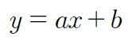
- **회귀 직선과 훈련 샘플 사이의 직선 거리를 오프셋(offset) 또는 예측 오차인 잔차(residual)라고 함**
- 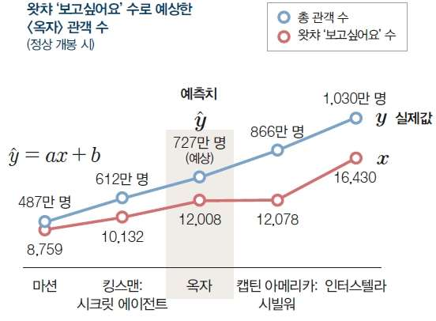

- 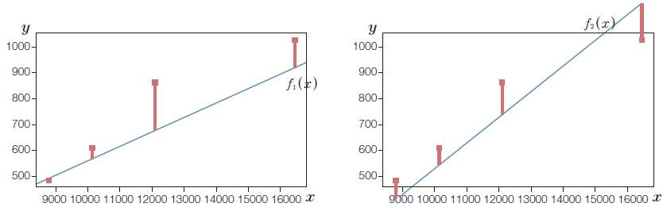

- 최대치가 적은 것이 더 좋은 선형회귀 직선

- 예측 함수와 실제값 간의 차이
  - 예측 함수는 예측값과 실제값 간의 차이를 최소화하는 방향으로
  
  - 데이터 n개 중 i번째 데이터의 값에 대한 실제값과 예측값의 차이
    - 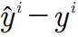
    
  - 데이터가 5개 있을 때 5개 데이터의 오차의 합
    - 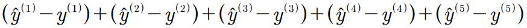
    
  - 오차 값들이 음수와 양수로 나왔을 때 값들 간의 차이가 상쇄되어 0으로 계산될 수 있음
  
  - **값의 제곱을 사용하여 오차의 합을 표현**(최소제곱법)
    
    - 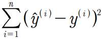
    
  - 제곱 오차 : 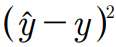 로 예측값과 실제값의 오차를 제곱으로 표시
  
  - 제곱 오차를 최소화하는 w0와 w1을 찾아야 함
  
  - $$
    \sum_{i=1}^n (w_{1}x^i+w_{0}\times1-y^i)
    $$
  

## 2. 비용함수

- **비용함수(목적함수) : 머신러닝에서 최소화해야 할 예측값과 실제값의 차이를 나타낸 함수**

- 가설함수 : 예측값을 예측하는 함수

- 
  $$
  f(x)=h_{@}(x)
  $$

- 함수 입력값은 x 이고 함수에서 함수에서 결정할 것은 @로 가중치 값인 Wn

- **비용함수가 두 개의 가중치 값으로 결정됨**

- **가설함수와 실제값 사이의 평균제곱오차를 구한다.**

- 잔차의 제곱합 : 예측값인 가설함수와 실제값인 y값 간의 차이를 제곱하여 모두 합함
  - 총 데이터는 m개가 존재하고 각 데이터 예측값과 실제값을 뺀 후 제곱한 값들을 모두 합한 값

- 가설을 하나 세운 뒤, 이 값이 주어진 요건을 충족하는지 판단하여 조금씩 변화를 주고, 이 변화가 긍정적이면 오차가 최소가 될 때까지 이 과정을 계속 반복하는 방법

- **1. 손실 함수 (Loss Function)** = 비용함수
  - 손실 함수는 실제값과 예측값의 차이(loss, cost)를 수치화해주는 함수이다.
  - 오차가 클수록 손실 함수의 값이 크고, 오차가 작을수록 손실 함수의 값이 작아진다.
  - **손실 함수의 값을 최소화 하는 W, b를 찾아가는것이 학습 목표이다.**
  - 회귀 : 평균제곱오차 / 분류 : 크로스 엔트로피

- 평균제곱오차(MSE) : 잔차의 제곱합을 N으로 나눈 값. 딥러닝에서 가장 많이 사용된다.

- 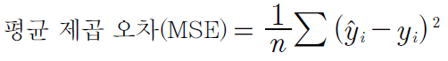

- 비용함수의 최소값은 편미분을 사용하여 수렴하는 곳을 찾는다.

- 선형회귀란

  - 임의의 직선을 그어 이에 대한 평균 제곱 오차를 구하고 이값을 가장 작게 만들어 주는 a와 b를 찾아가는 작업

## 3. 경사하강법

- 비용함수가 최소가 되는 지점을 구하는 것
- 비용함수(MSE)의 식 : 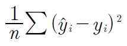
- 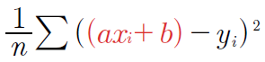
- 우리가 할 일은 ‘미분 값이 0인 지점’을 찾는 것
- 이 값을 미분할 때 우리가 궁금한 것은 a 와 b라는 것에 주의해야 함. 
- 식 전체를 미분하는 것이 아니라 필요한 값을 중심으로 미분해야 하기 때문(a와 b로 각각 *편미분)
- 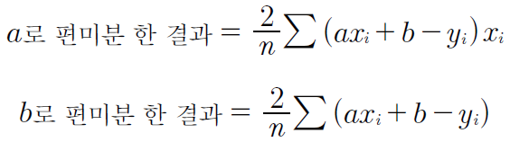
### 1. **선형회귀 비용함수 기울기 구하기**
- 
### 2. **선형회귀 절편 구하기**
- 

## 4. 수렴(Convergence)
- 아무튼 선형 회귀 분석을 수행하면 기울기와 절편을 계속 변경해가면서 최적의 값을 찾게 될 텐데, 이걸 언제까지 할지 정해줘야한다. 무작정 계속 시킬 수는 없으니까. 어차피 파리미터를 계속 조정하다보면 어느정도 최적의 값으로 수렴한다.

## 5. 학습률

- 어느 만큼 이동시킬지를 신중히 결정해야하는데, 이때 이동거리를 정해주는 것
- 딥러닝에서 학습률의 값을 적절히 바꾸면서 최적의 학습률을 찾는 것은 중요한 최적화 과정중 하나

## . 다중 선형 회귀

더 정확한 예측을 하려면 추가 정보를 입력해야 하며, **정보를 추가해 새로운 예측값을 구하려면 변수의 개수를 늘려 다중 선형 회귀를 만들어 주어야 함**

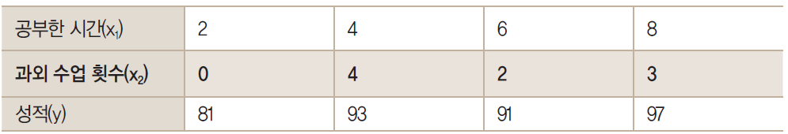

- 그럼 지금부터 두 개의 독립변수 x1과 x2가 생긴 것임
- 이를 사용해 종속 변수 y를 만들 경우 기울기를 두 개 구해야 하므로 다음과 같은 식이 나옴
- 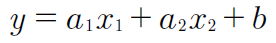
- 두 기울기 a1, a2를 구하는 방법 : 경사하강법
- 각각의 값에 기울기 a값이 다르므로 기울기도 a1과 a2이렇게 두가지를 만듦
- 경사 하강법을 적용하고 학습률을 곱해 기존의 값을 업데이트함